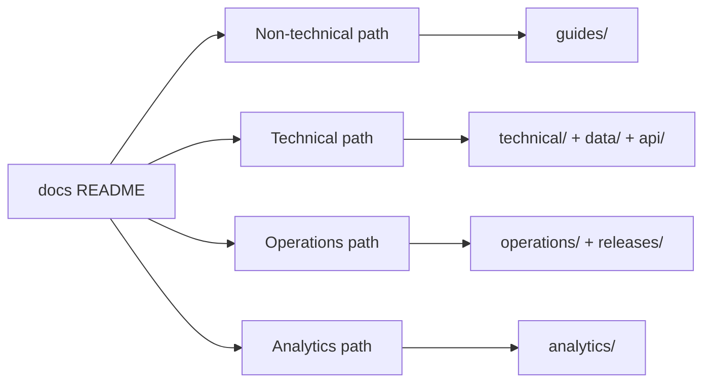

# Questioner Documentation Hub

> **Purpose:** Single entry point for platform handover — product context, technical reference, operations, and analytics.  
> **Audience:** Admins, analysts, developers, operators, and stakeholders joining the project.  
> **Status:** Phases 1–7 complete — canonical documentation hub with legacy redirects, link validation, and module source index.

---

## Platform Summary

**Questioner** is a token-based survey qualification and market-research platform. It screens respondents in **Layer 1** (demographics, quotas, validation), then routes qualified participants to **Layer 2** evaluation — either in-app or via Google Forms (legacy path). Admins design versioned survey blueprints, issue secure tokens, and monitor completion. Analysts generate web reports, Excel exports, and PPTX decks powered by an AI analytics pipeline.

| Layer | Stack |
|-------|-------|
| **Frontend** | React 18, TypeScript, Vite, Tailwind CSS, Framer Motion |
| **Backend** | FastAPI (Python 3.10+), Pydantic v2, Motor (async MongoDB) |
| **Data** | MongoDB, Redis (cache/queues), GridFS (media/voice) |
| **Analytics** | OpenAI, pandas/scipy, python-pptx, Playwright (hybrid PPTX capture) |
| **Infra** | Docker Compose, Nginx, AWS ECS, GitHub Actions CI/CD |

**Core lifecycle:** Design template → Create survey → Issue tokens → Respondent screens (L1) → Evaluate (L2) → Sync/analyze → Report & export.

For a one-page project overview and quick start commands, see the root [README.md](../README.md).

---

## How to Use This Hub

1. **Pick your path** below based on role and goal.
2. **Follow the handover checklist** for a structured onboarding sequence: [handover/teammate-handover-checklist.md](handover/teammate-handover-checklist.md).
3. **Use the document map** to find a specific topic. Canonical docs live under `docs/`; legacy paths redirect here.
4. **Validate links** after doc edits: `python scripts/validate_docs_links.py`



---

## Start Here — By Audience

### Non-technical handover
*Product managers, client stakeholders, new admins/analysts who need to understand what the platform does and how surveys run end-to-end.*

| Step | Document | Status |
|------|----------|--------|
| 1 | [handover/teammate-handover-checklist.md](handover/teammate-handover-checklist.md) | **Available** |
| 2 | [handover/executive-overview.md](handover/executive-overview.md) | **Available** |
| 3 | [handover/product-overview.md](handover/product-overview.md) | **Available** |
| 4 | [handover/stakeholder-map.md](handover/stakeholder-map.md) | **Available** |
| 5 | [guides/survey-lifecycle.md](guides/survey-lifecycle.md) | **Available** |
| 6 | [guides/admin-guide.md](guides/admin-guide.md) | **Available** |
| 7 | [guides/analyst-guide.md](guides/analyst-guide.md) | **Available** |
| 8 | [guides/respondent-flow.md](guides/respondent-flow.md) | **Available** |
| 9 | [handover/glossary.md](handover/glossary.md) | **Available** |

**Also useful:** [technical/local-development.md](technical/local-development.md), root [README.md](../README.md) (quick start).

---

### Technical handover
*Developers onboarding to frontend, backend, data model, APIs, and testing.*

| Step | Document | Status |
|------|----------|--------|
| 1 | [handover/teammate-handover-checklist.md](handover/teammate-handover-checklist.md) | **Available** |
| 2 | [technical/local-development.md](technical/local-development.md) | **Available** |
| 3 | [technical/system-overview.md](technical/system-overview.md) | **Available** |
| 3b | [technical/architecture-review.md](technical/architecture-review.md) | **Available** — risks & refactoring |
| 4 | [technical/backend-architecture.md](technical/backend-architecture.md) | **Available** |
| 5 | [technical/frontend-architecture.md](technical/frontend-architecture.md) | **Available** |
| 6 | [technical/auth-and-roles.md](technical/auth-and-roles.md) | **Available** |
| 7 | [data/database-overview.md](data/database-overview.md) | **Available** |
| 8 | [data/collections-reference.md](data/collections-reference.md) | **Available** |
| 9 | [api/api-overview.md](api/api-overview.md) | **Available** |
| 10 | [technical/environment-variables.md](technical/environment-variables.md) | **Available** |
| 11 | [technical/testing-and-qa.md](technical/testing-and-qa.md) | **Available** |

**Key code entry points:** `backend/main.py`, `frontend/src/App.tsx`, `backend/config.py`.

---

### Operations handover
*DevOps, release managers, and engineers responsible for deployment, secrets, monitoring, and incident response.*

| Step | Document | Status |
|------|----------|--------|
| 1 | [handover/teammate-handover-checklist.md](handover/teammate-handover-checklist.md) | **Available** |
| 2 | [operations/deployment.md](operations/deployment.md) | **Available** |
| 3 | [operations/ci-cd.md](operations/ci-cd.md) | **Available** |
| 4 | [operations/security-and-secrets.md](operations/security-and-secrets.md) | **Available** |
| 5 | [operations/monitoring-and-health.md](operations/monitoring-and-health.md) | **Available** |
| 6 | [operations/troubleshooting.md](operations/troubleshooting.md) | **Available** |
| 7 | [operations/rollback-runbooks.md](operations/rollback-runbooks.md) | **Available** |
| 8 | [releases/module-rollout.md](releases/module-rollout.md) | **Available** |
| 9 | [releases/pptx-export-rollout.md](releases/pptx-export-rollout.md) | **Available** |

**Infra paths:** `infra/docker/`, `backend/Dockerfile`, AWS task definitions under `infra/`.

---

### Analytics & AI handover
*Analysts and engineers working on reports, exports, Brand Analyzer, and PPTX generation.*

| Step | Document | Status |
|------|----------|--------|
| 1 | [handover/teammate-handover-checklist.md](handover/teammate-handover-checklist.md) | **Available** |
| 2 | [analytics/analytics-overview.md](analytics/analytics-overview.md) | **Available** |
| 3 | [analytics/ai-reporting-pipeline.md](analytics/ai-reporting-pipeline.md) | **Available** |
| 4 | [analytics/pptx-export.md](analytics/pptx-export.md) | **Available** |
| 5 | [api/exports-api.md](api/exports-api.md) | **Available** |
| 6 | [analytics/brand-analyzer-business-guide.md](analytics/brand-analyzer-business-guide.md) | **Available** |
| 7 | [analytics/brand-analyzer-technical-guide.md](analytics/brand-analyzer-technical-guide.md) | **Available** |
| 8 | [data/product-test-data-layer.md](data/product-test-data-layer.md) | **Available** |

---

## Handover Checklist (Quick)

Use the full checklist for day-by-day onboarding: **[handover/teammate-handover-checklist.md](handover/teammate-handover-checklist.md)**

| # | Task | Doc |
|---|------|-----|
| 1 | Understand what Questioner does and who uses it | [executive-overview.md](handover/executive-overview.md), [product-overview.md](handover/product-overview.md) |
| 2 | Run the app locally and log in | [technical/local-development.md](technical/local-development.md) |
| 3 | Trace one survey from token to report | [survey-lifecycle.md](guides/survey-lifecycle.md) |
| 4 | Read system architecture | [technical/system-overview.md](technical/system-overview.md) |
| 5 | Review database model | [data/database-overview.md](data/database-overview.md), [data/collections-reference.md](data/collections-reference.md) |
| 6 | Understand analytics pipeline | [analytics/ai-reporting-pipeline.md](analytics/ai-reporting-pipeline.md) |
| 7 | Know deployment and secrets | [operations/deployment.md](operations/deployment.md), [operations/security-and-secrets.md](operations/security-and-secrets.md) |
| 8 | Review feature rollouts (modules, PPTX) | [releases/module-rollout.md](releases/module-rollout.md), [releases/pptx-export-rollout.md](releases/pptx-export-rollout.md) |
| 9 | Seed Product Test data if needed | [data/product-test-data-layer.md](data/product-test-data-layer.md), [data/seeds-and-fixtures.md](data/seeds-and-fixtures.md) |
| 10 | Verify exports API (analysts) | [api/exports-api.md](api/exports-api.md) |
| 11 | Run test / QA gates | [technical/testing-and-qa.md](technical/testing-and-qa.md) |

---

## Document Map — Canonical Structure

All paths below are the **target canonical locations**. Status indicates whether the file exists today.

### Handover (`docs/handover/`)

| Document | Description | Status |
|----------|-------------|--------|
| [teammate-handover-checklist.md](handover/teammate-handover-checklist.md) | Structured onboarding sequence for all roles | **Available** |
| [executive-overview.md](handover/executive-overview.md) | Business context, value proposition, high-level capabilities | **Available** |
| [product-overview.md](handover/product-overview.md) | Platform modules, survey types, qualification flow | **Available** |
| [stakeholder-map.md](handover/stakeholder-map.md) | Admin, analyst, client, respondent, dev, ops roles | **Available** |
| [glossary.md](handover/glossary.md) | Domain terms (L1/L2, token, blueprint, BA/PF, etc.) | **Available** |

### User guides (`docs/guides/`)

| Document | Description | Status |
|----------|-------------|--------|
| [admin-guide.md](guides/admin-guide.md) | Templates, surveys, tokens, dashboard | **Available** |
| [analyst-guide.md](guides/analyst-guide.md) | Reports, exports, interpretation | **Available** |
| [respondent-flow.md](guides/respondent-flow.md) | Public `/s/{token}` journey | **Available** |
| [survey-lifecycle.md](guides/survey-lifecycle.md) | End-to-end study lifecycle | **Available** |

### Technical (`docs/technical/`)

| Document | Description | Status |
|----------|-------------|--------|
| [system-overview.md](technical/system-overview.md) | Platform architecture, components, data flows | **Available** |
| [architecture-review.md](technical/architecture-review.md) | Staff review — risks, scores, refactoring directions | **Available** |
| [frontend-architecture.md](technical/frontend-architecture.md) | React routes, guards, pages, API client | **Available** |
| [backend-architecture.md](technical/backend-architecture.md) | FastAPI routers, services, workers, config | **Available** |
| [auth-and-roles.md](technical/auth-and-roles.md) | JWT, RBAC (admin/analyst/client) | **Available** |
| [environment-variables.md](technical/environment-variables.md) | Full env var catalog from `.env.example` | **Available** |
| [local-development.md](technical/local-development.md) | Single source of truth for local setup | **Available** |
| [testing-and-qa.md](technical/testing-and-qa.md) | pytest, Vitest, lint, rollout QA, handover gates | **Available** |

### Data (`docs/data/`)

| Document | Description | Status |
|----------|-------------|--------|
| [database-overview.md](data/database-overview.md) | ERD, relationships, naming conventions | **Available** |
| [collections-reference.md](data/collections-reference.md) | All MongoDB collections and indexes | **Available** |
| [seeds-and-fixtures.md](data/seeds-and-fixtures.md) | Seed scripts, verification, fixtures | **Available** |
| [product-test-data-layer.md](data/product-test-data-layer.md) | Product Test question banks | **Available** |
| [question-banks.md](data/question-banks.md) | Research module CSV banks | **Available** |

### API & integrations (`docs/api/`)

| Document | Description | Status |
|----------|-------------|--------|
| [api-overview.md](api/api-overview.md) | Router map, Swagger, conventions | **Available** |
| [exports-api.md](api/exports-api.md) | BA/PF and product-scalers Excel exports | **Available** |
| [webhooks-and-integrations.md](api/webhooks-and-integrations.md) | Google Forms, Apps Script, webhooks | **Available** |

### Analytics (`docs/analytics/`)

| Document | Description | Status |
|----------|-------------|--------|
| [analytics-overview.md](analytics/analytics-overview.md) | Reporting capabilities and outputs | **Available** |
| [ai-reporting-pipeline.md](analytics/ai-reporting-pipeline.md) | Ingest → aggregate → AI → report/PPTX | **Available** |
| [brand-analyzer-business-guide.md](analytics/brand-analyzer-business-guide.md) | Brand Analyzer for business users | **Available** |
| [brand-analyzer-technical-guide.md](analytics/brand-analyzer-technical-guide.md) | Brand Analyzer implementation | **Available** |
| [pptx-export.md](analytics/pptx-export.md) | PPTX generation, workers, hybrid capture | **Available** |

### Operations (`docs/operations/`)

| Document | Description | Status |
|----------|-------------|--------|
| [deployment.md](operations/deployment.md) | Docker, prod deploy, service topology | **Available** |
| [ci-cd.md](operations/ci-cd.md) | GitHub Actions, image build, deploy flow | **Available** |
| [monitoring-and-health.md](operations/monitoring-and-health.md) | Health checks, logs, queue status | **Available** |
| [troubleshooting.md](operations/troubleshooting.md) | Common failures and fixes | **Available** |
| [rollback-runbooks.md](operations/rollback-runbooks.md) | Feature rollback procedures | **Available** |
| [security-and-secrets.md](operations/security-and-secrets.md) | Auth, secrets, webhook hardening | **Available** |

### Releases (`docs/releases/`)

| Document | Description | Status |
|----------|-------------|--------|
| [module-rollout.md](releases/module-rollout.md) | Phase 9 question modules rollout | **Available** |
| [pptx-export-rollout.md](releases/pptx-export-rollout.md) | PPTX export env matrix and rollback | **Available** |

---

## Legacy & Scattered Docs (Being Consolidated)

These files are **legacy or module-local** sources. Redirects point to canonical `docs/` paths; module source docs (e.g. Brand Analyzer, AI_ARCHITECTURE) remain in `backend/` and are linked from hub pages.

| Location | Content | Status |
|----------|---------|--------|
| [../README.md](../README.md) | Project overview, quick start, structure | See [product-overview.md](handover/product-overview.md), [local-development.md](technical/local-development.md) |
| [setup_instructions.md](setup_instructions.md) | Redirect → `technical/local-development.md` | Migrated |
| [architecture_analysis.md](architecture_analysis.md) | Redirect → `technical/architecture-review.md` | Migrated |
| `architecture_analysis.md.resolved` | **Removed** — content in [architecture-review.md](technical/architecture-review.md) | Migrated |
| [database_erd.md](database_erd.md) | Redirect → `data/database-overview.md` | Migrated |
| [deployment.md](deployment.md) | Redirect → `operations/deployment.md` | Migrated |
| [../backend/docs/deployment.md](../backend/docs/deployment.md) | Redirect → operations docs | Migrated |
| [analytics_enhancement_summary.md](analytics_enhancement_summary.md) | Redirect → `analytics/analytics-overview.md` | Migrated |
| [../ANALYST_GUIDE.md](../ANALYST_GUIDE.md) | Redirect → `api/exports-api.md` | Migrated |
| [../Complete Technical Documentation.md](../Complete%20Technical%20Documentation.md) | Redirect → Brand Analyzer technical hub | Migrated |
| [../backend/analytics_module/AI_ARCHITECTURE.md](../backend/analytics_module/AI_ARCHITECTURE.md) | Deep AI/report reference | Linked from [ai-reporting-pipeline.md](analytics/ai-reporting-pipeline.md) |
| [../backend/analytics_module/BRAND_AWARENESS_PARITY_CHECKLIST.md](../backend/analytics_module/BRAND_AWARENESS_PARITY_CHECKLIST.md) | Phase 8 parity audit | Linked from `analytics/` |
| [../backend/analytics_module/src/BrandAnalyzer/README.md](../backend/analytics_module/src/BrandAnalyzer/README.md) | Standalone Brand Analyzer app | Linked from [brand-analyzer-technical-guide.md](analytics/brand-analyzer-technical-guide.md) |
| [../backend/analytics_module/src/BrandAnalyzer/DOCUMENTATION.md](../backend/analytics_module/src/BrandAnalyzer/DOCUMENTATION.md) | Brand Analyzer technical source | Linked from [brand-analyzer-technical-guide.md](analytics/brand-analyzer-technical-guide.md) |
| [../backend/analytics_module/src/BrandAnalyzer/BUSINESS_GUIDE.md](../backend/analytics_module/src/BrandAnalyzer/BUSINESS_GUIDE.md) | Brand Analyzer business source | Linked from [brand-analyzer-business-guide.md](analytics/brand-analyzer-business-guide.md) |
| [MODULE_ROLLOUT.md](MODULE_ROLLOUT.md) | Redirect → `releases/module-rollout.md` | Migrated |
| [PPTX_EXPORT_ROLLOUT.md](PPTX_EXPORT_ROLLOUT.md) | Redirect → `releases/pptx-export-rollout.md` + `analytics/pptx-export.md` | Migrated |
| [product_test/DATA_LAYER.md](product_test/DATA_LAYER.md) | Redirect → `data/product-test-data-layer.md` | Migrated |
| [../data/question_banks/README.md](../data/question_banks/README.md) | CSV question bank schema source | Linked from [question-banks.md](data/question-banks.md) |

### Resolved documentation drift (Phases 4–7)

| Topic | Resolution |
|-------|------------|
| **Uvicorn command** | Canonical: `uvicorn backend.main:app` from repo root — see [local-development.md](technical/local-development.md) |
| **API port** | Canonical: **8081** (host) per `.env.example` |
| **Setup / deployment** | Consolidated into `technical/local-development.md` and `operations/` |
| **Product name in ERD** | `data/database-overview.md` uses **Questioner** naming |
| **Data / API / analytics** | Consolidated under `data/`, `api/`, `analytics/` |
| **Rollout docs** | Canonical: `releases/module-rollout.md`, `releases/pptx-export-rollout.md` |
| **Testing / QA** | Canonical: [technical/testing-and-qa.md](technical/testing-and-qa.md) |
| **Architecture review** | `architecture_analysis.md.resolved` removed → [architecture-review.md](technical/architecture-review.md) |
| **Root README** | Concise landing page → links here for full docs |
| **Link validation** | `python scripts/validate_docs_links.py` |

### Legacy redirect policy

Old paths are kept as **short redirect stubs** (not deleted) so bookmarks and external links keep working. Canonical content always lives under the paths in the [document map](#document-map--canonical-structure).

### Remaining technical debt (documented, not doc drift)

| Topic | Issue |
|-------|-------|
| **Health endpoint** | Dockerfile expects `/health`; API implements `GET /` only |
| **Deploy workflows** | `deploy-staging.yml` / `deploy-production.yml` are empty |
| **CI unit path** | `ci.yml` references `backend/tests/unit` — directory not present |

---

## Repository Quick Reference

```
Questioner/
├── backend/          # FastAPI app, analytics_module, voice_feedback, workers
├── frontend/         # React + Vite UI
├── docs/             # ← You are here — canonical documentation hub
├── infra/            # Docker Compose, Nginx, AWS deploy artifacts
├── scripts/          # Repo-level diagnostics and seed wrappers
├── data/             # Question bank CSVs
└── .github/workflows/ # CI/CD pipelines
```

---

## Documentation Roadmap

| Phase | Focus | Status |
|-------|-------|--------|
| **1** | Canonical index + handover map | **Complete** |
| **2** | Non-technical handover docs | **Complete** |
| **3** | Technical architecture docs | **Complete** |
| **4** | Setup, deployment, operations | **Complete** |
| **5** | Data, API, analytics consolidation | **Complete** |
| **6** | Release docs, testing, link validation | **Complete** |
| **7** | README update, legacy cleanup, cross-links | **Complete** |

---

## Module Source Documentation

Developer-only references kept **next to code** — linked from canonical hub pages, not duplicated.

| Module | Source doc (in repo) | Hub link |
|--------|----------------------|----------|
| **Analytics / AI** | [backend/analytics_module/AI_ARCHITECTURE.md](../backend/analytics_module/AI_ARCHITECTURE.md) | [ai-reporting-pipeline.md](analytics/ai-reporting-pipeline.md) |
| **Brand Analyzer** | [BUSINESS_GUIDE.md](../backend/analytics_module/src/BrandAnalyzer/BUSINESS_GUIDE.md), [DOCUMENTATION.md](../backend/analytics_module/src/BrandAnalyzer/DOCUMENTATION.md) | [brand-analyzer-business-guide.md](analytics/brand-analyzer-business-guide.md), [brand-analyzer-technical-guide.md](analytics/brand-analyzer-technical-guide.md) |
| **Brand awareness parity** | [BRAND_AWARENESS_PARITY_CHECKLIST.md](../backend/analytics_module/BRAND_AWARENESS_PARITY_CHECKLIST.md) | [analytics-overview.md](analytics/analytics-overview.md) |
| **Question banks (CSV)** | [data/question_banks/README.md](../data/question_banks/README.md) | [question-banks.md](data/question-banks.md) |
| **Google Forms script** | [scripts/external/google-apps-script.js](../scripts/external/google-apps-script.js) | [webhooks-and-integrations.md](api/webhooks-and-integrations.md) |

---

## Documentation Conventions

All canonical docs under `docs/` use this header pattern:

```markdown
# Title

> **Audience:** Who should read this
> **Purpose:** One-line scope
> **Related:** Links to adjacent canonical docs
```

| Rule | Convention |
|------|------------|
| **Product name** | Questioner (not legacy "Architect Studio") |
| **API port (dev)** | 8081 unless deployment differs |
| **File names** | `kebab-case.md` in `docs/` |
| **Legacy paths** | Short redirect stub; never duplicate full content |
| **After edits** | Run `python scripts/validate_docs_links.py` |

---

*Last updated: Phase 7 — README landing page, architecture review migration, legacy redirects, cross-link validation.*
