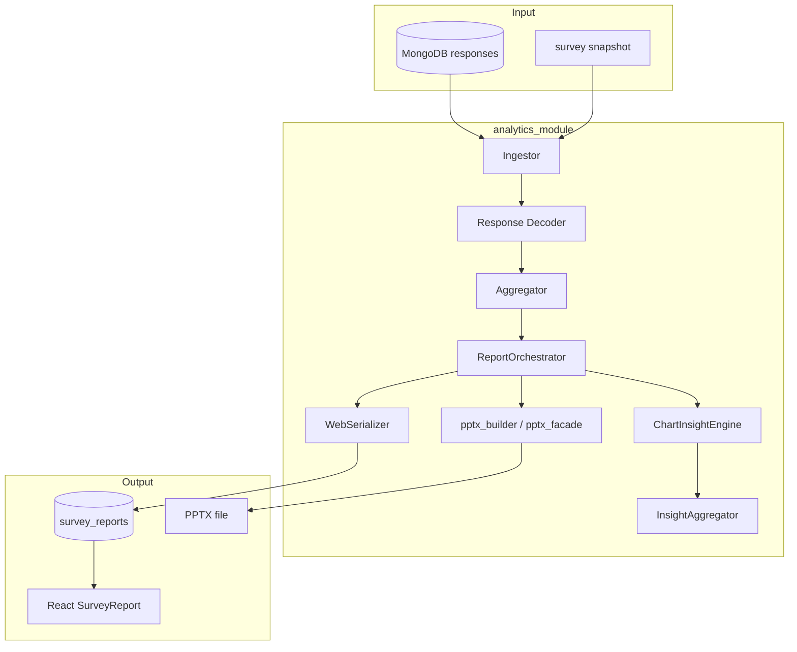
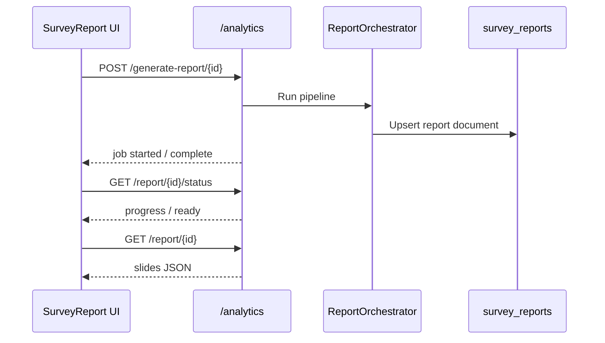

# AI Reporting Pipeline

> **Audience:** Developers and technical analysts maintaining the report generation system.  
> **Purpose:** End-to-end analytics pipeline — ingest through AI synthesis to web report and PPTX.  
> **Related:** [analytics-overview.md](analytics-overview.md) · [pptx-export.md](pptx-export.md) · [../../backend/analytics_module/AI_ARCHITECTURE.md](../../backend/analytics_module/AI_ARCHITECTURE.md)

---

## Pipeline Architecture



---

## Execution Sequence

| Step | Phase | Component | Output |
|------|-------|-----------|--------|
| 1 | **Ingest** | `ingestor.py` | DataFrames from MongoDB responses |
| 2 | **Decode** | `response_decoder/` | Human-readable labels; AI unaided mapping |
| 3 | **Aggregate** | `aggregator.py` | Statistics, T2B%, distributions |
| 4 | **Orchestrate** | `report_orchestrator.py` | Slide objects, chart payloads |
| 5 | **AI narrate** | `chart_insight_engine.py` | Per-chart OpenAI narratives |
| 6 | **Synthesize** | `insight_aggregator.py` | Executive summary, SWOT, 4P |
| 7 | **Serialize** | `web_serializer.py` | Frontend JSON schema |
| 8 | **Persist** | Platform bridge | `survey_reports` document |
| 9 | **Export** | `pptx_generator_v2.py` / worker | PowerPoint (optional) |

---

## Key Modules

| Module | Path | Role |
|--------|------|------|
| `ReportOrchestrator` | `report_orchestrator.py` | Top-level coordinator |
| `Ingestor` | `ingestor.py` | MongoDB → pandas |
| `Aggregator` | `aggregator.py` | Statistical computation |
| `ChartInsightEngine` | `chart_insight_engine.py` | Per-chart AI (async, cached) |
| `InsightAggregator` | `insight_aggregator.py` | Report-level synthesis |
| `WebSerializer` | `web_serializer.py` | Internal → frontend JSON |
| `PlatformBridge` | `platform_bridge.py` | API ↔ engine adapter |
| `ConfigLoader` | `config_loader.py` | OpenAI config, prompts |
| `pptx_builder/` | hybrid + native builders | Slide generation |
| `BrandAnalyzer` | `src/BrandAnalyzer/` | Brand equity analytics |

---

## AI Component Registry (Summary)

| Component | Purpose | Cached |
|-----------|---------|--------|
| `chart_insights` | Per-chart headline + analysis | Yes (`ai_insight_cache`) |
| `verbatim` | Brand-scoped thematic analysis | Yes |
| `executive_summary` | Report synthesis (JSON) | No |
| `executive_hero` | Top-3 takeaway (PPTX) | No |
| `recommendations` | 4P strategic advice | No |
| `ai_percentages` | Open-end classification | No |
| `decoder` | Unaided brand variant mapping | File cache |
| `insights` | Slide-level PPTX narration | No |

Default model: `gpt-4o-mini` (`OPENAI_MODEL`)

**Full registry:** [AI_ARCHITECTURE.md](../../backend/analytics_module/AI_ARCHITECTURE.md) §2

---

## Prompt Management

Versioned JSON prompts in:

```
backend/resources/analytics/prompts/
├── chart_insights.json
├── executive_summary.json
├── recommendations.json
├── slide_insights.json
└── verbatim_analysis.json
```

Loaded by `PromptRegistry` at startup. Pre-commit hook validates prompt assets.

---

## Caching & Performance

| Layer | Mechanism |
|-------|-----------|
| **AI insights** | MongoDB `ai_insight_cache` — keyed by prompt hash + data fingerprint |
| **Redis** | Runtime TTL cache (`CACHE_TTL`) |
| **Startup warmup** | `main.py` primes high-traffic prompt templates |

Invalidation: data updates invalidate relevant cache entries.

---

## Module-Aware Ingestion (Phase 9)

When `MODULE_ROLLOUT_STAGE` ≥ `analytics_aliases`:

- `module_answer_aliases.py` normalizes response IDs
- Ingestor reads `surveys.module_snapshots`
- Exports align with analytical mapping

Tests: `backend/tests/analytics/test_ingestor_modules.py`

---

## API Trigger Flow



---

## Fault Tolerance

| Concern | Behavior |
|---------|----------|
| OpenAI unavailable | Data-only report; AI sections omitted |
| Partial chart failure | Other charts still render |
| PPTX worker crash | Stale job recovery — [pptx-export.md](pptx-export.md) |
| Duplicate survey_id | Unique index; cleanup script available |

---

## Developer Entry Points

| Task | Start here |
|------|------------|
| Add chart type | `aggregator.py` + `web_serializer.py` |
| Add AI prompt | `backend/resources/analytics/prompts/` + registry |
| Debug ingest | `ingestor.py`, survey snapshot in MongoDB |
| PPTX slide | `pptx_builder/pptx_*.py` |
| Tests | `backend/tests/integration/test_analytics.py` |

---

## Deep Dive Reference

For component-level documentation (personas, cost tracking, file map):

**[backend/analytics_module/AI_ARCHITECTURE.md](../../backend/analytics_module/AI_ARCHITECTURE.md)**

---

## Related Documentation

| Document | Purpose |
|----------|---------|
| [analytics-overview.md](analytics-overview.md) | Business-facing overview |
| [pptx-export.md](pptx-export.md) | PPTX subsystem |
| [../data/collections-reference.md](../data/collections-reference.md) | `survey_reports` schema |

---

*Phase 5 — [docs/README.md](../README.md)*
