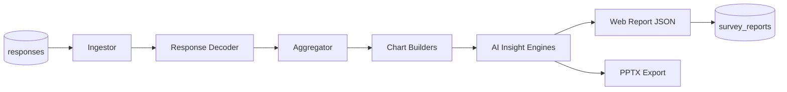

# Analytics Overview

> **Audience:** Analysts, product owners, and developers working with reports and exports.  
> **Purpose:** What the analytics subsystem does, outputs available, and how it connects to survey data.  
> **Related:** [ai-reporting-pipeline.md](ai-reporting-pipeline.md) · [pptx-export.md](pptx-export.md) · [../guides/analyst-guide.md](../guides/analyst-guide.md)

> **Consolidates:** [analytics_enhancement_summary.md](../analytics_enhancement_summary.md) (historical summary).

---

## What Analytics Does

The Questioner analytics engine transforms **raw survey responses** into:

| Output | Format | Audience |
|--------|--------|----------|
| **Web report** | Interactive JSON in browser | Analysts, clients |
| **PPTX deck** | PowerPoint file | Stakeholder presentations |
| **Excel exports** | `.xlsx` flat/stacked | External modeling — [exports-api.md](../api/exports-api.md) |
| **AI narratives** | Text in report slides | Executive readouts |

Location: `backend/analytics_module/` (~237 Python modules)

---

## Pipeline Summary

Detail: [ai-reporting-pipeline.md](ai-reporting-pipeline.md)

---

## Data Inputs

| Source | Used for |
|--------|----------|
| `responses` | L1 screening + L2 evaluations |
| `surveys.template_snapshot_schema` | Question labels, structure (immutable) |
| `surveys.module_snapshots` | Module questions (PF, usage, pricing) |
| `surveys.analytical_mapping` | Export/analytics column aliases |
| `surveys.internal_brands_data` | Brand lists, comparisons |

**Key principle:** Reports always use the **snapshot** at survey creation — not the live template.

---

## Report Types & Modules

| Module | Capabilities |
|--------|--------------|
| **Demographics / L1** | Age, gender, region, SES cross-tabs |
| **Brand evaluation** | Means, T2B%, radar charts, brand comparison |
| **Purchase funnel** | Awareness → consideration → trial → purchase |
| **Brand awareness** | Top-of-mind, aided/unaided |
| **Taste test** | NPS, preference, attribute importance |
| **Product Test** | IHUT metrics, packaging, trial media strip |
| **Brand Analyzer** | Brand equity decomposition — [brand-analyzer-business-guide.md](brand-analyzer-business-guide.md) |
| **Voice feedback** | Verbatim themes (separate dashboard) |

---

## AI-Augmented Features

When `OPENAI_API_KEY` is configured:

| Feature | Description |
|---------|-------------|
| Per-chart insights | Narrative explaining each visualization |
| Executive summary | Study-level synthesis |
| SWOT | Strengths/weaknesses/opportunities/threats |
| 4P recommendations | Product, price, place, promotion |
| Verbatim analysis | Thematic coding of open ends |
| Unaided brand mapping | AI decoder for variant spellings |

Without OpenAI: **data-only reports** still generate (charts + tables, no AI text).

---

## How to Generate (Analyst)

1. Open survey → **Report** page
2. Click **Generate Report**
3. Wait for pipeline completion (poll status endpoint)
4. Optional: **Export PPTX** — [pptx-export.md](pptx-export.md)
5. Optional: **Excel export** via API — [exports-api.md](../api/exports-api.md)

Workflow: [../guides/analyst-guide.md](../guides/analyst-guide.md)

---

## API Endpoints (Summary)

| Endpoint | Purpose |
|----------|---------|
| `POST /analytics/generate-report/{survey_id}` | Trigger generation |
| `GET /analytics/report/{survey_id}` | Fetch web report |
| `GET /analytics/report/{survey_id}/status` | Job status + PPTX progress |
| `POST /analytics/report/{survey_id}/generate-pptx` | Queue PPTX |
| `GET /analytics/admin/pptx-diagnostics` | Ops diagnostics |
| `GET /analytics/orphans` | Webhook failure audit |

Full map: [../api/api-overview.md](../api/api-overview.md)

---

## Storage

| Collection | Content |
|------------|---------|
| `survey_reports` | Generated report JSON, PPTX job state |
| `ai_insight_cache` | Cached OpenAI responses with prompt versioning |

---

## Cost & Telemetry

- AI token usage tracked per report
- Admin views: `/admin/ai-telemetry`, `/analytics/admin/ai-quota-status`
- Redis caches insights with TTL (`CACHE_TTL`)

---

## Related Documentation

| Document | Purpose |
|----------|---------|
| [ai-reporting-pipeline.md](ai-reporting-pipeline.md) | Technical pipeline |
| [pptx-export.md](pptx-export.md) | PowerPoint export |
| [brand-analyzer-business-guide.md](brand-analyzer-business-guide.md) | Brand equity (business) |
| [brand-analyzer-technical-guide.md](brand-analyzer-technical-guide.md) | Brand equity (technical) |
| [../../backend/analytics_module/AI_ARCHITECTURE.md](../../backend/analytics_module/AI_ARCHITECTURE.md) | Deep AI reference |

---

*Phase 5 — [docs/README.md](../README.md)*
