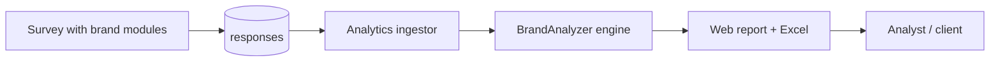

# Brand Analyzer — Business Guide

> **Audience:** Marketing teams, brand managers, strategists, and stakeholders consuming Brand Equity Analyzer results.  
> **Purpose:** Hub for the business-facing Brand Analyzer guide — what metrics mean, how to act on them, and how to present findings.  
> **Related:** [brand-analyzer-technical-guide.md](brand-analyzer-technical-guide.md) · [analytics-overview.md](analytics-overview.md) · [../guides/analyst-guide.md](../guides/analyst-guide.md)

---

## What Brand Analyzer Does

The **Brand Equity Analyzer** decomposes brand preference into measurable building blocks:

| Question | Output |
|----------|--------|
| Which attributes drive preference? | Correlation / T-values |
| Where does our brand win vs competitors? | POD (points of differentiation) |
| Where are we table stakes? | POP (points of parity) |
| What is overall brand health? | CBI (Composite Brand Index) |

It runs inside the Questioner analytics pipeline when a survey includes brand evaluation and preference data.

---

## When to Use It

| Role | Typical use |
|------|-------------|
| **Brand manager** | Track CBI across waves; find PODs vs competitors |
| **Marketing director** | Portfolio prioritization; campaign attribute focus |
| **Strategy** | Competitive positioning map; white-space attributes |
| **Research** | Tracker design; sample-size adequacy |

---

## Key Outputs

| Output | Format | Description |
|--------|--------|-------------|
| CBI scores | Chart + table | Overall brand equity index per brand |
| POP/POD matrix | Heatmap / Excel | Attribute positioning vs competitors |
| Driver analysis | Correlation table | Which attributes most influence preference |
| Excel workbook | `.xlsx` | Sheet-by-sheet stakeholder report |

Export access: [../api/exports-api.md](../api/exports-api.md) (BA/PF endpoints when applicable).

---

## Reading Results (Quick Reference)

| Metric | Higher is better? | Action if low |
|--------|-------------------|---------------|
| **CBI** | Yes | Invest in high-correlation attributes where you can differentiate |
| **POD** | Yes (on key drivers) | Emphasize in campaigns; protect from commoditization |
| **POP** | Neutral (table stakes) | Match competitors; don't over-invest |
| **Unassociated** | No | Opportunity or irrelevant attribute — investigate |

---

## Full Business Guide (Canonical Source)

The complete business guide — scenarios, Excel sheet walkthrough, stakeholder presentation tips, FAQs — lives with the Brand Analyzer module:

**[backend/analytics_module/src/BrandAnalyzer/BUSINESS_GUIDE.md](../../backend/analytics_module/src/BrandAnalyzer/BUSINESS_GUIDE.md)**

Topics covered there:

1. Why brand equity matters  
2. Questions the tool answers (by role)  
3. Required inputs and data quality  
4. Understanding each output  
5. Excel report sheet-by-sheet  
6. Strategic decision framework  
7. Common business scenarios  
8. Presenting to stakeholders  
9. Limitations and caveats  
10. FAQ  

---

## Integration with Questioner

Technical pipeline: [brand-analyzer-technical-guide.md](brand-analyzer-technical-guide.md) · [ai-reporting-pipeline.md](ai-reporting-pipeline.md)

---

## Related Documentation

| Document | Purpose |
|----------|---------|
| [BUSINESS_GUIDE.md](../../backend/analytics_module/src/BrandAnalyzer/BUSINESS_GUIDE.md) | Full business reference (module source) |
| [brand-analyzer-technical-guide.md](brand-analyzer-technical-guide.md) | Formulas, pipeline, architecture |
| [../api/exports-api.md](../api/exports-api.md) | BA/PF Excel export API |
| [../guides/analyst-guide.md](../guides/analyst-guide.md) | Analyst workflow |

---

*Phase 5 — [docs/README.md](../README.md)*
