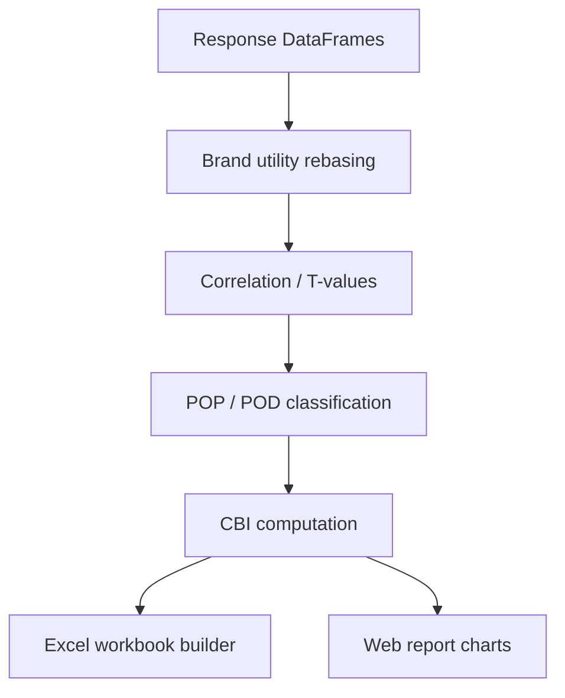

# Brand Analyzer — Technical Guide

> **Audience:** Developers, data scientists, and technical analysts maintaining or extending Brand Equity Analyzer.  
> **Purpose:** Hub for implementation docs — pipeline, formulas, module map, and integration with Questioner analytics.  
> **Related:** [brand-analyzer-business-guide.md](brand-analyzer-business-guide.md) · [ai-reporting-pipeline.md](ai-reporting-pipeline.md)

---

## Module Location

```
backend/analytics_module/src/BrandAnalyzer/
├── BUSINESS_GUIDE.md      # Business-facing (see brand-analyzer-business-guide.md)
├── DOCUMENTATION.md       # Complete technical reference (primary)
├── README.md              # Standalone app notes
└── src/                   # Python implementation
```

The analyzer is invoked from the main analytics pipeline when brand evaluation and preference data are present in survey responses.

---

## Pipeline Overview



| Step | Component | Output |
|------|-----------|--------|
| 1 | Ingest brand-attribute scores | Normalized DataFrame |
| 2 | Rebase preference shares | Per-respondent brand utility |
| 3 | Correlation analysis | Driver attributes per brand |
| 4 | POP/POD matrix | Competitive positioning |
| 5 | CBI aggregation | Composite brand index |
| 6 | Serialize | Excel + web chart payloads |

---

## Core Concepts (Technical)

| Concept | Definition |
|---------|------------|
| **Brand utility** | Preference share rebased to 100% per respondent |
| **T-value** | Statistical significance of attribute–preference correlation |
| **POP** | Point of parity — brand matches category leader on attribute |
| **POD** | Point of differentiation — brand leads on attribute |
| **CBI** | Weighted composite of equity drivers |

Formula detail: see **DOCUMENTATION.md** §5 (Mathematical Formulas).

---

## Primary Technical References

### 1. Module documentation (canonical)

**[backend/analytics_module/src/BrandAnalyzer/DOCUMENTATION.md](../../backend/analytics_module/src/BrandAnalyzer/DOCUMENTATION.md)**

Covers:

- Core concepts and inputs  
- Complete step-by-step pipeline  
- Mathematical formulas  
- POP/POD/Strong/Unassociated classification  
- Architecture and module map  
- Worked example and glossary  

### 2. Standalone app README

**[backend/analytics_module/src/BrandAnalyzer/README.md](../../backend/analytics_module/src/BrandAnalyzer/README.md)**

Historical standalone runner notes and file layout.

### 3. Legacy repo-root doc

**[Complete Technical Documentation.md](../../Complete%20Technical%20Documentation.md)** — root redirect; prefer `DOCUMENTATION.md` in the module path.

---

## Integration Points

| Integration | Location |
|-------------|----------|
| Analytics ingestor | `backend/analytics_module/ingestor.py` |
| Report orchestrator | `backend/analytics_module/report_orchestrator.py` |
| Excel exports | `backend/routers/exports.py` — `/exports/ba-pf/{survey_id}` |
| Module rollout | `MODULE_ROLLOUT_STAGE` ≥ `analytics_aliases` for alias normalization |

API: [../api/exports-api.md](../api/exports-api.md) · Data: [../data/collections-reference.md](../data/collections-reference.md)

---

## Tests

| Area | Path |
|------|------|
| Brand awareness parity | `backend/analytics_module/BRAND_AWARENESS_PARITY_CHECKLIST.md` |
| Analytics integration | `backend/tests/integration/test_analytics.py` |
| Export modules | `backend/tests/test_exports_modules.py` |

---

## Developer Quick Start

1. Read `DOCUMENTATION.md` §4 (pipeline) and §8 (module map)  
2. Trace ingest from `ingestor.py` → BrandAnalyzer entry  
3. Run export test: `pytest backend/tests/test_exports_modules.py -k ba -q`  
4. Verify BA/PF structure: `GET /exports/test/ba-pf` (see [exports-api.md](../api/exports-api.md))

---

## Related Documentation

| Document | Purpose |
|----------|---------|
| [DOCUMENTATION.md](../../backend/analytics_module/src/BrandAnalyzer/DOCUMENTATION.md) | Full technical reference |
| [brand-analyzer-business-guide.md](brand-analyzer-business-guide.md) | Business interpretation |
| [ai-reporting-pipeline.md](ai-reporting-pipeline.md) | Parent analytics pipeline |
| [AI_ARCHITECTURE.md](../../backend/analytics_module/AI_ARCHITECTURE.md) | AI components (separate from BA math) |

---

*Phase 5 — [docs/README.md](../README.md)*
