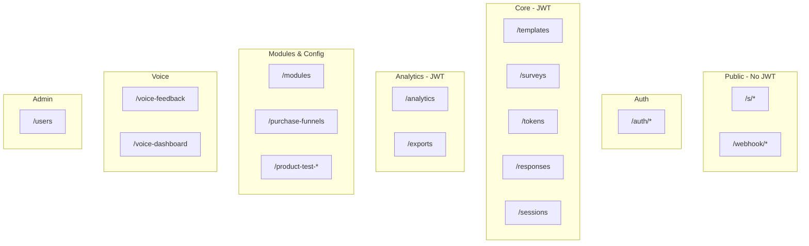

# API Overview

> **Audience:** Developers and API integrators.  
> **Purpose:** REST API map, Swagger usage, auth conventions, and router reference.  
> **Related:** [exports-api.md](exports-api.md) · [webhooks-and-integrations.md](webhooks-and-integrations.md) · [../technical/backend-architecture.md](../technical/backend-architecture.md) · [../technical/auth-and-roles.md](../technical/auth-and-roles.md)

---

## Base URLs

| Environment | API base | Swagger |
|-------------|----------|---------|
| **Native dev** | `http://localhost:8081` | `http://localhost:8081/docs` |
| **Docker (direct)** | `http://localhost:8081` | `http://localhost:8081/docs` |
| **Docker (nginx)** | `https://<host>/api` | `https://<host>/api/docs` |
| **Frontend proxy** | `/api` → backend (Vite/nginx strips prefix) | `/api/docs` |

> **Note:** Legacy docs referenced port `3001` — use **8081** per `.env.example` unless your deployment differs.

---

## Authentication

| Route class | Auth |
|-------------|------|
| **Portal routes** | `Authorization: Bearer <JWT>` from `POST /auth/token` |
| **Public survey** | No JWT — token in URL path `/s/{token}` |
| **Webhook** | No auth (known gap — see [webhooks-and-integrations.md](webhooks-and-integrations.md)) |
| **Export test endpoints** | JWT required except structure tests may vary — see [exports-api.md](exports-api.md) |
| **PPTX capture** | Special capture JWT on allowlisted report routes |

Login:

```bash
curl -X POST "http://localhost:8081/auth/token" \
  -H "Content-Type: application/x-www-form-urlencoded" \
  -d "username=admin&password=YOUR_PASSWORD"
```

---

## Swagger / OpenAPI

Interactive docs at **`/docs`** when the API is running.

| Feature | Path |
|---------|------|
| Swagger UI | `/docs` |
| OpenAPI JSON | `/openapi.json` |
| Health (basic) | `GET /` → `{"message":"Survey Platform API is running"}` |

Use Swagger to explore request bodies for survey creation, token generation, and analytics.

---

## Router Map (24 routers)



### Complete router table

| Router | Prefix | Auth | Primary endpoints |
|--------|--------|------|-----------------|
| `auth` | `/auth` | Public login | `POST /token`, `POST /signup`, `GET /me` |
| `templates` | `/templates` | JWT | CRUD blueprints |
| `surveys` | `/surveys` | JWT | CRUD studies, stats, blueprint |
| `tokens` | `/tokens` | JWT | Generate, list, bulk update |
| `public` | `/s` | Token URL | `GET /{token}`, `POST /{token}/layer1`, `POST /{token}/layer2` |
| `responses` | `/responses` | JWT | Respondent list, detail, exclude |
| `sessions` | `/sessions` | JWT | Session state |
| `webhook` | `/webhook` | None | `POST /google-form` |
| `analytics` | `/analytics` | JWT / capture | Reports, PPTX, orphans, platform stats |
| `exports` | `/exports` | JWT | Excel exports — [exports-api.md](exports-api.md) |
| `users` | `/users` | Admin | User CRUD |
| `question_modules` | `/modules` | JWT / analyst | Module CRUD, `GET /rollout` |
| `purchase_funnels` | `/purchase-funnels` | JWT | PF config |
| `product_test_questions` | *(root)* | JWT | `GET /product-test-questions/status` |
| `product_test_configs` | `/product-test-configs` | JWT | PT study config |
| `product_test_media` | `/surveys` | JWT | Trial media upload/stream |
| `packaging_heatmap` | `/surveys` | Analyst | Heatmap upload/aggregate |
| `voice_feedback` | `/voice-feedback` | JWT | Upload, transcribe |
| `voice_dashboard` | `/voice-dashboard` | JWT | Themes, aggregates |
| `attribute_banks` | `/attribute-banks` | JWT | Sensory libraries |
| `brand_attributes` | `/brand-attributes` | JWT / admin | Brand attrs |
| `taste_test_configs` | `/taste-test-configs` | JWT / analyst | Taste config |
| `questions` | `/questions` | JWT | Master questions |

Entry point: `backend/main.py`

---

## Key Endpoint Groups

### Survey operations

| Method | Path | Description |
|--------|------|-------------|
| `GET` | `/surveys` | List surveys |
| `POST` | `/surveys` | Create survey |
| `GET` | `/surveys/{id}` | Survey detail |
| `POST` | `/tokens/generate` | Issue token batch |
| `GET` | `/responses/survey/{id}/respondents` | Paginated respondents |

### Analytics

| Method | Path | Description |
|--------|------|-------------|
| `POST` | `/analytics/generate-report/{survey_id}` | Trigger report |
| `GET` | `/analytics/report/{survey_id}` | Fetch web report |
| `GET` | `/analytics/report/{survey_id}/status` | Generation + PPTX status |
| `POST` | `/analytics/report/{survey_id}/generate-pptx` | Queue PPTX export |
| `GET` | `/analytics/admin/pptx-diagnostics` | PPTX ops diagnostics |

### Public respondent

| Method | Path | Description |
|--------|------|-------------|
| `GET` | `/s/{token}` | Survey payload for respondent |
| `POST` | `/s/{token}/layer1` | Submit screening |
| `POST` | `/s/{token}/layer2` | Submit evaluation (in-app) |

---

## Response Conventions

| Code | Meaning |
|------|---------|
| `200` | Success |
| `400` | Validation error (invalid ObjectId, bad transition) |
| `401` | Missing/invalid JWT |
| `403` | Insufficient role |
| `404` | Resource not found |
| `429` | Rate limited (SlowAPI + Redis) |

Errors typically return `{ "detail": "..." }`.

---

## Rate Limiting

SlowAPI middleware with Redis backend (`backend/utils/rate_limit.py`). Applies to selected public and authenticated routes.

---

## Client Integration (Frontend)

Axios client: `frontend/src/services/api.ts`

- Base URL: `VITE_API_URL` or `/api`
- Auto-attaches JWT except for `s/` public paths
- 401 → redirect to login (except public survey / export frame)

---

## Related Documentation

| Document | Purpose |
|----------|---------|
| [exports-api.md](exports-api.md) | Excel export endpoints |
| [webhooks-and-integrations.md](webhooks-and-integrations.md) | Google Forms |
| [../technical/auth-and-roles.md](../technical/auth-and-roles.md) | RBAC |
| [../data/collections-reference.md](../data/collections-reference.md) | Data model |

---

*Phase 5 — [docs/README.md](../README.md)*
