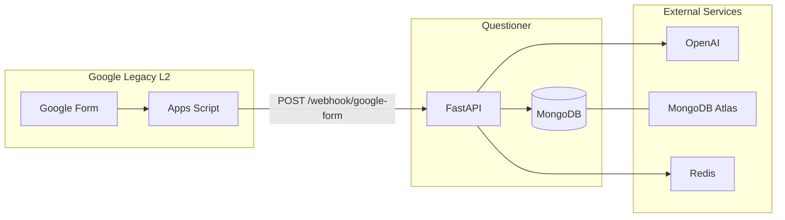

# Webhooks & Integrations

> **Audience:** Developers integrating Google Forms, external systems, and operators configuring Layer 2 legacy path.  
> **Purpose:** Google Apps Script setup, webhook payloads, external dependencies, and security notes.  
> **Related:** [api-overview.md](api-overview.md) · [../guides/respondent-flow.md](../guides/respondent-flow.md) · [../operations/security-and-secrets.md](../operations/security-and-secrets.md)

---

## Integration Landscape



| Integration | Required? | Path |
|-------------|-----------|------|
| **In-app Layer 2** | Recommended | `POST /s/{token}/layer2` — no external form |
| **Google Forms** | Legacy / optional | Apps Script → webhook |
| **OpenAI** | Optional | AI narratives in reports |
| **MongoDB** | Critical | All data |
| **Redis** | High | Queue, cache, rate limits |

---

## Layer 2 Delivery Paths

| Path | `responses.source` | Integration |
|------|-------------------|-------------|
| **In-app gateway** | `in_app_gateway` | Native Questioner UI |
| **Google Forms** | `layer2` | This document |

Prefer **in-app gateway** for new studies — fewer moving parts, no webhook fragility.

---

## Google Forms Setup

### 1. Create the form

- Add all Layer 2 questions
- Add a **Short Answer** question titled exactly **`Token`** (case-insensitive match in script)

### 2. Install Apps Script

Source file: [scripts/external/google-apps-script.js](../../scripts/external/google-apps-script.js)

```javascript
var WEBHOOK_URL = "YOUR_BACKEND_URL/webhook/google-form";
// e.g. https://api.yourdomain.com/webhook/google-form
// Local dev: https://xxxx.ngrok-free.app/webhook/google-form
```

### 3. Configure trigger

Run `setupTrigger()` once in Apps Script editor to create `onFormSubmit` trigger.

### 4. Pre-fill token (respondent flow)

When respondent passes Layer 1, frontend redirects to Google Form with token pre-filled in the `Token` field. Respondent must **not** modify this field.

---

## Webhook Endpoint

```
POST /webhook/google-form
Content-Type: application/json
```

**Authentication:** None (known security gap)

### Handler logic (`backend/routers/webhook.py`)

1. Parse JSON body
2. Extract `token` — reject if missing → log to `orphan_submissions`
3. Atomically transition token `passed` → `submitted` via `TokenService`
4. Insert `responses` document with `source: "layer2"`
5. Return `{ "status": "success" }`

### Request payload (Apps Script)

```json
{
  "token": "uuid-from-form",
  "answers": {
    "Question title 1": "answer value",
    "Question title 2": "another answer"
  },
  "timestamp": "2026-07-06T10:00:00.000Z"
}
```

| Field | Required | Notes |
|-------|----------|-------|
| `token` | Yes | Must match valid token in `passed` state |
| `answers` | No | Keyed by Google Form question titles |
| `timestamp` | No | ISO datetime from script |

### Success response

```json
{ "status": "success" }
```

### Failure modes → `orphan_submissions`

| Reason | Cause |
|--------|-------|
| `missing_token` | Token field empty |
| `invalid_transition_*` | Token not in `passed` state |
| Invalid token | Token not found |

Audit orphans: `GET /analytics/orphans` (authenticated).

---

## Local Development with ngrok

```bash
# Terminal 1: API on 8081
uvicorn backend.main:app --reload --port 8081

# Terminal 2: expose webhook
ngrok http 8081
```

Set Apps Script `WEBHOOK_URL` to:

```
https://<ngrok-id>.ngrok-free.app/webhook/google-form
```

---

## External Dependencies

| Service | Role | Config |
|---------|------|--------|
| **MongoDB Atlas** | Primary database | `MONGO_URI` |
| **Redis** | PPTX queue, AI cache, rate limits | `REDIS_URL` |
| **OpenAI** | Chart insights, executive summary | `OPENAI_API_KEY` |
| **Google Forms** | Legacy L2 UI | Manual per study |
| **Google Apps Script** | Webhook relay | Per form |
| **Playwright** | PPTX chart capture | In worker container |
| **AWS Secrets Manager** | Production secrets | `ENV=production` |

---

## Security Considerations

| Risk | Status | Mitigation |
|------|--------|------------|
| Webhook has no auth | Open | Add shared secret header; IP allowlist |
| Token field tampering | Operational | Orphan logging; recruiter instructions |
| Token guessing | Low | UUID tokens |
| HTTPS | Required prod | nginx TLS |

Detail: [../operations/security-and-secrets.md](../operations/security-and-secrets.md)

---

## Troubleshooting

| Symptom | Check |
|---------|-------|
| No L2 data | Apps Script trigger authorized? `WEBHOOK_URL` correct? |
| Orphan spike | Token field renamed in Google Form? |
| `invalid_transition` | Respondent skipped Layer 1 or token reused |
| 500 errors | API logs; MongoDB connectivity |

More: [../operations/troubleshooting.md](../operations/troubleshooting.md)

---

## Related Documentation

| Document | Purpose |
|----------|---------|
| [../technical/local-development.md](../technical/local-development.md) | Google Forms setup section |
| [../guides/respondent-flow.md](../guides/respondent-flow.md) | Respondent journey |
| [exports-api.md](exports-api.md) | Data export after collection |

---

*Phase 5 — [docs/README.md](../README.md)*
