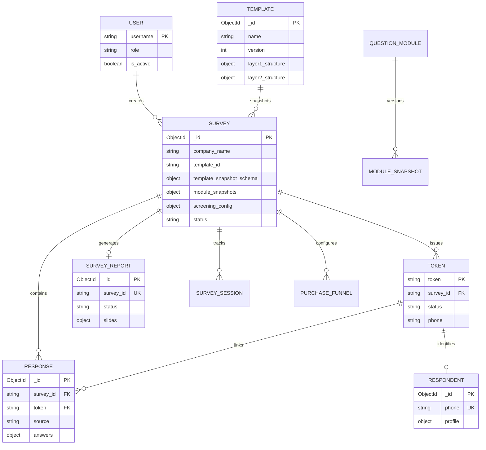
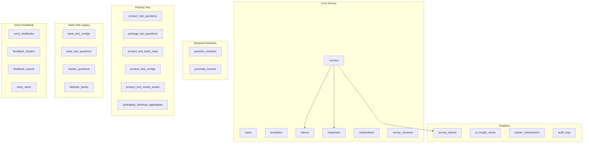
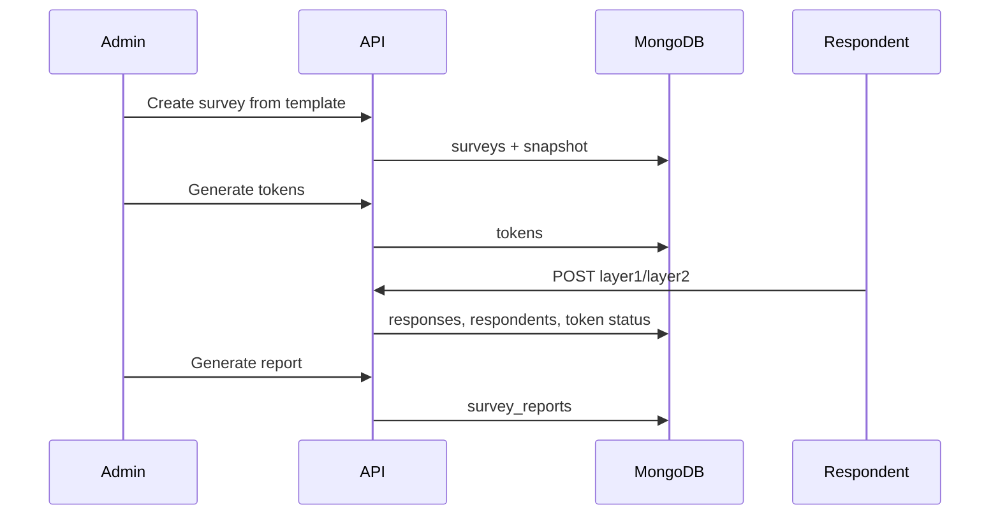

# Database Overview

> **Audience:** Developers, analysts, and operators working with Questioner data.  
> **Purpose:** Canonical MongoDB data model for the **Questioner** platform — relationships, naming, and design principles.  
> **Related:** [collections-reference.md](collections-reference.md) · [seeds-and-fixtures.md](seeds-and-fixtures.md) · [../technical/system-overview.md](../technical/system-overview.md)

> **Supersedes:** [database_erd.md](../database_erd.md) (legacy ERD — redirect in place).

---

## Database Identity

| Property | Value |
|----------|-------|
| **Platform name** | Questioner |
| **Database name** | `survey_platform` (configurable via `DATABASE_NAME`) |
| **Driver** | Motor (async MongoDB) |
| **Binary storage** | GridFS buckets (voice, packaging images, trial media) |

The legacy ERD referred to "Architect Studio" — that name is deprecated; all new documentation uses **Questioner**.

---

## Design Principles

1. **Template snapshot immutability** — Surveys store `template_snapshot_schema` at creation; fieldwork is not affected by later template edits.
2. **Token-centric respondent journey** — `tokens` collection drives access control and lifecycle for public respondents.
3. **Layered responses** — `responses.source` distinguishes `layer1`, `layer2`, and `in_app_gateway`.
4. **Module snapshots** — Research modules (`purchase_funnel`, `brand_usage`, etc.) are snapshotted on surveys via `module_snapshots`.
5. **Report per survey** — `survey_reports` uses unique `survey_id` index for one canonical report document per study.

---

## Core Entity Relationship Diagram

---

## Domain Groupings

Full collection list: [collections-reference.md](collections-reference.md)

---

## Key Relationships

### Template → Survey

- A **survey** is created from a **template** (specific version).
- On create, the system copies `layer1_structure`, `layer2_structure`, and related schema into `template_snapshot_schema`.
- Editing the template later does **not** change active surveys.

### Survey → Token → Response

- One survey has many **tokens** (campaign links).
- Each token progresses: `unused` → `passed`/`failed` → `submitted`.
- **Responses** are stored per layer with shared `token` + `survey_id`.
- Phone number on token/respondent links identity across layers.

### Survey → Report

- **survey_reports** document generated by analytics pipeline.
- Keyed by `survey_id` (unique index).
- Holds web report JSON, PPTX job status, AI outputs.

### Survey → Module snapshots

- `module_snapshots` on survey document stores frozen module question trees.
- Sourced from `question_modules` collection at survey creation / runtime resolution.
- Used by ingestor, exports, and respondent UI.

---

## Response Document Model

| Field | Description |
|-------|-------------|
| `survey_id` | Parent study |
| `token` | Respondent access key |
| `phone` | Identity (after L1) |
| `source` | `layer1`, `layer2`, or `in_app_gateway` |
| `answers` | Key-value answers; may include `__structured` for in-app gateway |
| `submitted_at` | Timestamp |

### In-app gateway structured payload

Layer 2 in-app submissions may include:

- `_evaluations.internal.{brand}.{qid}` — client brand ratings
- `_evaluations.competitors.{brand}.{qid}` — competitor ratings
- `flat_evaluations[]` — export-friendly rows
- `purchase_funnel` — funnel module answers
- `question_map` — ID → label mapping

---

## GridFS Buckets

| Bucket | Collection prefix | Content |
|--------|-------------------|---------|
| `voice_recordings` | `voice_recordings.files` | Voice feedback audio |
| `packaging_images` | `packaging_images.files` | Packaging heatmap images |
| `product_test_media` | `product_test_media.files` | Trial photo/video uploads |

Metadata registry: `product_test_media_assets` links GridFS files to tokens/questions.

---

## Indexes

Indexes are created on startup (`database.ensure_indexes()`) and via `backend/utils/db_indexes.py` script.

| Priority collections | Index highlights |
|---------------------|------------------|
| `tokens` | `token` unique, `status`, `survey_id` |
| `survey_reports` | `survey_id` unique, `status` |
| `respondents` | `phone` unique |
| `question_modules` | `(module_id, version)` unique |
| `survey_sessions` | `token` unique |
| `product_test_media_assets` | `asset_id`, lifecycle indexes |

Detail: [collections-reference.md](collections-reference.md#indexes)

---

## Data Flow Summary

---

## Related Documentation

| Document | Purpose |
|----------|---------|
| [collections-reference.md](collections-reference.md) | Per-collection field reference |
| [product-test-data-layer.md](product-test-data-layer.md) | Product Test banks |
| [seeds-and-fixtures.md](seeds-and-fixtures.md) | Seeding reference data |
| [question-banks.md](question-banks.md) | CSV module banks |
| [../api/api-overview.md](../api/api-overview.md) | API access to data |

---

*Phase 5 — [docs/README.md](../README.md)*
