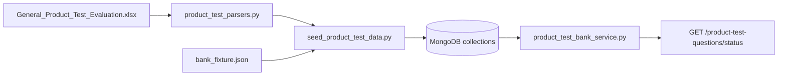

# Product Test — Data Layer

> **Audience:** Developers and analysts configuring Product Test (IHUT) surveys.  
> **Purpose:** Question banks, seeding, health checks, and troubleshooting for Product Test data.  
> **Related:** [seeds-and-fixtures.md](seeds-and-fixtures.md) · [collections-reference.md](collections-reference.md) · [../guides/admin-guide.md](../guides/admin-guide.md)

> **Canonical location.** Legacy path: [product_test/DATA_LAYER.md](../product_test/DATA_LAYER.md) (redirect).

---

The Product Test survey type depends on two MongoDB question banks. If these collections are empty, the Structural Blueprint shows **Phase Empty** even when all parameters are configured.

## Collections

| Collection | Purpose |
|------------|---------|
| `product_test_questions` | In-home use (IHUT) sensory and performance questions |
| `package_test_questions` | Packaging and presentation evaluation (optional module) |
| `product_test_bank_meta` | Last seed timestamp, source (`excel` / `fixture` / `legacy`) |

Questions with `question_status: "fixed"` are **always** included in the blueprint without opening the configuration modal.

## Quick start (new environment)

From the repository root, with MongoDB running and `.env` configured:

```bash
# Windows
.\scripts\seed-pt.ps1

# Linux / macOS
./scripts/seed-pt.sh
```

Or directly:

```bash
python -m backend.scripts.seed_product_test_data
python -m backend.scripts.seed_product_test_data --verify-only
```

## Excel workbook (canonical source)

Place the workbook at the repo root:

```
General_Product_Test_Evaluation.xlsx
```

Sheets:

- `General_Product_Test_Evaluation` — product test bank
- `package test` — package test bank

Custom path:

```bash
python -m backend.scripts.seed_product_test_data --xlsx "path/to/workbook.xlsx"
```

## Fixture fallback (no Excel)

If the workbook is missing, the seed script automatically loads:

```
backend/data/product_test/bank_fixture.json
```

Force fixture only:

```bash
python -m backend.scripts.seed_product_test_data --fixture
```

Dry run (parse only):

```bash
python -m backend.scripts.seed_product_test_data --dry-run
```

## Health check API

Authenticated endpoint for pre-flight checks (used before blueprint generation):

```
GET /product-test-questions/status
```

Base URL: same as API host — e.g. `http://localhost:8081/product-test-questions/status` (native) or `https://<host>/api/product-test-questions/status` (via nginx).

Response:

```json
{
  "product_count": 41,
  "package_count": 7,
  "fixed_count": 18,
  "optional_count": 23,
  "package_fixed_count": 0,
  "package_optional_count": 7,
  "seeded": true,
  "healthy": true,
  "last_seeded_at": "2026-06-28T12:00:00",
  "seed_source": "excel",
  "excel_available": true
}
```

| Field | Meaning |
|-------|---------|
| `seeded` | `product_count > 0` and `fixed_count > 0` — minimum for blueprint |
| `healthy` | `seeded` and `package_count > 0` — package test module can attach |

## Verify without re-seeding

```bash
python -m backend.scripts.seed_product_test_data --verify-only
```

Exit code `0` = bank OK; `1` = run seed.

## Architecture



## Code references

| Component | Path |
|-----------|------|
| Seed script | `backend/scripts/seed_product_test_data.py` |
| Bank service | `backend/services/product_test_bank_service.py` |
| Router | `backend/routers/product_test_questions.py` |
| Wrapper scripts | `scripts/seed-pt.ps1`, `scripts/seed-pt.sh` |

## Troubleshooting

| Symptom | Fix |
|---------|-----|
| Blueprint shows Phase Empty | Run `python -m backend.scripts.seed_product_test_data --verify-only` |
| `seeded: false` in status API | Seed script not run or MongoDB wrong URI in `.env` |
| Only fixed questions in blueprint | Expected without modal config; open **Configure Test Attributes** for optional sections |
| Excel not found warning | Add workbook to repo root or use `--fixture` for dev |

More: [../operations/troubleshooting.md](../operations/troubleshooting.md)

---

*Phase 5 — [docs/README.md](../README.md)*
