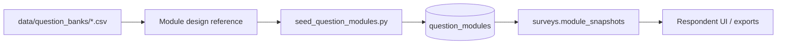

# Question Banks (CSV Reference)

> **Audience:** Research designers, module authors, and developers seeding question modules.  
> **Purpose:** Document the CSV question bank reference files and how they relate to runtime MongoDB modules.  
> **Related:** [../../data/question_banks/README.md](../../data/question_banks/README.md) · [seeds-and-fixtures.md](seeds-and-fixtures.md) · [../releases/module-rollout.md](../releases/module-rollout.md)

---

## Location

```
data/question_banks/
├── 01_purchase_funnel.csv
├── 02_taste_test.csv
├── 03_brand_usage.csv
├── 04_brand_pricing_behavior.csv
├── 05_brand_analyzer.csv
└── README.md
```

These CSVs are **design-time reference** for research module structure. **Runtime** questions for modular surveys live in MongoDB `question_modules` (seeded via `seed_question_modules`).

---

## File Map

| File | Module | Layer | Description |
|------|--------|-------|-------------|
| `01_purchase_funnel.csv` | Purchase Funnel | L2 | Awareness + purchase behavior (7 questions) |
| `02_taste_test.csv` | Taste Test | L2 | Sensory evaluation across brands & attributes |
| `03_brand_usage.csv` | Brand Usage | L5 | Recency, frequency, timing & occasion |
| `04_brand_pricing_behavior.csv` | Brand Pricing | L6 | Budget, stocking, channels & pack sizes |
| `05_brand_analyzer.csv` | Brand Analyzer | L7 | Aided awareness, perception grid, satisfaction |

---

## CSV Schema

| Column | Description |
|--------|-------------|
| `module` | Research module identifier |
| `section` | Logical grouping within module |
| `question_id` | Unique code used in database / exports |
| `question_label` | Short analytical label |
| `type` | `open_single`, `open_loop`, `scq`, `mcq`, `grid`, `loop` |
| `en_text` | English question text |
| `ar_text` | Arabic question text |
| `options_en` | Options (English), pipe-separated |
| `options_ar` | Options (Arabic), pipe-separated |
| `brand_pipeline` | Filtering logic referencing prior questions |
| `example_answer` | Representative answer for documentation |

---

## Question Types

| Code | Meaning | Answer format example |
|------|---------|---------------------|
| `open_single` | Free text (single) | `"Dove"` |
| `open_loop` | Free text (multiple) | `["Dove", "Lux"]` |
| `scq` | Single choice | `"Every day"` |
| `mcq` | Multiple choice | `["Brand A", "Brand B"]` |
| `grid` | Attribute × brand matrix | `{"trustworthy": ["Brand A"]}` |
| `loop` | Per-brand repeated | `{"Brand A": 4, "Brand B": 3}` |

---

## CSV → Runtime Pipeline



1. CSVs inform module structure and `question_id` conventions.
2. `python -m backend.scripts.seed_question_modules` loads active versions into MongoDB.
3. Survey creation snapshots modules into `surveys.module_snapshots`.
4. Ingestor and exports use snapshots + `analytical_mapping` for column labels.

---

## Module Rollout Alignment

| Backend flag | `MODULE_ROLLOUT_STAGE` | Enables |
|--------------|------------------------|---------|
| `seed_only` | Seed DB only | No respondent UI |
| `generic_renderer` | Generic module renderer | |
| `pf_from_db` | Purchase funnel from DB | |
| `usage_pricing` | Brand usage + pricing | |
| `analytics_aliases` | Export alias layer | |
| `full` | All capabilities | |

Frontend mirror: `VITE_MODULE_ROLLOUT_STAGE`

Detail: [../releases/module-rollout.md](../releases/module-rollout.md)

---

## Related Runtime Collections

| Collection | Relationship |
|------------|--------------|
| `question_modules` | Versioned module definitions (from seed) |
| `surveys.module_snapshots` | Frozen copy per survey |
| `surveys.analytical_mapping` | Export column aliases |
| `responses` | Module answers in `answers` / `__structured` |

---

## When to Use CSV vs MongoDB

| Scenario | Use |
|----------|-----|
| Designing new module questions | Edit CSV as spec, then update seed script |
| Running production surveys | MongoDB `question_modules` only |
| Export column headers | `analytical_mapping` + module snapshots |
| Product Test IHUT | Separate bank — [product-test-data-layer.md](product-test-data-layer.md) |

---

## Related Documentation

| Document | Purpose |
|----------|---------|
| [../../data/question_banks/README.md](../../data/question_banks/README.md) | Original CSV README |
| [seeds-and-fixtures.md](seeds-and-fixtures.md) | `seed_question_modules` |
| [../api/exports-api.md](../api/exports-api.md) | Module-aware exports |

---

*Phase 5 — [docs/README.md](../README.md)*
