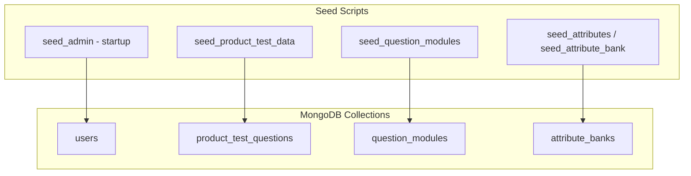

# Seeds & Fixtures

> **Audience:** Developers and operators preparing new environments.  
> **Purpose:** Reference for all seed scripts, fixtures, verification commands, and when to run each.  
> **Related:** [product-test-data-layer.md](product-test-data-layer.md) · [question-banks.md](question-banks.md) · [../technical/local-development.md](../technical/local-development.md)

---

## Overview



---

## Automatic Seeds (No Manual Run)

| What | When | Module |
|------|------|--------|
| **Admin user** | API startup | `backend/utils/seed_utils.seed_admin()` |
| **DB indexes** | API startup | `backend/database.ensure_indexes()` |

Requires `ADMIN_USERNAME` and `ADMIN_PASSWORD` in `.env`.

---

## Product Test Question Banks

**Required for:** Product Test survey blueprints.

| Command | Purpose |
|---------|---------|
| `.\scripts\seed-pt.ps1` | Windows wrapper |
| `./scripts/seed-pt.sh` | Unix wrapper |
| `python -m backend.scripts.seed_product_test_data` | Full seed |
| `python -m backend.scripts.seed_product_test_data --verify-only` | Check only (exit 0/1) |
| `python -m backend.scripts.seed_product_test_data --dry-run` | Parse without write |
| `python -m backend.scripts.seed_product_test_data --fixture` | Force JSON fixture |
| `python -m backend.scripts.seed_product_test_data --xlsx path` | Custom workbook |

**Canonical source:** `General_Product_Test_Evaluation.xlsx` at repo root  
**Fixture fallback:** `backend/data/product_test/bank_fixture.json`

Detail: [product-test-data-layer.md](product-test-data-layer.md)

---

## Question Modules (Phase 9)

**Required for:** DB-driven purchase funnel, brand usage, brand pricing modules.

```bash
python -m backend.scripts.seed_question_modules --dry-run
python -m backend.scripts.seed_question_modules
```

**Rollout:** Set `MODULE_ROLLOUT_STAGE` before enabling respondent UI — see [../releases/module-rollout.md](../releases/module-rollout.md).

**QA:**

```bash
python -m backend.scripts.run_phase9_qa
```

**Collections populated:** `question_modules`

---

## Attribute Banks

| Script | Purpose |
|--------|---------|
| `python -m backend.scripts.seed_attributes` | General attribute banks |
| `python -m backend.scripts.seed_attribute_bank` | Brand attribute banks |

**Collections:** `attribute_banks`, `brand_attribute_banks`

---

## Taste Test / Master Questions (Legacy)

| Script | Purpose |
|--------|---------|
| `python -m backend.scripts.import_taste_questions` | Import master questions |
| `python -m backend.scripts.import_taste_test_data` | Taste test data import |
| `python -m backend.scripts.import_structural_questions` | Structural questions |
| `python -m backend.scripts.migrate_taste_test_question_ids` | ID migration |

**Collections:** `master_questions`, `taste_test_questions`, `structural_questions`

---

## Manual / Dev Utilities

| Script | Purpose |
|--------|---------|
| `python -m backend.scripts.seed_manual_survey` | Dev survey fixture |
| `python -m backend.scripts.reset_admin` | Reset admin password |
| `python -m backend.scripts.reset_admin_v2` | Alternate admin reset |

---

## Migrations (Not Seeds — Run When Documented)

| Script | Purpose |
|--------|---------|
| `python -m backend.scripts.migrate_pf_response_ids` | PF response ID migration |
| `python -m backend.scripts.migrate_product_test_snapshots` | PT snapshot schema |
| `python -m backend.scripts.cleanup_duplicate_survey_reports` | Fix duplicate report index |

Always run `--dry-run` first when supported.

---

## CSV Question Banks (Reference Data)

Static CSV files in `data/question_banks/` — used as **reference** for module design; runtime modules are seeded into MongoDB via `seed_question_modules`.

See [question-banks.md](question-banks.md).

---

## New Environment Checklist

| Step | Command / action |
|------|------------------|
| 1 | Copy `.env.example` → `.env`, set `MONGO_URI`, secrets |
| 2 | Start MongoDB (+ Redis if using queue/PPTX) |
| 3 | Start API once (admin seeded automatically) |
| 4 | `python -m backend.scripts.seed_product_test_data --verify-only` |
| 5 | If Product Test: run seed-pt script |
| 6 | If modular surveys: `seed_question_modules` |
| 7 | Log in with `ADMIN_USERNAME` / `ADMIN_PASSWORD` |
| 8 | Create test survey + token; complete L1/L2 |

---

## Verification Commands Summary

```bash
# Product Test banks
python -m backend.scripts.seed_product_test_data --verify-only

# Module rollout QA
python -m backend.scripts.run_phase9_qa

# Capture auth (pre-PPTX deploy)
python -m backend.scripts.verify_capture_auth_rollout --survey-id <id> --probe-api

# Config loads
python -c "from backend.config import settings; print(settings.ENV, settings.DATABASE_NAME)"
```

---

## Related Documentation

| Document | Purpose |
|----------|---------|
| [product-test-data-layer.md](product-test-data-layer.md) | Product Test detail |
| [question-banks.md](question-banks.md) | CSV module reference |
| [collections-reference.md](collections-reference.md) | Target collections |

---

*Phase 5 — [docs/README.md](../README.md)*
