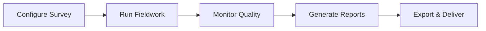

# Analyst Guide

> **Audience:** Research analysts, insights managers, and fieldwork coordinators.  
> **Purpose:** Day-to-day workflow for surveys, fieldwork monitoring, report generation, exports, and interpreting outputs.  
> **Prerequisites:** Portal login with **analyst** or **admin** role.  
> **Related:** [admin-guide.md](admin-guide.md) · [glossary.md](../handover/glossary.md) · [survey-lifecycle.md](survey-lifecycle.md)

---

## Analyst Role Summary

Analysts own the **research execution loop**:

You can do everything an admin does **except** user management and admin-only system pages (platform analytics, AI telemetry, attribute banks — unless you also hold admin role).

---

## Daily Workflow Overview

| Phase | Activities | Portal areas |
|-------|------------|--------------|
| **Setup** | Pick template, configure brands/gates/quotas, generate tokens | Create Survey, Tokens |
| **Fieldwork** | Distribute links, track completion, chase dropouts | Responses, Dashboard |
| **Analysis** | Generate reports, review charts, validate data | Survey Report, Analytics |
| **Delivery** | Export Excel/PPTX, prepare client narrative | Report page, Export API |

---

## Step 1: Configure and Launch a Study

Follow the same survey creation flow as admins (see [admin-guide.md](admin-guide.md) Workflow 2).

### Analyst-specific focus areas

**Screening design**
- Align gates with client brief (age, gender, geography, SES).
- Set quotas to match recruitment plan — avoid cells that are impossible to fill.

**Brand configuration**
- Client brand + correct competitor set.
- Order may affect rotation in Layer 2 — confirm with methodology.

**Layer 2 path**
- Prefer **in-app gateway** for tighter data control and fewer webhook failures.
- Use Google Forms only when client or methodology requires it.

**Product Test**
- Confirm question banks are seeded before blueprint generation.
- Verify structural blueprint is not "Phase Empty".

---

## Step 2: Run Fieldwork

### Generate and distribute tokens
1. Open survey → Token Management.
2. Generate batch size matching recruitment wave.
3. Provide links to field team with instructions:
   - One person per link
   - Complete on mobile if study is mobile-optimized
   - Do not refresh and restart with a different device mid-survey if avoidable

### Monitor the dashboard

Use **lifecycle filters** on the Responses page:

| Metric | Healthy signal | Warning signal |
|--------|----------------|----------------|
| **Completion rate** (`submitted` / `passed`) | Steady climb toward target | Many stuck at `passed` |
| **Rejection rate** (`failed` / started) | Matches screening intent | Sudden spike — wrong audience recruited |
| **Pending** (`unused`) | Decreasing over time | Large unused batch — links not distributed |
| **Quota fill** | Even across cells | One cell full, others empty |

### Quality checks during fieldwork
- Spot-check 3–5 complete respondents — answers look genuine?
- Check for duplicate phones across tokens (may indicate link sharing).
- Compare completes to recruitment agency reported N.

---

## Step 3: Generate Reports

### When to generate
- **Interim report** — after ~30–50% completes for early read (optional).
- **Final report** — when fieldwork closes and quotas are met (or client approves close).

### How to generate
1. Navigate to survey → **Report** or **Survey Reports**.
2. Click **Generate Report** (or refresh if report exists but fieldwork continued).
3. Wait for pipeline completion. Large studies take longer.

### What the pipeline produces
| Output | Description |
|--------|-------------|
| **Charts** | Means, distributions, radar plots, funnel charts |
| **Tables** | Demographic splits, brand comparisons |
| **AI narratives** | Per-chart insights, executive summary (requires OpenAI configured) |
| **Structured data** | Stored in database for exports |

### If AI narratives are missing
Reports still show **data-only** charts. AI requires OpenAI API key in environment. Escalate to operator if AI was expected but absent.

---

## Step 4: Interpret Report Outputs

### Demographics
Validate sample matches target.profile. Flag over/under-indexed segments to client.

### Brand evaluation charts
- **Means** — average rating per brand per attribute.
- **Top-two-box (T2B)** — % rating in top two scale points; common in sensory research.
- **Radar charts** — multi-attribute brand profiles at a glance.

### Purchase funnel
Typical sequence: Awareness → Consideration → Trial → Purchase.

Look for:
- Drop-off between stages (e.g. high awareness, low trial).
- Client brand vs competitors at each stage.

### Brand awareness
| Metric | Meaning |
|--------|---------|
| **Top-of-mind** | First brand named unaided |
| **Unaided awareness** | Brand mentioned without prompt |
| **Aided awareness** | Brand recognized from a list |

### AI-generated content
Treat AI narratives as **draft interpretation**:
- Verify against charts — AI can misread edge cases.
- Edit wording for client presentations.
- Use executive summary as starting point, not final legal claim.

---

## Step 5: Excel Exports

For external analysis (SPSS, R, internal modeling), use the **Exports API**.

### Prerequisites
- Valid JWT token (login to portal, use bearer token in API client).
- Survey ID for the study you are exporting.

### Export types

| Export | Endpoint | Format | Rows |
|--------|----------|--------|------|
| **BA & PF** | `GET /ba-pf/{survey_id}` | Flat Excel | One per respondent |
| **Product scalers** | `GET /product-scalers/{survey_id}` | Stacked Excel | One per brand per respondent |

### Test structure first (no live data needed)
| Endpoint | Purpose |
|----------|---------|
| `GET /exports/test/ba-pf` | Download column structure sample |
| `GET /exports/test/product-scalers` | Download scaler structure sample |

### Using Postman or cURL
1. Login → copy JWT.
2. Set header: `Authorization: Bearer <token>`.
3. Request export URL on your API host.
4. Save binary response as `.xlsx`.

**Note:** Host and port depend on deployment. Confirm with your operator (guides may reference different ports across environments).

### BA & PF column logic (summary)
- **TOPOFMIND** — from awareness Q1.
- **Aided_Awareness** — 1/0 from aided list.
- **Unaided_Awareness** — 1/0 from unaided responses.

### Product scalers column logic (summary)
- Columns keyed as `{brand}_{question_id}`.
- Headers use human labels from template (e.g. AfterTaste, Texture).
- Gender and age included per row for slicing.

**Full technical reference:** [exports-api.md](../api/exports-api.md)

---

## Step 6: PPTX Delivery

### When to use
Client meetings, steering committees, workshops — when interactive web report is not enough.

### Process
1. From Survey Report, request **PPTX export**.
2. Job enters **background queue** — do not close session immediately if UI polls status.
3. Download completed file.
4. Quick QA: spot-check 5 slides (title, sample size, key charts, brand names).

### If export fails
- Retry once.
- Check with operator: Redis queue, Playwright worker, disk space.
- Fallback: manual screenshots from web report.

---

## Step 7: Comparison Analytics

Analysts can access **Comparison Analytics** (`/analytics/compare`) to contrast metrics across surveys (e.g. Wave 1 vs Wave 2, or client vs competitor tracking).

Use for:
- Tracking studies over time
- Methodology validation (pilot vs main wave)

---

## Client Delivery Checklist

Before sending to client:

- [ ] Sample size and quotas documented
- [ ] Fieldwork dates noted
- [ ] Key charts match narrative
- [ ] AI text reviewed for accuracy
- [ ] Brand names and client name correct on every slide
- [ ] Excel exports open without errors
- [ ] PPTX opens in PowerPoint / Google Slides
- [ ] Caveats documented (e.g. low base size in subgroups)

---

## Analyst Troubleshooting

| Issue | Check |
|-------|-------|
| Export returns 401 | JWT expired — re-login |
| Export empty rows | No `submitted` responses for survey_id |
| Report numbers look wrong | Wrong survey selected; or partial fieldwork |
| Funnel chart missing brands | Brand config on survey vs responses |
| Many orphan submissions | Google Forms webhook path — escalate to developer |
| Quota seems bypassed | Rare race under high traffic — document and escalate |

---

## Related Documentation

| Document | Purpose |
|----------|---------|
| [admin-guide.md](admin-guide.md) | Templates, tokens, user admin |
| [glossary.md](../handover/glossary.md) | BA, PF, T2B, lifecycle terms |
| [respondent-flow.md](respondent-flow.md) | Token states |
| [product-test-data-layer.md](../data/product-test-data-layer.md) | Product Test data setup |
| [pptx-export.md](../analytics/pptx-export.md) | PPTX operations (technical) |

---

*Part of the Questioner documentation handover — [docs/README.md](../README.md)*
