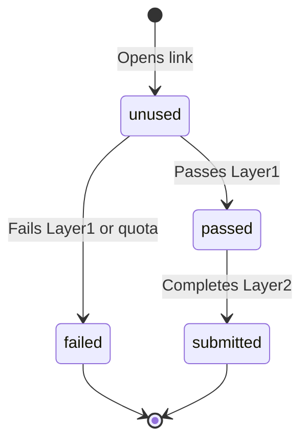

# Respondent Flow

> **Audience:** Field teams, client stakeholders, support staff, and analysts explaining the participant experience.  
> **Purpose:** Plain-language explanation of the `/s/{token}` journey and token states — no code.  
> **Related:** [glossary.md](../handover/glossary.md) · [survey-lifecycle.md](survey-lifecycle.md) · [product-overview.md](../handover/product-overview.md)

---

## What the Respondent Sees

A respondent does **not** log in to Questioner. They receive a **link** from a recruiter, panel, or SMS campaign:

```
https://your-domain.com/s/abc123-def456-...
```

That link contains a **token** — a unique key tied to one survey and one participation slot.

---

## Journey Overview



| Stage | What happens | Token status after |
|-------|--------------|-------------------|
| **1. Open link** | Survey loads; branding and Layer 1 questions appear | `unused` (until L1 submitted) |
| **2. Layer 1 screening** | Demographics + eligibility checks | `passed` or `failed` |
| **3. Layer 2 evaluation** | Main study questions (if passed) | `submitted` when done |
| **4. End** | Thank-you or rejection screen | Terminal state |

---

## Step 1: Opening the Link

### What the platform checks
- Token exists and belongs to an active survey.
- Token is not already `failed` or `submitted`.
- Token has not expired (if expiry is configured).

### What the respondent sees
- Welcome / study introduction
- Layer 1 questions (name, phone, age, gender, area, education, etc.)
- Mobile-friendly form with validation (e.g. phone format)

### If the link does not work
| Message / behavior | Likely reason |
|--------------------|---------------|
| Invalid or expired link | Token expired or typo in URL |
| Already completed | Token already `submitted` |
| Study closed | Survey no longer accepting responses |

*Support should issue a new token from a fresh batch if recruitment allows.*

---

## Step 2: Layer 1 — Screening

**Goal:** Confirm the respondent matches the target profile before they see product or brand questions.

### Typical questions
- Full name
- Mobile phone number (primary identity key)
- Age, gender
- City / area / location
- Education, marital status (study-dependent)
- Screening MCQs (e.g. category usage)

### What happens behind the scenes
1. Answers are validated (format, required fields).
2. **Screening gates** are applied (e.g. age must be 18–35).
3. **Quotas** are checked (e.g. only 50 females in age band allowed).
4. Respondent profile is saved (linked to phone number).

### Outcomes

#### Passed screening → status `passed`
- Respondent sees a transition screen.
- Layer 2 begins (in-app) or redirect to Google Form (legacy path).
- Phone number is stored on the token.

#### Failed screening → status `failed` (terminal)
- Respondent sees a polite **rejection / not eligible** message.
- They cannot continue to Layer 2 with the same token.
- Common reasons:
  - Wrong age, gender, or area
  - Quota for their demographic is full
  - Failed a screening question (e.g. does not use category)

---

## Step 3: Layer 2 — Evaluation

Only respondents with status **`passed`** reach this step.

### Path A — In-app (modern, inside Questioner)

The respondent stays on the same site and sees:
- Brand-by-brand evaluation pages
- Rating scales (taste, texture, packaging, etc.)
- Purchase funnel questions (awareness, consideration, purchase)
- Optional modules (brand usage, pricing)
- Product Test tasks (IHUT, packaging) if configured
- Optional voice feedback recordings

When they submit the final page:
- Answers are saved.
- Token moves to **`submitted`**.
- Confirmation / thank-you screen.

### Path B — Google Forms (legacy)

The respondent is **redirected** to an external Google Form:
- Token is pre-filled in a hidden field.
- They complete the form on Google.
- On submit, Google Apps Script sends answers back to Questioner.
- Token moves to **`submitted`** if webhook succeeds.

**Respondent tip:** Do not edit or remove the token field on Google Forms.

---

## Token States Explained

| Status | Plain language | Can continue? |
|--------|----------------|---------------|
| **unused** | Link created; screening not finished (or not started) | Yes — complete Layer 1 |
| **passed** | Qualified; Layer 2 not finished | Yes — complete Layer 2 |
| **failed** | Not eligible or quota full | No — journey ends |
| **submitted** | Fully complete | No — journey ends (success) |

### Dashboard labels (what analysts see)

| Dashboard term | Token status |
|----------------|--------------|
| Pending | `unused` |
| Verified incomplete | `passed` |
| Verified complete | `submitted` |
| Rejected | `failed` |

---

## Identity and Privacy

| Topic | Behavior |
|-------|----------|
| **Login** | Respondents never create accounts |
| **Identifier** | Phone number is the main key after Layer 1 |
| **Token sharing** | Should be discouraged — one token = one journey |
| **Return visits** | If token is `passed`, respondent may resume Layer 2 (device/browser dependent) |
| **Data use** | Governed by client privacy policy and recruitment consent |

---

## Timeline Example

```
10:00  Respondent opens link                    → unused
10:05  Submits Layer 1 (age 28, female, Cairo) → passed
10:06  Starts Layer 2 brand evaluation
10:18  Submits final Layer 2 page               → submitted
```

**Dropout example:**

```
14:00  Opens link, passes Layer 1               → passed
14:02  Closes browser during Layer 2           → still passed
       (Analyst sees "verified incomplete")
```

---

## What Respondents Should Be Told (Field Script)

Suggested recruiter instructions:

1. Use the link on the device you will complete the survey with.
2. Answer honestly — wrong demographics may disqualify you.
3. Do not share your link with others.
4. If using Google Forms, do not change the pre-filled code field.
5. Complete in one sitting if possible (especially Layer 2).
6. Allow microphone permission only if the study asks for voice feedback.

---

## Visual Flow

```
     ┌──────────────┐
     │  Open /s/    │
     │    token     │
     └──────┬───────┘
            │
            ▼
     ┌──────────────┐
     │   Layer 1    │
     │  Screening   │
     └──────┬───────┘
            │
     ┌──────┴──────┐
     │             │
     ▼             ▼
┌─────────┐   ┌─────────┐
│ FAILED  │   │ PASSED  │
│ (stop)  │   └────┬────┘
└─────────┘        │
                   ▼
            ┌──────────────┐
            │   Layer 2    │
            │  Evaluation  │
            └──────┬───────┘
                   │
                   ▼
            ┌──────────────┐
            │  SUBMITTED   │
            │  (complete)  │
            └──────────────┘
```

---

## Related Documentation

| Document | Purpose |
|----------|---------|
| [survey-lifecycle.md](survey-lifecycle.md) | Where respondent flow fits in full study |
| [glossary.md](../handover/glossary.md) | Token, Layer 1/2 definitions |
| [admin-guide.md](admin-guide.md) | How teams monitor respondents |
| [local-development.md](../technical/local-development.md) | Test a link locally |

---

*Part of the Questioner documentation handover — [docs/README.md](../README.md)*
