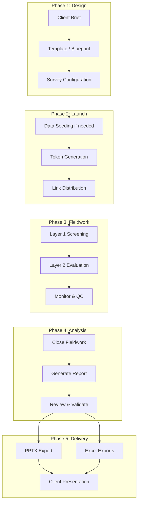
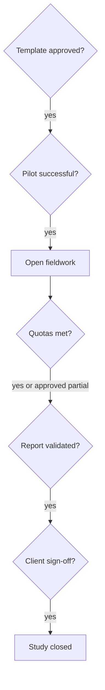

# Survey Lifecycle

> **Audience:** Admins, analysts, client stakeholders, and operations teams.  
> **Purpose:** End-to-end lifecycle from study design through fieldwork to final report and client delivery.  
> **Related:** [product-overview.md](../handover/product-overview.md) · [admin-guide.md](admin-guide.md) · [analyst-guide.md](analyst-guide.md) · [respondent-flow.md](respondent-flow.md)

---

## Lifecycle at a Glance



---

## Phase 1: Study Design

**Owner:** Client + Analyst (+ Admin for template governance)  
**Duration:** Days to weeks depending on complexity

### 1.1 Client brief
| Input | Examples |
|-------|----------|
| Objectives | Brand tracking, product test, packaging evaluation |
| Target audience | Age, gender, geography, category users |
| Brands | Client brand + competitor set |
| Sample size | Total N and quota cells |
| Timeline | Field start, reporting deadline |
| Deliverables | Web report, PPTX, raw Excel |

### 1.2 Template selection
- Choose existing **template** matching study type, or create new blueprint.
- Confirm Layer 1 fields and Layer 2 modules (purchase funnel, product test, etc.).
- Lock methodology decisions before survey creation.

### 1.3 Survey configuration
- Create **survey** from template → system stores **template snapshot**.
- Configure:
  - Company name and branding context
  - Brands and category
  - Screening gates and quotas
  - Layer 2 delivery path (in-app vs Google Forms)
- Status: typically **draft** until launch approval.

### 1.4 Pre-launch technical checks
| Check | Required when |
|-------|---------------|
| Product Test question banks seeded | Product Test surveys |
| Question modules seeded | Modular PF / usage / pricing studies |
| Google Form + Apps Script configured | Legacy Layer 2 path |
| Staging test with test token | Always recommended |

**Gate:** Client / lead analyst sign-off before token generation.

---

## Phase 2: Launch

**Owner:** Analyst  
**Duration:** Hours to days

### 2.1 Activate fieldwork
- Move survey from draft to active (operational convention — exact UI may vary).
- Confirm recruitment agency has scripts and quota table.

### 2.2 Generate tokens
- Generate batch(es) sized to recruitment plan.
- Record **batch ID** → agency mapping for support.

### 2.3 Distribute links
- Channels: SMS, panel portal, QR codes, intercept recruiters.
- Each link: `https://domain.com/s/{token}`

### 2.4 Pilot (recommended)
- 5–10 test tokens with internal or trusted respondents.
- Verify: screening works, Layer 2 completes, data appears in Responses, report generates.

---

## Phase 3: Fieldwork

**Owner:** Analyst + recruitment partners  
**Duration:** Days to weeks

### 3.1 Respondent journey
See [respondent-flow.md](respondent-flow.md) for participant perspective.

Summary:
```
unused → passed → submitted   (success path)
unused → failed               (screen-out path)
passed → (abandoned)          (dropout — still "verified incomplete")
```

### 3.2 Monitoring cadence

| Frequency | Action |
|-----------|--------|
| **Daily** | Check completion vs targets; quota fill by cell |
| **Every 2–3 days** | Rejection rate; dropout rate after L1 |
| **Weekly** | Interim read for client (optional) |
| **Ad hoc** | Investigate orphan submissions or support tickets |

### 3.3 Quality control
- Spot-check complete records for straight-lining or nonsense answers.
- Exclude fraudulent tokens if policy allows (excluded flag).
- Pause recruitment on cells that hit quota.

### 3.4 Mid-fieldwork changes
| Change | Impact |
|--------|--------|
| Tighten screening | More rejections — communicate to recruiters |
| Increase quota | May need more tokens |
| Change Layer 2 questions | **Avoid** — survey uses creation snapshot; may need new survey |
| Extend token expiry | Generate new batch if old links expired |

---

## Phase 4: Analysis

**Owner:** Analyst  
**Duration:** 1–5 days after fieldwork close

### 4.1 Close fieldwork
- Stop link distribution.
- Confirm total `submitted` meets minimum analysis N.
- Document exclusions and reasons.

### 4.2 Generate report
1. Open Survey Report for the study.
2. Trigger **Generate Report**.
3. Pipeline runs: ingest → aggregate → charts → AI narratives (if enabled).
4. Wait for completion.

### 4.3 Validate outputs
| Check | Why |
|-------|-----|
| Sample size on report matches `submitted` count | Data integrity |
| Demographics match quota plan | Weighting decisions |
| Brand names correct | Client sensitivity |
| Key metrics directionally sensible | Catch ingestion bugs |
| AI text matches charts | AI is assistive, not authoritative |

### 4.4 Iteration
- Refresh report if late submissions allowed (rare after close).
- Regenerate after data fixes (developer-supported).

---

## Phase 5: Delivery

**Owner:** Analyst → Client  
**Duration:** 1–3 days

### 5.1 Deliverables package

| Deliverable | Format | Typical use |
|-------------|--------|-------------|
| Web report | Browser | Interactive review with client |
| PPTX deck | PowerPoint | Steering committee, workshops |
| BA & PF Excel | `.xlsx` | Client analytics team, modeling |
| Product scalers Excel | `.xlsx` | Sensory / product deep dives |

See [analyst-guide.md](analyst-guide.md) for export procedures.

### 5.2 Client presentation
- Walk through executive summary and key charts.
- Document methodology appendix (sample, dates, quotas, exclusions).
- Capture follow-up questions for wave 2 or ad-hoc cuts.

### 5.3 Archive
- Store final exports and report snapshot.
- Retain token batch log and fieldwork dates for audit.

---

## Lifecycle Timeline Example

| Week | Activity | Status |
|------|----------|--------|
| W-2 | Client brief, template review | Design |
| W-1 | Survey config, pilot tokens, UAT | Launch prep |
| W1 | Token batch 1 distributed, daily monitoring | Fieldwork |
| W2 | Quota fill, interim read | Fieldwork |
| W3 | Close fieldwork, final N = 412 | Close |
| W3 | Generate report, QA | Analysis |
| W4 | PPTX + Excel to client, presentation | Delivery |

---

## Roles Across the Lifecycle

| Phase | Admin | Analyst | Client | Respondent | Developer | Operator |
|-------|:-----:|:-------:|:------:|:----------:|:---------:|:--------:|
| Design | A | R | C | — | — | — |
| Launch | I | R | I | — | — | I |
| Fieldwork | I | R | I | R | — | I |
| Analysis | I | R | I | — | C | I |
| Delivery | I | R | C | — | — | — |

*R = Responsible, A = Accountable, C = Consulted, I = Informed*

Full matrix: [stakeholder-map.md](../handover/stakeholder-map.md)

---

## Decision Points & Gates



---

## Common Lifecycle Pitfalls

| Pitfall | Prevention |
|---------|------------|
| Launching without pilot | Always run 5+ test completions |
| Quota cells too small | Model feasibility before fieldwork |
| Google Form webhook not tested | End-to-end test on staging |
| Product Test banks empty | Seed before blueprint build |
| Reporting before fieldwork close | distorts N and narratives |
| Sharing tokens publicly | Invalidates sample — use single-use discipline |

---

## After the Study

| Follow-up | Action |
|-----------|--------|
| **Tracking wave** | Duplicate survey config; new token batch; comparison analytics |
| **Methodology fix** | New template version; do not mutate live survey schema |
| **Platform issues** | Log bugs for developer; update ops runbooks |
| **Documentation** | Note learnings for next wave in internal wiki |

---

## Related Documentation

| Document | Purpose |
|----------|---------|
| [executive-overview.md](../handover/executive-overview.md) | Why the platform exists |
| [admin-guide.md](admin-guide.md) | How to configure studies |
| [analyst-guide.md](analyst-guide.md) | Reports and exports |
| [respondent-flow.md](respondent-flow.md) | Participant journey |
| [teammate-handover-checklist.md](../handover/teammate-handover-checklist.md) | Onboarding sequence |

---

*Part of the Questioner documentation handover — [docs/README.md](../README.md)*
