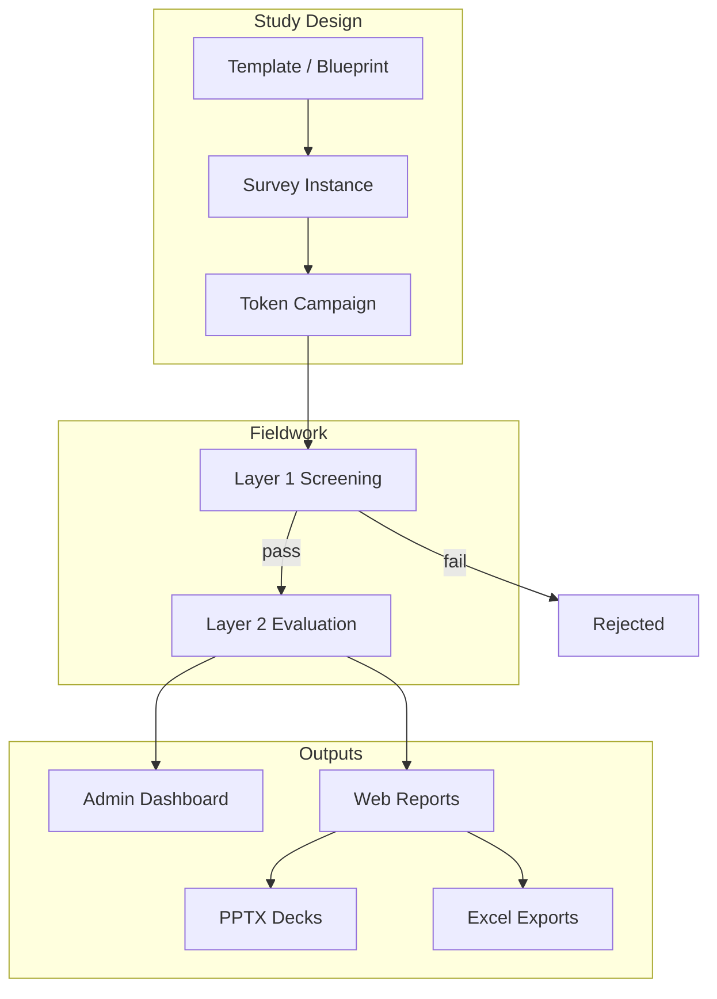

# Executive Overview

> **Audience:** Leadership, client stakeholders, product owners, and anyone joining the project without a technical background.  
> **Purpose:** Explain what Questioner is, why it exists, who uses it, and what business problems it solves.  
> **Related:** [product-overview.md](product-overview.md) · [stakeholder-map.md](stakeholder-map.md) · [survey-lifecycle.md](../guides/survey-lifecycle.md)

---

## What Is Questioner?

**Questioner** is a market-research and survey qualification platform. It helps research teams run controlled studies where only the right participants complete the full questionnaire, and where results are collected, analyzed, and reported in one place.

At its core, the platform separates **screening** from **evaluation**:

1. **Layer 1 (Screening)** — Collect demographics, validate eligibility, enforce quotas, and reject unsuitable respondents early.
2. **Layer 2 (Evaluation)** — Qualified participants complete the main research questionnaire (product ratings, brand awareness, purchase funnel, etc.).

Each participant enters through a **unique secure link** (token). The platform tracks their progress from first click to final submission and supports automated reporting with charts, AI-written insights, Excel exports, and presentation decks.

---

## Why Does It Exist?

Traditional survey tools (e.g. Google Forms alone) are good at collecting answers but weak at:

| Problem | How Questioner addresses it |
|---------|----------------------------|
| **Wrong respondents completing full surveys** | Layer 1 screening + quotas reject ineligible people before expensive Layer 2 questions |
| **No link between screening and evaluation** | Tokens bind identity (phone) across both layers |
| **Manual report building** | Analytics pipeline generates web reports, charts, and PPTX decks |
| **Inconsistent study setup** | Versioned **templates** (blueprints) standardize question structure across projects |
| **Campaign control** | Token batches let teams issue, track, and expire access links per study |
| **Fragmented analysis** | Brand awareness, purchase funnel, product scalers, and product test modules feed one data model |

Questioner was built for **speed and data quality** in consumer and product research — especially taste tests, brand trackers, and product evaluations where sample integrity matters.

---

## Who Uses It?

| Role | Who they are | Primary goal |
|------|--------------|--------------|
| **Admin** | Platform owner or research operations lead | Configure studies, manage users, oversee the full system |
| **Analyst** | Research analyst or insights team | Create surveys, monitor fieldwork, generate reports and exports |
| **Client** | External brand or sponsor (limited access) | View assigned studies and outcomes (when enabled) |
| **Respondent** | Survey participant | Complete screening and evaluation via a token link — no login required |
| **Developer** | Engineering team | Maintain features, integrations, and data pipelines |
| **Operator** | DevOps / release manager | Deploy, monitor, and keep environments healthy |

See [stakeholder-map.md](stakeholder-map.md) for detailed responsibilities.

---

## What Business Problems Does It Solve?

### 1. Sample quality and quota control
Research studies often need specific demographics (age, gender, area, education, socio-economic segment). Questioner enforces **screening gates** and **quotas** so field teams do not over-recruit the wrong profiles or blow past cell limits.

### 2. End-to-end study operations
One platform covers study design → token distribution → respondent journey → response storage → analytics → client-ready outputs. Teams spend less time stitching spreadsheets and slides together manually.

### 3. Repeatable research methodologies
**Templates** encode proven study structures (taste test, product test, brand awareness). New **surveys** snapshot a template at creation time, so live fieldwork is not disrupted when templates evolve.

### 4. Actionable insights at speed
The analytics layer produces:
- Interactive web reports with charts and distributions
- AI-generated narratives (executive summary, SWOT, chart commentary)
- **PPTX** export for stakeholder presentations
- **Excel exports** (Brand Awareness & Purchase Funnel, product scalers) for external analysis

### 5. Specialized research modules
Beyond basic surveys, the platform supports:
- **Product Test** — In-home use (IHUT) and packaging evaluation question banks
- **Research modules** — Purchase funnel, brand usage, brand pricing behavior
- **Voice feedback** — Audio capture, transcription, and thematic analysis

### 6. Campaign traceability
Every respondent is tied to a **token** with a clear status (`unused` → `passed` / `failed` → `submitted`). Operations teams can see who completed, who dropped off after screening, and who was rejected — without guessing from raw form exports.

---

## Platform Capabilities at a Glance

---

## What Questioner Is Not

Understanding boundaries helps set expectations:

| Questioner is | Questioner is not |
|---------------|-------------------|
| A qualification + research operations platform | A generic form builder for any use case |
| Strong at controlled token-based fieldwork | A panel provider or respondent recruitment source |
| Able to integrate Google Forms (legacy path) | A replacement for all Google Workspace workflows |
| AI-augmented for reporting | Fully autonomous research design — humans still configure studies |

---

## Success Metrics Teams Typically Care About

| Metric | Meaning |
|--------|---------|
| **Screen-out rate** | % of tokens that fail Layer 1 (by design or quota) |
| **Completion rate** | % of passed tokens that reach `submitted` |
| **Quota fill** | How fast demographic cells reach their targets |
| **Time to report** | How quickly a study moves from last submission to client-ready deck |
| **Data integrity** | Orphan/mismatched submissions kept near zero |

---

## Getting Deeper Without Code

| If you want to… | Read next |
|-----------------|-----------|
| Understand features and modules | [product-overview.md](product-overview.md) |
| Know who does what | [stakeholder-map.md](stakeholder-map.md) |
| Learn domain language | [glossary.md](glossary.md) |
| Follow a study start to finish | [survey-lifecycle.md](../guides/survey-lifecycle.md) |
| Run the platform as an admin | [admin-guide.md](../guides/admin-guide.md) |
| Work with reports and exports | [analyst-guide.md](../guides/analyst-guide.md) |
| Understand the respondent experience | [respondent-flow.md](../guides/respondent-flow.md) |

---

*Part of the Questioner documentation handover — [docs/README.md](../README.md)*
