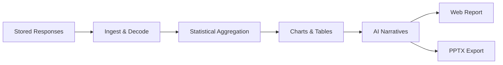
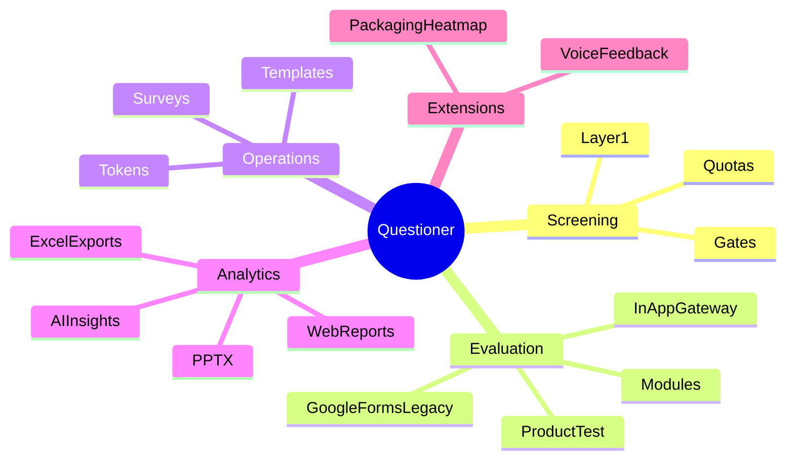

# Product Overview

> **Audience:** Product owners, client leads, admins, analysts, and stakeholders who need a full picture of platform capabilities.  
> **Purpose:** Describe what Questioner does across screening, evaluation, analytics, and specialized modules — without code.  
> **Related:** [executive-overview.md](executive-overview.md) · [survey-lifecycle.md](../guides/survey-lifecycle.md) · [glossary.md](glossary.md)

---

## Platform in One Sentence

Questioner qualifies respondents through **Layer 1**, routes passers to **Layer 2** research questions, stores structured responses, and turns them into **dashboards, AI reports, Excel exports, and PPTX presentations**.

---

## Core Concepts

### Templates (Blueprints)

A **template** is a reusable study design. It defines:

- Layer 1 question structure (demographics, screening fields)
- Layer 2 question structure (brand evaluations, scalers, modules)
- Screening rules and validation logic
- Study type (e.g. taste test, product test, brand tracker)

Templates are **versioned**. When you change a template, previous versions remain available for audit and rollback.

### Surveys (Study Instances)

A **survey** is a live study created from a template. It includes:

- Client/company name and branding context
- Brand list, category, and study-specific configuration
- Screening gates and quota targets
- A **snapshot** of the template at creation time (so fieldwork stays stable)

Surveys move through operational states (e.g. draft → active → completed) as fieldwork progresses.

### Tokens (Secure Access Links)

A **token** is a unique identifier (UUID) that grants one respondent access to one survey. Tokens are:

- Generated in **batches** (e.g. 500 or 1,000 at once)
- Shared as links: `https://your-domain.com/s/{token}`
- Tracked through a **status lifecycle** (see [respondent-flow.md](../guides/respondent-flow.md))
- Optionally bound to a phone number after Layer 1

Tokens are the primary access control for respondents — they do not log in.

---

## Layer 1 — Screening

**Purpose:** Decide quickly whether a participant is eligible for the full study.

### What happens
1. Respondent opens their token link.
2. They answer demographic and screening questions (name, phone, age, gender, area, education, etc.).
3. The platform validates answers against **screening gates** configured on the survey.
4. **Quotas** are checked (global limits and per-demographic buckets).
5. Result:
   - **Pass** → token moves to `passed`; respondent may continue to Layer 2
   - **Fail** → token moves to `failed`; respondent sees a rejection message

### Why it matters
Layer 1 protects study integrity. Teams avoid paying for or analyzing responses from people outside the target profile.

### Data captured
- Respondent profile (upserted by phone number)
- Layer 1 answers stored with `source: "layer1"`
- Token status and quota counters updated

---

## Layer 2 — Evaluation

**Purpose:** Collect the main research data from qualified participants only.

### Two delivery paths

| Path | Description | When used |
|------|-------------|-----------|
| **In-app gateway (modern)** | Layer 2 questions render inside Questioner — brand-by-brand pages, purchase funnel, modules | Default for new studies |
| **Google Forms (legacy)** | Respondent is redirected to an external Google Form; answers return via webhook | Older studies or external form requirements |

### Typical Layer 2 content
- Product or brand evaluation scales (taste, texture, packaging, etc.)
- Brand awareness questions (top-of-mind, aided/unaided)
- Purchase funnel (awareness → consideration → purchase)
- Modular research blocks (brand usage, pricing behavior)
- Product Test phases (in-home use, packaging evaluation)

### Completion
When Layer 2 is submitted, the token moves to **`submitted`** — a terminal success state. Responses are stored with `source: "in_app_gateway"` or `source: "layer2"` depending on the path.

---

## Analytics & Reports

Once responses exist, the **analytics pipeline** transforms raw data into stakeholder-ready outputs.

### Pipeline stages (conceptual)

### Web reports
Interactive report viewer in the admin/analyst portal:
- Demographic breakdowns
- Brand comparison charts (radar, bar, distribution)
- Purchase funnel visualizations
- AI-written chart insights and executive summary
- SWOT-style synthesis (where configured)

### PPTX export
Automated PowerPoint deck generation for client presentations. Uses a hybrid approach (programmatic slides + captured chart visuals). Runs as a **background job** when analysts request export.

### Excel exports
Structured spreadsheets for external analysis tools:
- **BA & PF** — Brand Awareness & Purchase Funnel (one row per respondent)
- **Product scalers** — Stacked brand-level attributes (one row per brand per respondent)

See [analyst-guide.md](../guides/analyst-guide.md) for workflow details.

---

## Product Testing

**Product Test** is a specialized survey type for consumer product research (IHUT — in-home use testing).

### Components
| Component | Purpose |
|-----------|---------|
| **Product test question bank** | Sensory and performance questions (taste, texture, overall liking, etc.) |
| **Package test question bank** | Packaging and shelf-appeal evaluation |
| **Structural blueprint** | Auto-assembled study structure from configured parameters + question bank |

### Operational note
Product Test surveys require the question banks to be **seeded** in the database before blueprint generation works. Empty banks show as "Phase Empty" in the UI.

**Technical reference (when needed):** [product-test-data-layer.md](../data/product-test-data-layer.md)

---

## Research Modules

Modular question blocks extend standard surveys with standardized research methodologies:

| Module | Purpose |
|--------|---------|
| **Purchase funnel** | Brand awareness through purchase intent |
| **Brand usage** | Usage frequency, occasions, brand repertoire |
| **Brand pricing behavior** | Price sensitivity and value perception |

Modules are database-driven and can be rolled out in stages (see [module-rollout.md](../releases/module-rollout.md) for operations teams).

---

## Voice Feedback

**Voice feedback** lets respondents record short audio answers instead of (or in addition to) typed responses.

### Capabilities
- Audio upload with duration and file-size limits
- Speech-to-text transcription
- NLP analysis and thematic clustering
- Dashboard for reviewing verbatim themes

Useful for exploratory research, open-ended diagnostics, and markets where voice input is preferred.

---

## Admin Dashboard Capabilities

| Area | What admins and analysts can do |
|------|--------------------------------|
| **Templates** | Create, version, and manage survey blueprints |
| **Surveys** | Launch studies, configure brands, gates, quotas |
| **Tokens** | Generate batches, copy links, monitor status |
| **Responses** | View respondent list, filter by lifecycle, inspect individual journeys |
| **Reports** | Generate, view, and export analytical reports |
| **Analytics** | Platform-wide and comparison views (role-dependent) |
| **Users** | Manage admin/analyst/client accounts (admin only) |

---

## Respondent Experience Summary

| Step | Respondent sees |
|------|-----------------|
| 1 | Branded screening portal via `/s/{token}` |
| 2 | Layer 1 questions with validation (phone, age, etc.) |
| 3a | Pass → Layer 2 questions in-app, or redirect to Google Form |
| 3b | Fail → Thank-you / not eligible message |
| 4 | Submission confirmation |

Full detail: [respondent-flow.md](../guides/respondent-flow.md)

---

## Integrations & External Dependencies

| Integration | Role |
|-------------|------|
| **MongoDB** | Primary data store — critical |
| **Redis** | Caching and background job queues — important for analytics/PPTX |
| **OpenAI** | AI chart insights and report narratives — enhances reports; data reports work without it |
| **Google Forms + Apps Script** | Legacy Layer 2 path — optional if using in-app gateway |
| **GridFS** | Media storage (packaging images, trial media, voice audio) |

---

## Feature Map

---

## Related Documentation

| Topic | Document |
|-------|----------|
| Business context | [executive-overview.md](executive-overview.md) |
| Roles and responsibilities | [stakeholder-map.md](stakeholder-map.md) |
| Terminology | [glossary.md](glossary.md) |
| End-to-end lifecycle | [survey-lifecycle.md](../guides/survey-lifecycle.md) |
| Admin how-to | [admin-guide.md](../guides/admin-guide.md) |
| Analyst how-to | [analyst-guide.md](../guides/analyst-guide.md) |

---

*Part of the Questioner documentation handover — [docs/README.md](../README.md)*
