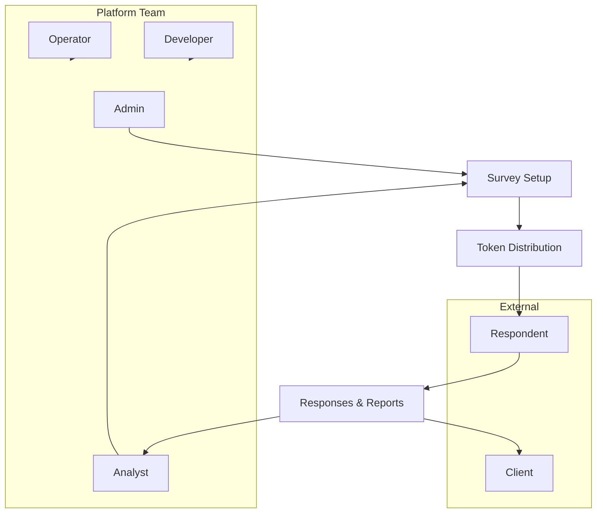

# Stakeholder Map

> **Audience:** Everyone involved in operating, building, or consuming Questioner outputs.  
> **Purpose:** Clarify who does what, what each role can access, and how responsibilities connect across a typical study.  
> **Related:** [executive-overview.md](executive-overview.md) · [admin-guide.md](../guides/admin-guide.md) · [analyst-guide.md](../guides/analyst-guide.md)

---

## Stakeholder Overview

---

## Role Definitions

### Admin

**Who:** Platform owner, research operations lead, or senior team member with full system access.

**Primary responsibilities:**
| Area | Responsibility |
|------|----------------|
| **User management** | Create and manage admin, analyst, and client accounts |
| **Templates** | Own master blueprints and versioning policy |
| **System configuration** | Attribute banks, platform analytics, AI telemetry |
| **Governance** | Decide rollout stages, access policies, and production credentials |
| **Oversight** | Monitor platform health and escalations from analysts |

**Platform access (high level):**
- Everything an **analyst** can access, plus:
- User management (`/user-management`)
- Platform analytics (`/admin/analytics`)
- AI telemetry (`/admin/ai-telemetry`)
- Attribute bank manager (`/admin/attributes`)

**Typical decisions:**
- Who gets analyst vs client access
- When to activate a new module rollout stage
- Whether to use in-app Layer 2 vs Google Forms for a study

---

### Analyst

**Who:** Research analyst, insights manager, or fieldwork coordinator.

**Primary responsibilities:**
| Area | Responsibility |
|------|----------------|
| **Study setup** | Create surveys from templates, configure brands, gates, quotas |
| **Fieldwork** | Generate token batches, distribute links, monitor completion |
| **Quality control** | Review respondent lifecycle (complete, incomplete, rejected) |
| **Reporting** | Trigger report generation, review charts and AI narratives |
| **Exports** | Download Excel exports (BA/PF, product scalers) and PPTX decks |
| **Client delivery** | Prepare stakeholder-ready outputs |

**Platform access (high level):**
- Dashboard, templates, surveys, tokens, responses, reports
- Survey creation wizard
- Comparison analytics (`/analytics/compare`)
- **Cannot** access user management or admin-only system pages

**Typical decisions:**
- Screening criteria and quota sizes for a wave
- When to close fieldwork and generate final report
- How to interpret and present findings to clients

---

### Client

**Who:** External brand sponsor, marketing lead, or stakeholder with limited portal access.

**Primary responsibilities:**
| Area | Responsibility |
|------|----------------|
| **Briefing** | Provide study objectives, brand list, target audience |
| **Review** | View assigned survey progress and reports (when shared) |
| **Feedback** | Request cuts, additional questions, or follow-up waves |

**Platform access:**
- Authenticated portal with **client** role (restricted compared to admin/analyst)
- Typically read-oriented — exact screens depend on deployment configuration

**Typical decisions:**
- Approve study design before fieldwork
- Sign off on final deliverables

---

### Respondent

**Who:** Survey participant recruited through field agencies, panels, or direct links.

**Primary responsibilities:**
| Area | Responsibility |
|------|----------------|
| **Participate** | Complete Layer 1 screening honestly |
| **Evaluate** | Complete Layer 2 if qualified |
| **Compliance** | Use the provided token link; do not share or modify the token |

**Platform access:**
- Public route only: `/s/{token}`
- No login, no dashboard, no visibility into other respondents

**What they experience:**
- Screening questions → pass/fail outcome → evaluation or rejection message
- See [respondent-flow.md](../guides/respondent-flow.md)

---

### Developer

**Who:** Software engineers maintaining frontend, backend, analytics, and integrations.

**Primary responsibilities:**
| Area | Responsibility |
|------|----------------|
| **Features** | Build and fix survey flows, modules, analytics, exports |
| **Integrations** | Webhooks, Google Forms bridge, OpenAI, export APIs |
| **Data model** | Collections, indexes, migrations, seed scripts |
| **Quality** | Tests, code review, documentation updates |
| **Support** | Debug issues escalated from analysts and operators |

**Does not typically:**
- Configure live study quotas or distribute tokens (analyst/admin)
- Own production deployment schedules alone (shared with operator)

**Key references:** [docs/README.md](../README.md) technical path, architecture docs, codebase entry points (`backend/main.py`, `frontend/src/App.tsx`).

---

### Operator

**Who:** DevOps engineer, infrastructure owner, or release manager.

**Primary responsibilities:**
| Area | Responsibility |
|------|----------------|
| **Deployment** | Staging and production releases via CI/CD |
| **Secrets** | MongoDB, Redis, OpenAI, JWT, Docker registry credentials |
| **Monitoring** | Service health, logs, queue backlogs (PPTX workers) |
| **Rollouts** | Module and PPTX feature flags per environment |
| **Incident response** | Outages, failed webhooks, database connectivity |

**Collaborates with:**
- Developers on fixes and rollbacks
- Admins on maintenance windows and credential rotation

**Key references:** [operations/deployment.md](../operations/deployment.md), rollout docs ([module-rollout.md](../releases/module-rollout.md), [pptx-export-rollout.md](../releases/pptx-export-rollout.md)).

---

## Responsibility Matrix (RACI-style)

| Activity | Admin | Analyst | Client | Respondent | Developer | Operator |
|----------|:-----:|:-------:|:------:|:----------:|:---------:|:--------:|
| Create templates | **A/R** | C | I | — | C | — |
| Create surveys | A | **R** | C | — | — | — |
| Configure screening/quota | A | **R** | C | — | — | — |
| Generate tokens | A | **R** | I | — | — | — |
| Distribute links | I | **R** | I | — | — | — |
| Complete screening (L1) | — | — | — | **R** | — | — |
| Complete evaluation (L2) | — | — | — | **R** | — | — |
| Monitor fieldwork | A | **R** | I | — | — | I |
| Generate reports | A | **R** | I | — | C | — |
| Export Excel/PPTX | A | **R** | I | — | — | — |
| Manage users | **R** | — | — | — | — | — |
| Deploy platform | I | — | — | — | C | **R** |
| Fix bugs / build features | I | I | — | — | **R** | C |
| Rotate secrets / scale infra | A | — | — | — | C | **R** |

*R = Responsible, A = Accountable, C = Consulted, I = Informed*

---

## Handoff Points Between Roles

### Client → Analyst
- Study brief, brand list, target demographics, timeline
- Approval to launch fieldwork

### Analyst → Respondent (via field team)
- Token links distributed through recruitment channel
- Instructions not to reuse or share links

### Respondent → Analyst
- Layer 1 and Layer 2 data flows automatically into dashboard
- Analyst monitors lifecycle filters: pending, incomplete, complete, rejected

### Analyst → Client
- Web report walkthrough, PPTX deck, Excel exports
- Interpretation of key metrics and recommendations

### Analyst/Admin → Developer
- Bug reports, feature requests, data anomalies (orphan submissions, quota issues)

### Developer/Operator → Admin
- Release notes, rollout stage changes, maintenance notifications

---

## Access Control Summary

| Role | Authentication | Typical scope |
|------|----------------|---------------|
| Admin | JWT login | Full platform + admin-only pages |
| Analyst | JWT login | Studies, fieldwork, reports, comparison analytics |
| Client | JWT login | Limited read access to assigned content |
| Respondent | Token link only | Single survey via `/s/{token}` |

---

## Who to Contact for Common Questions

| Question | Ask |
|----------|-----|
| "Can we change the age gate mid-fieldwork?" | Analyst (impacts quota); Admin if policy decision |
| "Why was this respondent rejected?" | Analyst — check respondent detail and screening rules |
| "Report generation is stuck" | Analyst first; then Developer/Operator if queue/worker issue |
| "We need a new user account" | Admin |
| "Deploy the module rollout to staging" | Operator + Developer |
| "What does BA/PF mean in the export?" | Analyst — see [glossary.md](glossary.md) |
| "Participant cannot open their link" | Analyst (token status/expiry); Operator if platform down |

---

## Related Documentation

| Document | Purpose |
|----------|---------|
| [executive-overview.md](executive-overview.md) | Business context |
| [admin-guide.md](../guides/admin-guide.md) | Admin workflows |
| [analyst-guide.md](../guides/analyst-guide.md) | Analyst workflows |
| [respondent-flow.md](../guides/respondent-flow.md) | Respondent journey |
| [teammate-handover-checklist.md](teammate-handover-checklist.md) | Onboarding by role |

---

*Part of the Questioner documentation handover — [docs/README.md](../README.md)*
