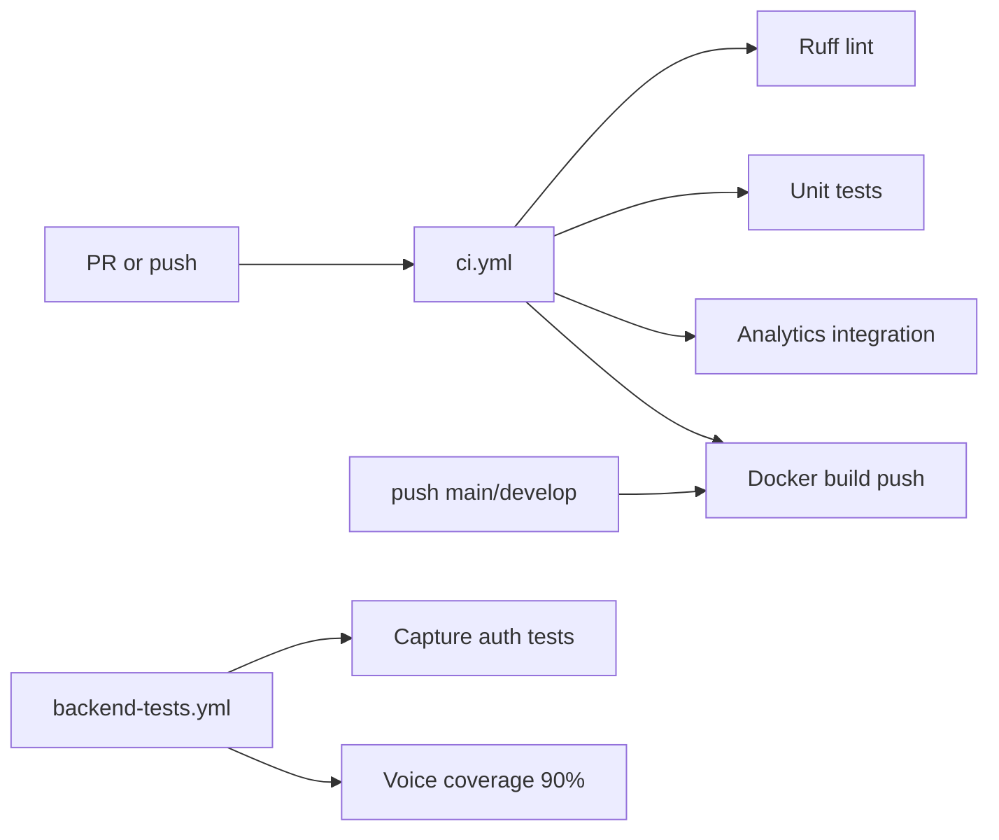

# CI/CD Pipeline

> **Audience:** DevOps and developers contributing to the main branch.  
> **Purpose:** GitHub Actions workflows, Docker image build, secrets, deployment targets, and validation gates.  
> **Related:** [deployment.md](deployment.md) · [local-development.md](../technical/local-development.md)

---

## Workflow Overview



| Workflow | File | Trigger | Purpose |
|----------|------|---------|---------|
| **Unified CI/CD** | [.github/workflows/ci.yml](../../.github/workflows/ci.yml) | Push/PR to `main`, `develop` | Lint, test, build+push image |
| **Backend QA** | [.github/workflows/backend-tests.yml](../../.github/workflows/backend-tests.yml) | Push/PR to `main`, `master` | PPTX capture auth + voice coverage |
| **Deploy staging** | [.github/workflows/deploy-staging.yml](../../.github/workflows/deploy-staging.yml) | — | *Empty — not configured* |
| **Deploy production** | [.github/workflows/deploy-production.yml](../../.github/workflows/deploy-production.yml) | — | *Empty — not configured* |

---

## ci.yml — Unified CI/CD Pipeline

### Job 1: `lint-and-test`

**Runner:** `ubuntu-latest`

**Services:**

| Service | Image | Port |
|---------|-------|------|
| MongoDB | `mongo:6.0` | 27017 |
| Redis | `redis:7.0` | 6379 |

**Steps:**

1. Checkout
2. Python 3.11 + pip cache
3. Install: `ruff`, `pytest`, `pytest-asyncio`, `mongomock`, `requirements.txt`
4. **Ruff lint** — fatal on syntax/undefined names; warnings otherwise
5. **Unit tests** — `pytest backend/tests/unit`
6. **Integration tests** — `pytest backend/tests/integration/test_analytics.py`

**Test environment:**

```yaml
MONGO_URI: mongodb://localhost:27017/test_db
REDIS_URL: redis://localhost:6379
SECRET_KEY: ci-test-secret
ADMIN_USERNAME: admin
ADMIN_PASSWORD: password
```

### Job 2: `build-and-push`

**Condition:** Push to `main` or `develop` (not PRs)

**Steps:**

1. Docker Buildx
2. Login DockerHub (`DOCKERHUB_USERNAME`, `DOCKERHUB_TOKEN`)
3. Build `backend/Dockerfile` → push:
   - `questioner/backend:latest`
   - `questioner/backend:${{ github.sha }}`
4. Registry build cache: `questioner/backend:buildcache`

---

## backend-tests.yml — Backend Quality Assurance

**Focus:** PPTX capture authentication (Phases 1–7) and voice feedback coverage.

**Steps:**

1. Python 3.11, `pip install -r requirements.txt`
2. Env: `MONGO_URI`, `REDIS_URL`, `OPENAI_API_KEY=mock_key`
3. Capture secrets: `SECRET_KEY`, `ADMIN_USERNAME`, `ADMIN_PASSWORD`
4. **Capture auth suite:**

   ```bash
   pytest backend/tests/capture_auth \
     backend/tests/test_capture_auth.py \
     backend/tests/test_capture_session.py \
     backend/tests/test_capture_preflight_auth.py \
     backend/tests/test_report_capture_auth.py \
     -o addopts= -q
   ```

5. **Voice feedback** — 90% coverage gate:

   ```bash
   pytest backend/tests/voice_feedback/ \
     --cov=backend/voice_feedback \
     --cov-fail-under=90
   ```

---

## GitHub Secrets Required

| Secret | Used by | Purpose |
|--------|---------|---------|
| `DOCKERHUB_USERNAME` | ci.yml build | Registry login |
| `DOCKERHUB_TOKEN` | ci.yml build | Registry password/token |
| `OPENAI_API_KEY` | Deploy *(planned)* | Production AI |
| `MONGO_URI_PROD` | Deploy *(planned)* | Production database |
| `REDIS_URL_PROD` | Deploy *(planned)* | Production Redis |

Configure under: **Repository → Settings → Secrets and variables → Actions**

---

## Local CI Parity

Reproduce CI locally before pushing — full matrix: [testing-and-qa.md](../technical/testing-and-qa.md)

```bash
# Lint
ruff check backend/ --select=E9,F63,F7,F82 --target-version=py311

# Backend smoke (ci.yml references backend/tests/unit — directory not present; use targeted suites)
export MONGO_URI=mongodb://localhost:27017/test_db
export REDIS_URL=redis://localhost:6379
export SECRET_KEY=ci-test-secret
pytest backend/tests/test_module_rollout_flags.py -o addopts= -q
pytest backend/tests/integration/test_analytics.py -o addopts= -q

# Capture auth (pre-PPTX deploy)
pytest backend/tests/capture_auth -o addopts= -q
```

---

## Deployment Targets (Current State)

| Target | Status | Notes |
|--------|--------|-------|
| **DockerHub** | Active via ci.yml | `questioner/backend:latest` |
| **Staging** | Not automated | `deploy-staging.yml` empty |
| **Production** | Not automated | `deploy-production.yml` empty |
| **AWS ECS** | Artifacts only | Task definition + appspec scaffold |

### Recommended deploy flow (manual until workflows exist)

1. CI passes on `main`
2. Pull image: `questioner/backend:$SHA`
3. Update compose/ECS task definition with new tag
4. Rolling restart: backend → pptx-worker → frontend
5. Run [post-deploy validation](deployment.md#post-deploy-validation)
6. Run [rollback-runbooks.md](rollback-runbooks.md) checks if issues

---

## Branch Strategy

| Branch | CI | Image push |
|--------|-----|------------|
| `main` | Full pipeline | Yes |
| `develop` | Full pipeline | Yes |
| PRs | Lint + test only | No |

---

## Cache Strategy

| Cache | Mechanism |
|-------|-----------|
| **Docker layers** | Buildx registry cache `questioner/backend:buildcache` |
| **pip** | `actions/setup-python` cache in workflows |
| **AI insights** | Redis TTL at runtime — not CI |

---

## Pre-Merge Checklist (Developers)

See [testing-and-qa.md](../technical/testing-and-qa.md) for the full gate matrix. Minimum:

- [ ] `ruff check backend/` clean on fatal rules
- [ ] Backend tests for changed areas pass (`-o addopts=`)
- [ ] `cd frontend && npm run lint` (if frontend touched)
- [ ] If touching PPTX/capture: capture auth suite green
- [ ] If touching voice: coverage ≥ 90%
- [ ] If touching modules: `python -m backend.scripts.run_phase9_qa`
- [ ] If editing docs: `python scripts/validate_docs_links.py`

---

## Related Documentation

| Document | Purpose |
|----------|---------|
| [testing-and-qa.md](../technical/testing-and-qa.md) | Test suites and quality gates |
| [deployment.md](deployment.md) | Runtime topology |
| [monitoring-and-health.md](monitoring-and-health.md) | Post-deploy checks |
| [rollback-runbooks.md](rollback-runbooks.md) | Roll back bad deploys |

---

*Phase 6 — [docs/README.md](../README.md)*
