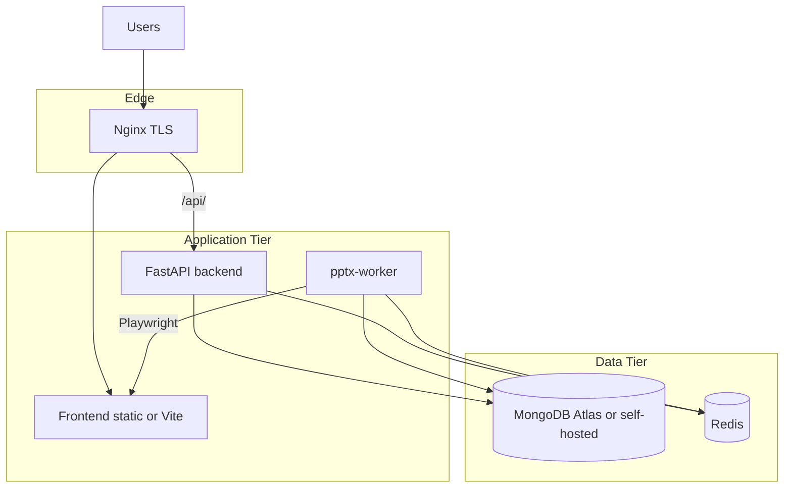

# Deployment Guide

> **Audience:** DevOps engineers and release managers.  
> **Purpose:** Deploy Questioner to staging and production — Docker topology, services, secrets, and validation.  
> **Related:** [ci-cd.md](ci-cd.md) · [environment-variables.md](../technical/environment-variables.md) · [monitoring-and-health.md](monitoring-and-health.md)

> **Consolidates:** empty [docs/deployment.md](../deployment.md) (redirect). Legacy `backend/docs/deployment.md` redirects to operations docs.

---

## Deployment Topology



---

## Service Inventory

| Service | Image / build | Port | Required |
|---------|---------------|------|----------|
| **backend** | `backend/Dockerfile` | 8080 | Yes |
| **frontend** | `frontend/Dockerfile` *(prod)* | 80 | Yes |
| **pptx-worker** | Same as backend, different CMD | — | If PPTX queue enabled |
| **mongodb** | `mongo:latest` | 27017 | Yes |
| **redis** | `redis:alpine` | 6379 | Yes (queue + rate limit) |
| **nginx** | `nginx:alpine` | 80, 443 | Recommended |

---

## Local / Dev — Docker Compose

**File:** [infra/docker/docker-compose.yml](../../infra/docker/docker-compose.yml)

```bash
cd infra/docker
cp ../../.env.example ../../.env
# Edit .env with secrets
docker compose up -d --build
```

### Services and ports (host)

| Container | Host port | Internal |
|-----------|-----------|----------|
| `questioner_backend` | 8081 | 8080 |
| `questioner_mongodb` | 27018 | 27017 |
| `questioner_redis` | 6370 | 6379 |
| `questioner_nginx` | 80, 443 | — |
| `questioner_frontend` | via nginx | 5173 |
| `questioner_pptx_worker` | — | worker process |

### Volumes

| Volume | Purpose |
|--------|---------|
| `mongodb_data` | Persistent MongoDB |
| `reports_data` | Generated report/PPTX files |
| `../../backend:/app/backend` | Dev hot-reload (dev Dockerfile only) |

### TLS (dev nginx)

Mount certs at `certs/` → `/etc/nginx/certs/` per [infra/nginx/nginx.dev.conf](../../infra/nginx/nginx.dev.conf).

---

## Production — Docker Compose Overlay

**File:** [infra/docker/docker-compose.prod.yml](../../infra/docker/docker-compose.prod.yml)

```yaml
# Uses pre-built images from registry
backend:
  image: ${ECR_REGISTRY}/questioner-backend:${TAG:-latest}
  env_file: .env.production
pptx-worker:
  image: ${ECR_REGISTRY}/questioner-backend:${TAG:-latest}
  command: python -m backend.workers.pptx_worker
frontend:
  image: ${ECR_REGISTRY}/questioner-frontend:${TAG:-latest}
```

Health checks configured for backend (`/health` expected by Dockerfile) and frontend (`wget` on port 80).

> **Gap:** Production `deploy-staging.yml` / `deploy-production.yml` workflows are currently empty placeholders. CI builds and pushes images via [ci.yml](../../.github/workflows/ci.yml); wire deploy workflows to your target environment.

---

## Production Backend Image

**File:** [backend/Dockerfile](../../backend/Dockerfile)

| Stage | Purpose |
|-------|---------|
| **Builder** | `pip install` dependencies |
| **Production** | Slim runtime + Playwright Chromium + ffmpeg |

| Setting | Value |
|---------|-------|
| User | `appuser` (non-root) |
| Process manager | `gunicorn` + 4 `UvicornWorker` |
| Bind | `0.0.0.0:8080` |
| Timeout | 120s |
| Init | `tini` |

```bash
docker build -f backend/Dockerfile -t questioner/backend:latest .
```

---

## AWS ECS (Artifacts)

Repository includes scaffold artifacts (may need population):

| File | Purpose |
|------|---------|
| [infra/aws/ecs-task-definition.json](../../infra/aws/ecs-task-definition.json) | ECS task definition |
| [infra/aws/appspec.yml](../../infra/aws/appspec.yml) | CodeDeploy AppSpec |

Configure: CPU/memory per service, secrets from AWS Secrets Manager, ALB target groups for backend:8080 and frontend:80.

Production secrets loaded via `config.py` → `questioner/production/secrets`.

---

## Nginx Reverse Proxy

| Config | Environment |
|--------|-------------|
| [infra/nginx/nginx.dev.conf](../../infra/nginx/nginx.dev.conf) | Dev — TLS, `/api/` → backend, `/` → Vite |
| [infra/nginx/nginx.prod.conf](../../infra/nginx/nginx.prod.conf) | Production static + API proxy |

Pattern:
- `/api/*` → strip prefix → `backend:8080`
- `/*` → frontend

---

## Required Secrets (Production)

| Secret | Source | Notes |
|--------|--------|-------|
| `MONGO_URI` | Atlas or self-hosted | Connection string with credentials |
| `REDIS_URL` | ElastiCache / Redis Cloud | Queue + cache |
| `SECRET_KEY` | Generated | Same on backend + pptx-worker |
| `OPENAI_API_KEY` | OpenAI dashboard | Analytics AI |
| `ADMIN_USERNAME` / `ADMIN_PASSWORD` | Ops-generated | Change from dev defaults |
| `ALLOWED_ORIGINS` | Deployment URLs | No `*` in production |
| Docker registry | GitHub Secrets | `DOCKERHUB_USERNAME`, `DOCKERHUB_TOKEN` |

GitHub Secrets for deploy workflows (when implemented): `MONGO_URI_PROD`, `REDIS_URL_PROD` — see [ci-cd.md](ci-cd.md).

---

## Pre-Deploy Checklist

- [ ] `.env.production` or AWS secrets populated
- [ ] `SECRET_KEY` identical on API and `pptx-worker`
- [ ] `ALLOWED_ORIGINS` lists production frontend URL(s)
- [ ] MongoDB indexes can be created (no duplicate `survey_id` in `survey_reports`)
- [ ] Redis reachable from backend and worker
- [ ] Product Test banks seeded (if PT surveys used)
- [ ] Question modules seeded (if modular surveys used)
- [ ] TLS certificates valid for nginx
- [ ] Default admin password rotated

---

## Post-Deploy Validation

```bash
# API liveness
curl -s https://<host>/api/ | jq
# Expected: {"message":"Survey Platform API is running"}

# Login
curl -s -X POST https://<host>/api/auth/token \
  -d "username=$ADMIN&password=$PASS" | jq .role

# PPTX worker (if enabled)
docker logs questioner_pptx_worker 2>&1 | tail -20
# Look for: [Capture-Preflight] Environment OK

# Admin diagnostics (authenticated)
curl -H "Authorization: Bearer $JWT" \
  https://<host>/api/analytics/admin/pptx-diagnostics
```

---

## Scaling Notes

| Component | Guidance |
|-----------|----------|
| **backend** | Horizontal scale behind load balancer; stateless JWT |
| **pptx-worker** | Scale replicas for export throughput; Redis queue coordinates |
| **MongoDB** | Atlas M10+ for production; monitor connection pool |
| **Redis** | Required for PPTX queue at scale |

---

## Related Documentation

| Document | Purpose |
|----------|---------|
| [ci-cd.md](ci-cd.md) | Build pipeline |
| [monitoring-and-health.md](monitoring-and-health.md) | Health checks |
| [security-and-secrets.md](security-and-secrets.md) | Hardening |
| [rollback-runbooks.md](rollback-runbooks.md) | Feature rollback |
| [local-development.md](../technical/local-development.md) | Dev setup |

---

*Phase 4 — [docs/README.md](../README.md)*
