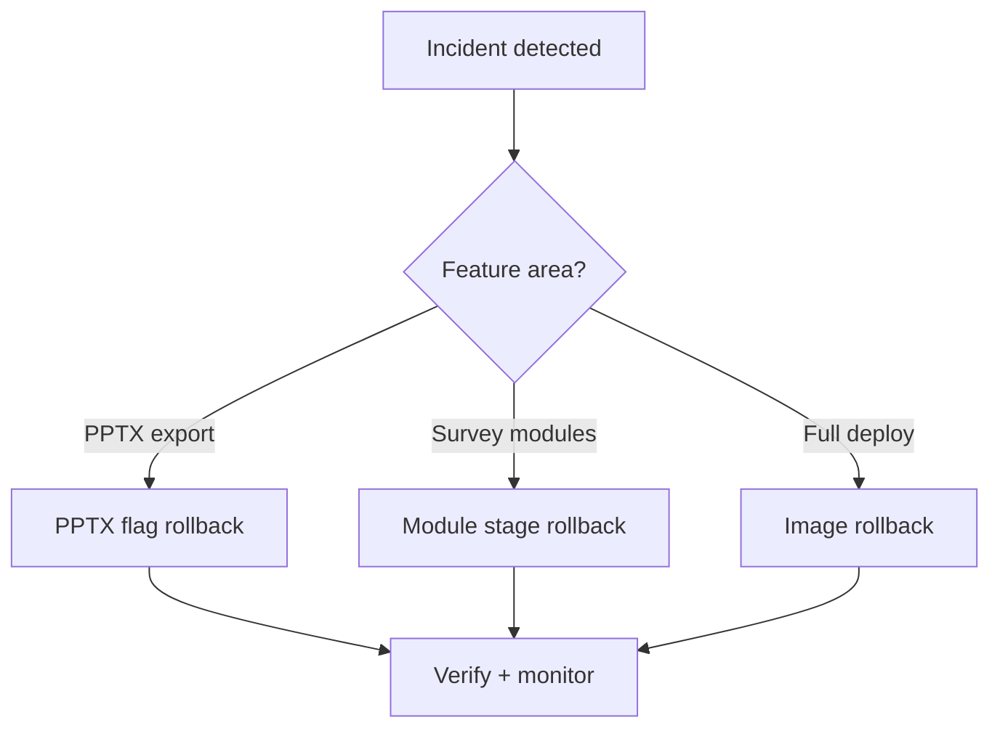

# Rollback Runbooks

> **Audience:** Operators and release managers handling feature regressions or failed rollouts.  
> **Purpose:** Combined rollback procedures for PPTX export, module system, and deployment — without code changes where possible.  
> **Related:** [../releases/pptx-export-rollout.md](../releases/pptx-export-rollout.md) · [../releases/module-rollout.md](../releases/module-rollout.md) · [deployment.md](deployment.md)

---

## Rollback Philosophy

1. **Prefer feature flags** over redeploying old code when possible
2. **Change one variable at a time** — observe, then proceed
3. **Restart affected services** after env changes (backend, worker, frontend rebuild for Vite vars)
4. **Document** what was rolled back and why



---

## PPTX Export Rollback

Source: [pptx-export-rollout.md](../releases/pptx-export-rollout.md)

### Symptom → action matrix

| Symptom | Env change | Service restart |
|---------|------------|-----------------|
| Redis / queue instability | `PPTX_QUEUE_ENABLED=false` | backend |
| Aggressive stale job failures | `PPTX_STALE_RECOVERY_ENABLED=false` | backend, worker |
| UI poll noise / progress issues | `PPTX_CAPTURE_PROGRESS_ENABLED=false` | backend |
| Hybrid capture failures | `PPTX_RENDER_MODE=native` | worker |
| Auth debug (temporary) | `PPTX_CAPTURE_AUTH_TOKEN_OVERRIDE=true` + JWT on worker only | worker |

### Full PPTX disable (emergency)

```env
PPTX_QUEUE_ENABLED=false
PPTX_RENDER_MODE=native
```

Restart backend. Exports may fall back to inline `BackgroundTasks` (legacy path) depending on code version.

### SECRET_KEY mismatch rollback procedure

If exports fail with `auth_invalid`:

1. **Do not** paste user JWT into `PPTX_CAPTURE_AUTH_TOKEN`
2. Verify identical `SECRET_KEY` in backend and worker `.env`
3. Rebuild and restart:

   ```bash
   docker compose up -d --build backend pptx-worker
   ```

4. Run verification:

   ```bash
   docker exec questioner_pptx_worker python -m backend.scripts.verify_capture_auth_rollout \
     --survey-id <id> --probe-api
   ```

5. Retry export from UI

### Worker restart test (staging)

```bash
docker compose restart pptx-worker
# Confirm stale recovery or manual retry with ?force_retry=true
```

### Duplicate survey_reports index

If startup fails on unique index:

```bash
python -m backend.scripts.cleanup_duplicate_survey_reports --dry-run
python -m backend.scripts.cleanup_duplicate_survey_reports --apply --recreate-index
```

---

## Module System Rollback (Phase 9)

Source: [module-rollout.md](../releases/module-rollout.md)

### Rollout stages (high → low)

| Stage | Capability |
|-------|------------|
| `full` | Everything enabled |
| `analytics_aliases` | Export alias layer |
| `usage_pricing` | Brand usage + pricing modules |
| `pf_from_db` | Purchase funnel from DB |
| `generic_renderer` | Generic module UI |
| `seed_only` | DB seed only — **no respondent module UI** |

### Rollback steps

**Step 1 — Disable respondent-facing modules (fastest)**

```env
# Backend
MODULE_ROLLOUT_STAGE=seed_only

# Frontend (requires rebuild)
VITE_MODULE_ROLLOUT_STAGE=seed_only
```

```bash
docker compose up -d --build backend
cd frontend && npm run build  # or rebuild frontend container
```

Respondents see pre-module behavior; data in `question_modules` remains.

**Step 2 — Partial rollback examples**

| Issue | Roll back to |
|-------|--------------|
| Usage/pricing bugs | `pf_from_db` |
| PF from DB issues | `generic_renderer` |
| Generic renderer bugs | `seed_only` |
| Export column mismatch | Keep UI stage; set `MODULE_ROLLOUT_STAGE=analytics_aliases` or lower |

**Step 3 — Verify**

```bash
curl -H "Authorization: Bearer $JWT" http://localhost:8081/modules/rollout
python -m backend.scripts.run_phase9_qa
```

### Forward rollout (re-enable)

Advance one stage at a time per [module-rollout.md](../releases/module-rollout.md) checklist.

---

## Trial Media Rollback (Frontend)

| Symptom | Action |
|---------|--------|
| Respondent upload issues | `VITE_TRIAL_MEDIA_ROLLOUT_STAGE=schema_only` |
| Re-enable | Advance to `respondent_upload` after fix |

Rebuild frontend after Vite env change.

---

## Deployment Rollback

When a **bad image** is deployed:

### Docker Compose

```bash
# Pin previous known-good tag
export TAG=<previous-sha>
docker compose -f docker-compose.prod.yml pull
docker compose -f docker-compose.prod.yml up -d backend pptx-worker frontend
```

### Verify after rollback

- [ ] `GET /` returns 200
- [ ] Login works
- [ ] Sample survey token flow completes
- [ ] Report generation succeeds
- [ ] PPTX export (if used) completes

---

## Combined Rollback Scenarios

### Scenario A: Bad deploy + PPTX broken

1. Roll back Docker image to last good SHA
2. Set `PPTX_RENDER_MODE=native` if capture still fails
3. Verify `SECRET_KEY` parity
4. Run capture auth test suite

### Scenario B: Module rollout caused fieldwork errors

1. `MODULE_ROLLOUT_STAGE=seed_only` (backend)
2. `VITE_MODULE_ROLLOUT_STAGE=seed_only` (frontend rebuild)
3. Active surveys continue with snapshot schema — no template mutation
4. Fix forward in staging before re-enabling stages

### Scenario C: Redis outage

1. `PPTX_QUEUE_ENABLED=false` — disable queue dependency
2. Restore Redis service
3. Re-enable queue after `redis-cli ping` OK
4. Run `pptx_reconciliation` via API restart

---

## Post-Rollback Communication Template

```
Rollback executed: [PPTX / Modules / Deploy]
Time: [UTC]
Change: [env var or image tag]
Reason: [brief]
Impact: [exports disabled / module UI hidden / etc.]
Verification: [checks passed]
Next: [fix forward plan]
```

---

## Prevention Checklist (Pre-Rollout)

- [ ] Staged rollout in staging first
- [ ] `verify_capture_auth_rollout.py --probe-api` passes
- [ ] `run_phase9_qa` passes for module changes
- [ ] Capture auth pytest suite green in CI
- [ ] Known-good image tag documented before promote

---

## Related Documentation

| Document | Purpose |
|----------|---------|
| [pptx-export-rollout.md](../releases/pptx-export-rollout.md) | Full PPTX rollout guide |
| [module-rollout.md](../releases/module-rollout.md) | Full module rollout guide |
| [testing-and-qa.md](../technical/testing-and-qa.md) | Test suites and quality gates |
| [troubleshooting.md](troubleshooting.md) | Symptom diagnosis |
| [monitoring-and-health.md](monitoring-and-health.md) | Post-rollback monitoring |

---

*Phase 4 — [docs/README.md](../README.md)*
