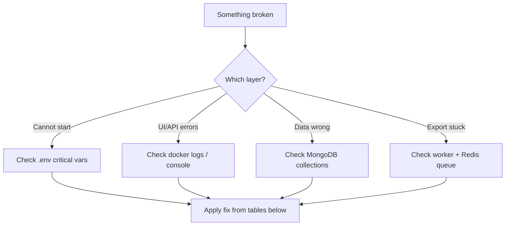

# Troubleshooting Guide

> **Audience:** Developers and operators resolving local, staging, and production issues.  
> **Purpose:** Symptom → cause → fix for common failures across MongoDB, Redis, PPTX, auth, CORS, seeds, and webhooks.  
> **Related:** [monitoring-and-health.md](monitoring-and-health.md) · [local-development.md](../technical/local-development.md)

---

## Quick Diagnostic Flow



---

## Application Won't Start

| Symptom | Cause | Fix |
|---------|-------|-----|
| `CRITICAL SECURITY ERROR: Missing ...` | `.env` missing `MONGO_URI`, `SECRET_KEY`, or `ADMIN_*` | Copy `.env.example` → `.env`, fill all critical vars |
| `ServerSelectionTimeoutError` | MongoDB not running or wrong port | Start MongoDB; use `27018` for Docker Compose host |
| Redis connection errors | Redis down or wrong port | Start Redis; use `6370` on host per `.env.example` |
| `Failed to load production secrets` | `ENV=production` without AWS access | Set `ENV=development` locally or configure AWS credentials |
| Import errors on `backend` | Wrong working directory | Run from repo root: `uvicorn backend.main:app` |

---

## MongoDB Issues

| Symptom | Cause | Fix |
|---------|-------|-----|
| Connection refused `27017` | Using default port but Docker maps **27018** | `MONGO_URI=mongodb://localhost:27018/survey_platform` |
| Works locally, fails in Docker backend | Host vs service hostname | In compose: `mongodb://mongodb:27017/...` |
| `E11000 duplicate key survey_id` | Duplicate `survey_reports` rows | `python -m backend.scripts.cleanup_duplicate_survey_reports --apply --recreate-index` |
| Empty Product Test blueprint | Banks not seeded | `python -m backend.scripts.seed_product_test_data` |
| Slow token lookups | Missing index on `tokens.token` | Consider adding index in ops migration |

---

## Redis / PPTX Queue Issues

| Symptom | Cause | Fix |
|---------|-------|-----|
| Exports never start | `PPTX_QUEUE_ENABLED=false` | Set `true`, restart worker |
| Jobs queued, never processed | `pptx-worker` not running | `docker compose up -d pptx-worker` |
| Export fails immediately `auth_invalid` | `SECRET_KEY` mismatch API vs worker | Ensure identical `.env` on both services |
| `capture_timeout` after long wait | Old behavior — 401 loop on report API | Update to capture JWT code; verify preflight logs |
| `401` on `/analytics/report/` in worker logs | Wrong `SECRET_KEY` or override misconfigured | Remove `PPTX_CAPTURE_AUTH_TOKEN`; align secrets |
| Stale jobs after worker restart | Expected with recovery on | `PPTX_STALE_RECOVERY_ENABLED=true`; retry export with `force_retry` |

### PPTX verification commands

```bash
docker exec questioner_pptx_worker python -m backend.scripts.verify_capture_auth_rollout \
  --survey-id <id> --probe-api

docker logs --tail 100 questioner_pptx_worker
```

---

## Playwright / Hybrid Capture Issues

| Symptom | Cause | Fix |
|---------|-------|-----|
| Preflight: frontend URL unreachable | Wrong `PPTX_EXPORT_FRONTEND_BASE_URL` | Docker: `http://frontend:5173`; ensure frontend container up |
| Charts not `data-export-ready` | Export frame auth or JS error | Check `ReportExportFrame` route; browser console in worker logs |
| `PPTX_RENDER_MODE=native` needed | Hybrid unstable in environment | Set native mode per [rollback-runbooks.md](rollback-runbooks.md) |
| Playwright missing in native dev | Browsers not installed | Use Docker worker or `playwright install chromium` |

---

## Authentication Issues

| Symptom | Cause | Fix |
|---------|-------|-----|
| Login 401 | Wrong password or user missing | Check `.env` `ADMIN_*`; restart API for `seed_admin` |
| API 401 on all routes | Expired or missing JWT | Re-login; check `ACCESS_TOKEN_EXPIRE_MINUTES` |
| API 403 on admin routes | User is `analyst` or `client` | Use admin account or correct dependency |
| Frontend shows admin UI but API 403 | `localStorage.role` tampered | Real fix: backend enforces; re-login |
| Capture export auth fails | `SECRET_KEY` drift | Align backend + worker env |

---

## CORS Issues

| Symptom | Cause | Fix |
|---------|-------|-----|
| Browser blocks API from `localhost:5173` | Origin not in `ALLOWED_ORIGINS` | Add `http://localhost:5173` to `.env` |
| Works on nginx, fails on Vite direct | Different origin | Add both origins or use nginx consistently |
| `ALLOWED_ORIGINS=*` in prod | Insecure wildcard | Set explicit production URLs |

---

## Frontend / API Connectivity

| Symptom | Cause | Fix |
|---------|-------|-----|
| Network error on all API calls | Wrong `VITE_API_URL` | Native: `http://localhost:8081`; Docker via nginx: `/api` |
| 404 on API calls | Double `/api` prefix | Axios base URL should not include path twice |
| Swagger on 8000 fails | Port drift | Use **8081** per `.env.example` |
| Vite proxy fails | Backend hostname | Native dev: bypass proxy, set full `VITE_API_URL` |

---

## Seed Data Issues

| Symptom | Cause | Fix |
|---------|-------|-----|
| Product Test "Phase Empty" | Empty `product_test_questions` | Run `scripts/seed-pt.ps1` or `seed_product_test_data` |
| Modules not rendering | Rollout stage `seed_only` | Set `VITE_MODULE_ROLLOUT_STAGE` ≥ `generic_renderer` |
| Module questions wrong | Seed not run | `python -m backend.scripts.seed_question_modules` |
| Excel workbook missing | No `General_Product_Test_Evaluation.xlsx` | Place at repo root or use `--fixture` flag |

---

## Webhook / Google Forms Failures

| Symptom | Cause | Fix |
|---------|-------|-----|
| L2 responses missing | Webhook not firing | Verify Apps Script trigger authorized |
| Orphan submissions logged | Invalid token in payload | Respondent edited token field |
| Webhook 400 `invalid_transition` | Token not in `passed` state | Respondent skipped L1 or token reused |
| Local webhook unreachable | Backend not exposed | Use ngrok → `/webhook/google-form` |
| Fake submissions | No webhook auth | Network restrict; add shared secret (future hardening) |

Check orphans: `GET /analytics/orphans` (authenticated).

---

## Report Generation Issues

| Symptom | Cause | Fix |
|---------|-------|-----|
| Report empty | No `submitted` responses | Complete fieldwork first |
| AI sections missing | No `OPENAI_API_KEY` | Add key or accept data-only report |
| Report generation hangs | Large dataset / OpenAI slow | Check logs; increase timeout |
| PPTX ready but download fails | File path / permissions | Check `reports_data` volume mount |

---

## Module Rollout Issues

| Symptom | Cause | Fix |
|---------|-------|-----|
| Module UI not showing | Frontend stage too low | Raise `VITE_MODULE_ROLLOUT_STAGE` |
| PF still legacy | Backend `MODULE_ROLLOUT_STAGE` < `pf_from_db` | Align backend stage |
| Export columns wrong | `analytics_aliases` not enabled | Set `MODULE_ROLLOUT_STAGE=analytics_aliases` or `full` |

Run: `python -m backend.scripts.run_phase9_qa`

---

## Docker-Specific

| Symptom | Cause | Fix |
|---------|-------|-----|
| `shared_mongo_net` error | External network missing | `docker network create shared_mongo_net` or remove from compose |
| nginx 502 | Backend/frontend not ready | `docker compose ps`; check depends_on order |
| SSL error on localhost | Certs not in `certs/` | Add `cert.pem` / `key.pem` or use port 5173 direct |
| Worker starts before frontend | Race on preflight | Restart worker after stack healthy |

---

## Escalation Path

| Severity | Action |
|----------|--------|
| **P1 — platform down** | Check MongoDB, Redis, backend logs; rollback deploy |
| **P2 — exports broken** | PPTX diagnostics, worker logs, `SECRET_KEY` parity |
| **P3 — data quality** | Orphan audit, respondent detail, quota review |
| **P4 — dev environment** | [local-development.md](../technical/local-development.md) |

---

## Related Documentation

| Document | Purpose |
|----------|---------|
| [monitoring-and-health.md](monitoring-and-health.md) | Health checks |
| [rollback-runbooks.md](rollback-runbooks.md) | Feature flag rollback |
| [security-and-secrets.md](security-and-secrets.md) | Credential issues |

---

*Phase 4 — [docs/README.md](../README.md)*
