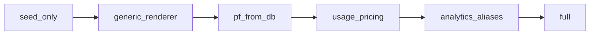

# Module System Rollout (Phase 9)

> **Audience:** Developers, release managers, and QA validating staged module deployment.  
> **Purpose:** Staged rollout for DB-driven survey modules — env flags, checklist, and test matrix.  
> **Related:** [../data/seeds-and-fixtures.md](../data/seeds-and-fixtures.md) · [../data/question-banks.md](../data/question-banks.md) · [../operations/rollback-runbooks.md](../operations/rollback-runbooks.md)

> **Canonical location.** Legacy path: [../MODULE_ROLLOUT.md](../MODULE_ROLLOUT.md) (redirect).

---

## Overview

Staged deployment for database-driven survey modules:

- `purchase_funnel`
- `brand_usage`
- `brand_pricing_behavior`

Modules are seeded into `question_modules` and snapshotted per survey in `module_snapshots`.

---

## Environment Variables

| Variable | Scope | Values | Default |
|----------|-------|--------|---------|
| `MODULE_ROLLOUT_STAGE` | Backend | `seed_only` → `full` | `full` |
| `VITE_MODULE_ROLLOUT_STAGE` | Frontend | same stages | `full` |

**Rule:** Frontend stage must align with backend for respondent-facing behavior.

Detail: [../technical/environment-variables.md](../technical/environment-variables.md)

---

## Stages (in order)

| Stage | Backend | Frontend UI | Description |
|-------|---------|-------------|-------------|
| 1 | `seed_only` | — | Deploy + seed; no respondent module UI |
| 2 | — | `generic_renderer` | `ConfigurableModuleStep` / `ModuleQuestionRenderer` |
| 3 | — | `pf_from_db` | Purchase funnel from `question_modules` / snapshots |
| 4 | — | `usage_pricing` | Brand usage + pricing behavior at runtime |
| 5 | `analytics_aliases` | — | Ingestor/export alias layer active |
| 6 | `full` | `full` | All capabilities enabled |



---

## Rollout Checklist

```bash
# 1. Backend + seed (no user-facing change)
MODULE_ROLLOUT_STAGE=seed_only docker compose up -d backend
python -m backend.scripts.seed_question_modules --dry-run
python -m backend.scripts.seed_question_modules

# 2. Generic renderer
VITE_MODULE_ROLLOUT_STAGE=generic_renderer npm run build

# 3. PF from DB
VITE_MODULE_ROLLOUT_STAGE=pf_from_db

# 4. Usage + pricing
VITE_MODULE_ROLLOUT_STAGE=usage_pricing

# 5. Analytics aliases (backend)
MODULE_ROLLOUT_STAGE=analytics_aliases

# 6. Optional response migration
python -m backend.scripts.migrate_pf_response_ids --dry-run
python -m backend.scripts.migrate_pf_response_ids
```

Seeding detail: [../data/seeds-and-fixtures.md](../data/seeds-and-fixtures.md)

---

## QA Test Matrix

Run the full Phase 9 suite:

```bash
python -m backend.scripts.run_phase9_qa
cd frontend && npm run test -- --run moduleSequencePermutations purchaseFunnelBrandLogic surveyFlowOrchestration moduleRollout moduleQuestionUtils
```

| Area | Test file |
|------|-----------|
| Seed contracts | `backend/tests/test_phase9_seed_contract.py` |
| API (GET/PUT/auth) | `backend/tests/test_question_modules_router.py` |
| Version immutability | `backend/tests/test_question_module_service_versioning.py` |
| PF migration pf_q* | `frontend/src/utils/purchaseFunnelBrandLogic.test.ts` |
| Specify round-trip | `backend/tests/test_module_specify_roundtrip.py` |
| Module sequence | `frontend/src/utils/moduleSequencePermutations.test.ts` |
| Analytics ingest | `backend/tests/analytics/test_ingestor_modules.py` |
| Analytics aggregate | `backend/tests/analytics/test_aggregator_modules.py` |
| Excel exports | `backend/tests/test_exports_modules.py` |
| Rollout flags | `backend/tests/test_module_rollout_flags.py` |

---

## API

| Endpoint | Purpose |
|----------|---------|
| `GET /modules/rollout` | Active rollout stage and capability flags (authenticated) |

Router map: [../api/api-overview.md](../api/api-overview.md)

---

## Rollback

Quick rollback to `seed_only` on both backend and frontend — see [../operations/rollback-runbooks.md](../operations/rollback-runbooks.md) § Module rollout.

---

*Phase 6 — [docs/README.md](../README.md)*
