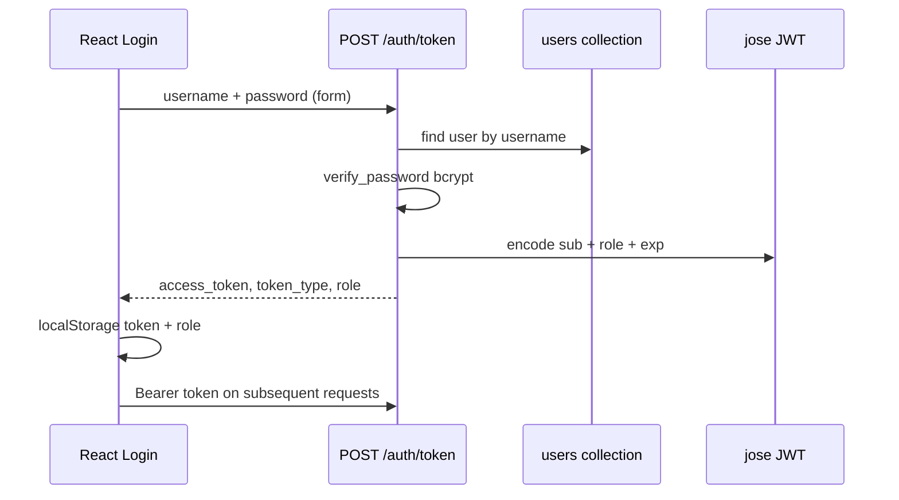
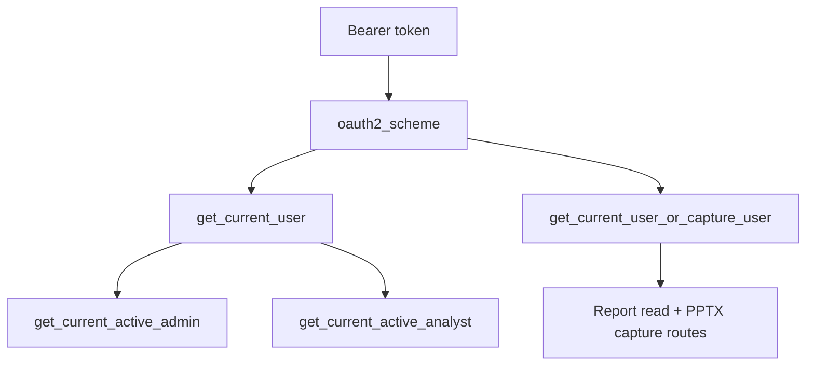
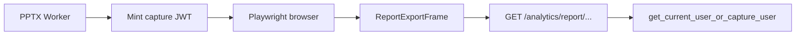

# Authentication & Roles

> **Audience:** Full-stack developers and security reviewers.  
> **Purpose:** JWT authentication, role-based access control (RBAC), protected routes, and backend authorization expectations.  
> **Related:** [backend-architecture.md](backend-architecture.md) · [frontend-architecture.md](frontend-architecture.md) · [../handover/stakeholder-map.md](../handover/stakeholder-map.md)

---

## Authentication Model

Questioner uses **stateless JWT authentication** for the admin/analyst/client portal.

| Property | Value |
|----------|-------|
| **Algorithm** | HS256 (`settings.ALGORITHM`) |
| **Secret** | `SECRET_KEY` environment variable |
| **Token transport** | `Authorization: Bearer <token>` header |
| **OAuth2 flow** | Password grant via `POST /auth/token` |
| **Default expiry** | `ACCESS_TOKEN_EXPIRE_MINUTES` (default 1440 = 24h) |
| **Logout** | Client-side only — discard token (`POST /auth/logout` is symbolic) |

Respondents **do not** use JWT — they access surveys via opaque **token URLs** (`/s/{uuid}`).

---

## Role Definitions

Stored on `users.role` in MongoDB:

| Role | Description | Portal access |
|------|-------------|---------------|
| `admin` | Full platform control | All routes + admin-only pages |
| `analyst` | Research operations | Studies, reports, comparison analytics |
| `client` | External stakeholder | Authenticated portal (limited; same PrivateRoute as analyst for most survey pages) |

Default on signup: `client` (see `UserBase.role` in `models.py`).

---

## Auth Flow



### Login endpoint

```
POST /auth/token
Content-Type: application/x-www-form-urlencoded

username=admin&password=***
```

Response:
```json
{
  "access_token": "eyJ...",
  "token_type": "bearer",
  "role": "admin"
}
```

### Signup endpoint

```
POST /auth/signup
Content-Type: application/json

{ "username": "...", "password": "...", "email": "...", "role": "analyst" }
```

Returns token immediately (self-registration flow).

### Current user

```
GET /auth/me
Authorization: Bearer <token>
```

Returns `User` model (no password hash).

---

## JWT Payload

Created in `backend/utils/security.py` → `create_access_token()`:

```python
{
  "sub": "<username>",
  "role": "admin" | "analyst" | "client",
  "exp": <unix timestamp>
}
```

Validated on every protected request via `get_current_user`.

---

## Backend Authorization Dependencies

Defined in `backend/routers/auth.py` and `backend/routers/capture_auth_deps.py`.

### Dependency hierarchy



| Dependency | Enforces | HTTP on failure |
|------------|----------|-----------------|
| `get_current_user` | Valid JWT, active user, **not** capture token | 401 |
| `get_current_active_admin` | `role == "admin"` | 403 |
| `get_current_active_analyst` | `role in ("admin", "analyst")` | 403 |
| `get_current_user_or_capture_user` | User JWT **or** scoped capture JWT | 401 / 403 |

### `get_current_user` behavior

1. Extract Bearer token from `Authorization` header
2. Decode JWT with `SECRET_KEY` + `ALGORITHM`
3. Load user from `users` collection by `sub` (username)
4. Reject if user missing or `is_active == False`
5. **Reject capture tokens** (`sub == "pptx-capture"`) — capture tokens must use dedicated deps

### Role enforcement examples

| Router / endpoint | Dependency |
|-------------------|------------|
| `GET /users` | `get_current_active_admin` |
| `POST /users` | `get_current_active_admin` |
| `packaging_heatmap` uploads | `get_current_active_analyst` |
| `question_modules` PUT | `get_current_active_analyst` |
| `brand_attributes` admin writes | `get_current_active_admin` |
| `tokens`, `surveys`, `responses` | `get_current_user` (any active role) |
| `public.py` `/s/*` | **No JWT** — survey token only |

---

## Frontend Route Protection

Implemented in `frontend/src/App.tsx`:

| Guard | Frontend check | Backend must still enforce |
|-------|----------------|---------------------------|
| `PrivateRoute` | `localStorage.token` | Yes — `get_current_user` |
| `AdminRoute` | `role === 'admin'` | Yes — `get_current_active_admin` |
| `AnalystRoute` | `role in admin, analyst` | Yes — `get_current_active_analyst` |

### Security note

Frontend role checks are **navigation convenience only**. A user can set `localStorage.role = 'admin'` in DevTools and reach admin **routes**, but API calls return **403 Forbidden** without a valid admin JWT.

**Always enforce authorization on the backend.**

---

## Role × Route Matrix (Frontend)

| Route | admin | analyst | client | public |
|-------|:-----:|:-------:|:------:|:------:|
| `/dashboard`, `/templates`, `/surveys` | ✓ | ✓ | ✓* | |
| `/create-survey`, `/surveys/:id` | ✓ | ✓ | ✓* | |
| `/surveys/:id/report` | ✓ | ✓ | ✓* | |
| `/analytics/compare` | ✓ | ✓ | | |
| `/user-management` | ✓ | | | |
| `/admin/*` | ✓ | | | |
| `/s/:token` | | | | ✓ |

\*Client role uses same `PrivateRoute` — backend may further restrict per endpoint in future.

---

## Respondent Access (Non-JWT)

Public survey routes use **survey tokens**, not portal JWTs.

| Endpoint | Auth mechanism |
|----------|----------------|
| `GET /s/{token}` | Token string in URL path |
| `POST /s/{token}/layer1` | Valid token + state machine |
| `POST /s/{token}/layer2` | Token must be `passed` |

Token validation in `TokenService` — see [system-overview.md](system-overview.md#layer-1--layer-2-paths).

---

## PPTX Capture Tokens (Special Case)

For hybrid PPTX export, Playwright needs read-only report access without a human user session.

| Property | Detail |
|----------|--------|
| **Subject** | `pptx-capture` (`CAPTURE_TOKEN_SUBJECT`) |
| **Module** | `capture_auth_deps.py`, `pptx_builder/hybrid_export/capture_auth.py` |
| **Scope** | Allowlisted report-read routes only |
| **Rejected by** | `get_current_user` on all other routes |



Capture tokens are **short-lived** and **survey-scoped** — not usable for admin operations.

---

## Webhook Authentication

```
POST /webhook/google-form
```

**No authentication** in current implementation. Anyone who knows the URL can POST payloads.

**Risk:** Data poisoning in production. Mitigation recommendations:
- Shared secret header validation
- IP allowlist for Google Apps Script egress
- Request signing

Documented as known gap in [architecture-review.md](architecture-review.md) § Problems & Limitations.

---

## Admin Bootstrap

On application startup:

```python
await seed_admin()  # backend/utils/seed_utils.py
```

Creates admin user from `ADMIN_USERNAME` / `ADMIN_PASSWORD` if not exists. Ensures `role: "admin"` on existing seed user.

**Production:** Change default credentials; rotate `SECRET_KEY`.

---

## Password Security

| Aspect | Implementation |
|--------|----------------|
| Hashing | bcrypt via `passlib` (`CryptContext`) |
| Verification | `verify_password()` on login |
| Storage | `hashed_password` field — never returned in API models |

---

## API Client Auth Behavior (`api.ts`)

| Scenario | Behavior |
|----------|----------|
| Portal request | Attach `Bearer` from `localStorage.token` |
| Public survey `s/*` | No Bearer attached |
| 401 response | Clear token, redirect to `/` (except public survey + export frame) |
| Export frame route | `skipAuthRedirect` / `isExportFrameRoute()` — no redirect during capture |

---

## Audit Trail

Significant actions logged to `audit_logs` via `utils/audit_utils.log_action()`:

- Example: signup events in `auth.py`

Extend audit coverage for admin mutations (user create/delete, survey delete).

---

## Authorization Checklist for New Endpoints

When adding a new API route:

- [ ] Choose correct dependency: `get_current_user`, `get_current_active_analyst`, or `get_current_active_admin`
- [ ] Never rely on frontend `AdminRoute` alone
- [ ] Public endpoints: document threat model (rate limits apply via SlowAPI)
- [ ] Capture routes: use `capture_auth_deps`, not generic user deps
- [ ] Return 401 for bad/missing token, 403 for insufficient role
- [ ] Add pytest for auth matrix (see `backend/tests/test_capture_auth*.py` pattern)

---

## Related Documentation

| Document | Purpose |
|----------|---------|
| [frontend-architecture.md](frontend-architecture.md) | Route guards, api.ts |
| [backend-architecture.md](backend-architecture.md) | Router auth per module |
| [../handover/stakeholder-map.md](../handover/stakeholder-map.md) | Role responsibilities |
| [../releases/pptx-export-rollout.md](../releases/pptx-export-rollout.md) | Capture auth rollout |

---

*Phase 3 technical architecture — [docs/README.md](../README.md)*
