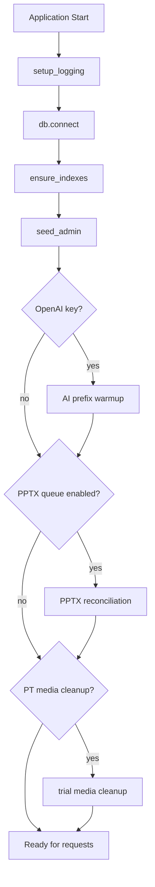
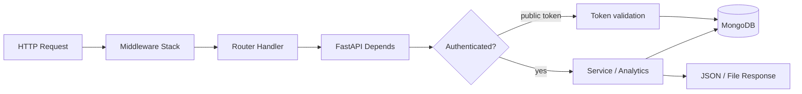

# Backend Architecture

> **Audience:** Backend developers and API integrators.  
> **Purpose:** FastAPI application structure — entrypoint, routers, services, models, workers, config, and startup behavior.  
> **Related:** [system-overview.md](system-overview.md) · [auth-and-roles.md](auth-and-roles.md)

---

## Entry Point: `backend/main.py`

The FastAPI application is created with an **async lifespan** context manager that handles startup and shutdown.

### Application wiring

```python
app = FastAPI(title="Survey Platform API", lifespan=lifespan)
```

| Concern | Implementation |
|---------|----------------|
| Rate limiting | `SlowAPIMiddleware` + Redis-backed `limiter` |
| Logging | `LoggingMiddleware` |
| Security headers | HTTP middleware (CSP, HSTS, X-Frame-Options) |
| CORS | `CORSMiddleware` — localhost dev origins + `ALLOWED_ORIGINS` |
| Routers | 24 `include_router()` calls |

### Health check

```
GET /  →  {"message": "Survey Platform API is running"}
```

Interactive API docs: `GET /docs` (Swagger UI).

---

## Startup Lifecycle



| Step | Module | Purpose |
|------|--------|---------|
| 1 | `database.py` | Motor connection to `MONGO_URI` / `DATABASE_NAME` |
| 2 | `database.ensure_indexes()` | Idempotent indexes on reports, voice, modules, sessions, heatmap, PT media |
| 3 | `utils/seed_utils.seed_admin()` | Create admin from `ADMIN_USERNAME` / `ADMIN_PASSWORD` if missing |
| 4 | `analytics_module.src.ai.warmup` | Background OpenAI priming for high-traffic prompt templates |
| 5 | `workers/pptx_reconciliation` | Recover orphaned PPTX jobs when queue rollout enabled |
| 6 | `services/product_test_media_lifecycle` | Clean abandoned trial uploads on startup |

Shutdown: `db.close()` in lifespan `finally` block.

---

## Router Layer (24 modules)

Routers are thin **HTTP adapters** — validate input, call services/analytics, return JSON or files.

### Core survey operations

| Router | Prefix | Auth | Responsibility |
|--------|--------|------|----------------|
| `auth.py` | `/auth` | Public (login/signup) | JWT issuance, `/me` |
| `templates.py` | `/templates` | `get_current_user` | Template CRUD, versioning |
| `surveys.py` | `/surveys` | `get_current_user` | Survey CRUD, dashboard stats, blueprint |
| `tokens.py` | `/tokens` | `get_current_user` | Batch generation, listing, bulk update |
| `public.py` | `/s` | **None** (token-based) | Respondent L1/L2, survey payload |
| `responses.py` | `/responses` | `get_current_user` | Paginated respondents, detail, exclude |
| `sessions.py` | `/sessions` | Varies | Session persistence for long surveys |
| `webhook.py` | `/webhook` | **None** | Google Forms completion relay |

### Analytics & exports

| Router | Prefix | Auth | Responsibility |
|--------|--------|------|----------------|
| `analytics.py` | `/analytics` | User or capture JWT | Report gen, status, PPTX jobs, download |
| `exports.py` | `/exports` | `get_current_user` | BA/PF and product-scalers Excel |

### Research configuration

| Router | Prefix | Auth | Responsibility |
|--------|--------|------|----------------|
| `purchase_funnels.py` | `/purchase-funnels` | `get_current_user` | PF config per survey |
| `question_modules.py` | `/modules` | user / analyst | Module CRUD, snapshots |
| `attribute_banks.py` | `/attribute-banks` | `get_current_user` | Sensory attribute libraries |
| `brand_attributes.py` | `/brand-attributes` | user / admin | Brand attribute registry |
| `taste_test_configs.py` | `/taste-test-configs` | user / analyst | Taste test study config |
| `questions.py` | `/questions` | `get_current_user` | Master taste test questions |

### Product Test

| Router | Prefix | Auth | Responsibility |
|--------|--------|------|----------------|
| `product_test_configs.py` | `/product-test-configs` | `get_current_user` | PT study configuration |
| `product_test_questions.py` | *(mixed paths)* | `get_current_user` | Bank status, listing |
| `packaging_heatmap.py` | `/surveys` | `get_current_active_analyst` | Heatmap image upload, aggregates |
| `product_test_media.py` | `/surveys` | Varies | Trial media upload/stream |

### Voice feedback

| Router | Prefix | Auth | Responsibility |
|--------|--------|------|----------------|
| `voice_feedback.py` | `/voice-feedback` | `get_current_user` | Config, upload, transcribe triggers |
| `voice_dashboard.py` | `/voice-dashboard` | `get_current_user` | Dashboard aggregates, themes |

### Administration

| Router | Prefix | Auth | Responsibility |
|--------|--------|------|----------------|
| `users.py` | `/users` | `get_current_active_admin` | User CRUD |

### Public router critical path

`backend/routers/public.py` is the highest-traffic module:

- `GET /s/{token}` — validate token, return survey schema
- `POST /s/{token}/layer1` — screening, quotas, token `passed`/`failed`
- `POST /s/{token}/layer2` — in-app evaluation, token `submitted`
- Product Test public gateway endpoints (via `product_test_public_gateway` service)

---

## Services Layer (17 modules)

Business logic lives in `backend/services/` to keep routers thin.

| Service | Domain |
|---------|--------|
| `token_service.py` | Token state machine (atomic transitions) |
| `orchestration_service.py` | Survey flow orchestration |
| `question_module_service.py` | Module versioning, snapshots, rollout |
| `analytics_service.py` | Analytics API facade |
| `product_test_orchestration.py` | PT blueprint assembly |
| `product_test_bank_service.py` | Question bank access |
| `product_test_public_gateway.py` | Respondent PT step delivery |
| `product_test_analytics_service.py` | PT-specific report sections |
| `product_test_media_*` | Upload, scan, stream, lifecycle |
| `packaging_heatmap_*` | Image assets + aggregate analytics |
| `product_test_value_classification.py` | Value tier classification |
| `product_test_snapshot_migration.py` | Snapshot schema migrations |
| `product_test_visibility_conditions.py` | Conditional question visibility |

### Token state machine (`token_service.py`)

```python
ALLOWED_TRANSITIONS = {
    "unused": ["passed", "failed", "unused"],
    "passed": ["submitted", "passed"],
    "failed": ["failed"],
    "submitted": ["submitted"],
}
```

Updates use `find_one_and_update` with a status guard to prevent invalid transitions.

---

## Models: `backend/models.py`

Single module (~900+ lines) defining Pydantic models for MongoDB documents.

### Core domain models

| Model | Collection | Notes |
|-------|------------|-------|
| `Template` | `templates` | `layer1_structure`, `layer2_structure`, versioning |
| `Survey` | `surveys` | `template_snapshot_schema`, screening, brands, PT snapshot |
| `Token` | `tokens` | Status, phone, batch_id, expiry |
| `Response` | `responses` | `source`: `layer1`, `layer2`, `in_app_gateway` |
| `User` / `UserInDB` | `users` | `role`: admin, analyst, client |
| `Respondent` | `respondents` | Upserted by phone |
| `QuestionModule` | `question_modules` | DB-driven module definitions |
| `PurchaseFunnel` | `purchase_funnels` | Per-survey PF config |
| `ProductTestConfig` | `product_test_configs` | PT parameters |
| `ProductTestQuestion` | `product_test_questions` | IHUT bank |
| `PackageTestQuestion` | `package_test_questions` | Packaging bank |

Models inherit from `MongoBaseModel` with alias support for `_id` ↔ `id`.

---

## Database: `backend/database.py`

```python
class Database:
    client: AsyncIOMotorClient
    db = None
```

### GridFS buckets

| Method | Bucket | Use |
|--------|--------|-----|
| `get_gridfs_bucket("voice_recordings")` | voice | Audio files |
| `get_packaging_images_bucket()` | packaging_images | Heatmap uploads |
| `get_product_test_media_bucket()` | product_test_media | Trial photo/video |

### Indexes created on startup

| Collection | Indexes |
|------------|---------|
| `survey_reports` | `survey_id` (unique), `status`, `generated_at` |
| `voice_feedbacks` | `(survey_id, question_id)`, `created_at`, `status` |
| `question_modules` | `(module_id, version)` unique, `is_active` |
| `survey_sessions` | `token` unique, `last_updated` |
| `packaging_heatmap_aggregates` | `(survey_id, question_id)` unique |
| `product_test_media_assets` | `asset_id`, token/survey/lifecycle indexes |
| `product_test_media.files` | metadata compound indexes |

---

## Analytics Module: `backend/analytics_module/`

Large subsystem (~237 Python files) — not duplicated here; key components:

| Component | File(s) | Role |
|-----------|---------|------|
| `ReportOrchestrator` | `report_orchestrator.py` | Top-level report coordinator |
| `Ingestor` | `ingestor.py` | Raw responses → DataFrames |
| `Aggregator` | `aggregator.py` | Statistics, T2B, distributions |
| `ChartInsightEngine` | `chart_insight_engine.py` | Per-chart OpenAI narratives |
| `InsightAggregator` | `insight_aggregator.py` | Executive summary, SWOT |
| `WebSerializer` | `web_serializer.py` | Internal slides → frontend JSON |
| `PlatformBridge` | `platform_bridge.py` | API ↔ engine bridge |
| `pptx_builder/` | multiple | Native + hybrid PPTX generation |
| `pptx_facade.py` | | Export entry point |

Deep dive: [AI_ARCHITECTURE.md](../../backend/analytics_module/AI_ARCHITECTURE.md)

---

## Workers: `backend/workers/`

| File | Purpose |
|------|---------|
| `pptx_queue.py` | `PptxJobQueue` (async) + `SyncPptxJobQueue` — Redis job queue |
| `pptx_worker.py` | Job consumer — Playwright capture + python-pptx |
| `pptx_job_service.py` | Job status persistence and updates |
| `pptx_reconciliation.py` | Startup orphan recovery |

Flow:
1. Analyst requests PPTX → `analytics` router enqueues job
2. Worker picks job from Redis
3. Hybrid capture renders chart URLs via Playwright
4. Output written to configured output path / storage
5. Job status updated for frontend polling

---

## Configuration: `backend/config.py`

`Settings` class loads from environment (`.env`):

| Category | Key variables |
|----------|---------------|
| **Core** | `ENV`, `MONGO_URI`, `DATABASE_NAME`, `SECRET_KEY`, `ALGORITHM` |
| **Auth** | `ADMIN_USERNAME`, `ADMIN_PASSWORD`, `ACCESS_TOKEN_EXPIRE_MINUTES` |
| **CORS** | `ALLOWED_ORIGINS` |
| **Redis** | `REDIS_URL`, `CACHE_TTL` |
| **OpenAI** | `OPENAI_API_KEY`, `OPENAI_MODEL` |
| **Analytics** | `ANALYTICS_RESOURCES_DIR`, `ANALYTICS_OUTPUT_DIR`, `ANALYTICS_DEVELOPER_MODE` |
| **Voice** | `WHISPER_MODE`, `MAX_AUDIO_DURATION_S`, `MAX_AUDIO_FILE_MB` |
| **Product Test** | Media cleanup, scanner settings |
| **Rollout** | `MODULE_ROLLOUT_STAGE`, PPTX rollout flags |

Full catalog: `technical/environment-variables.md` *(planned Phase 4)*.

---

## Cross-Cutting Utilities

| Module | Purpose |
|--------|---------|
| `utils/security.py` | bcrypt hashing, JWT create/decode |
| `utils/rate_limit.py` | SlowAPI limiter, Redis backend |
| `utils/logging_utils.py` | Structured logging + middleware |
| `utils/audit_utils.py` | `audit_logs` collection writes |
| `utils/seed_utils.py` | Admin seed on startup |

---

## Request Processing Pattern



---

## Testing

Backend tests live in `backend/tests/` (~114 pytest files):

- Analytics, product test, voice, PPTX rollout, capture auth, phase 9 modules
- Run: `pytest` from repo root or `backend/` per team convention

Detail: `technical/testing-and-qa.md` *(planned Phase 6)*.

---

## Related Documentation

| Document | Purpose |
|----------|---------|
| [system-overview.md](system-overview.md) | Platform-wide architecture |
| [auth-and-roles.md](auth-and-roles.md) | JWT dependencies |
| [frontend-architecture.md](frontend-architecture.md) | API consumer (React) |
| [../api/api-overview.md](../api/api-overview.md) | API index *(planned)* |

---

*Phase 3 technical architecture — [docs/README.md](../README.md)*
