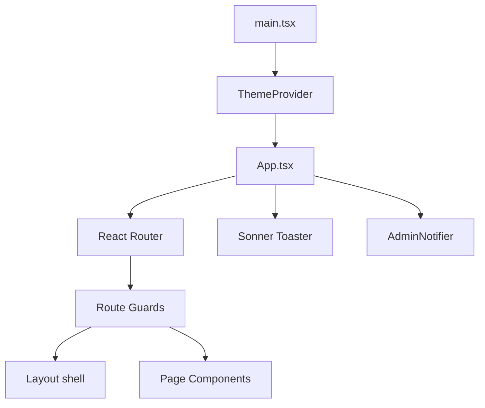
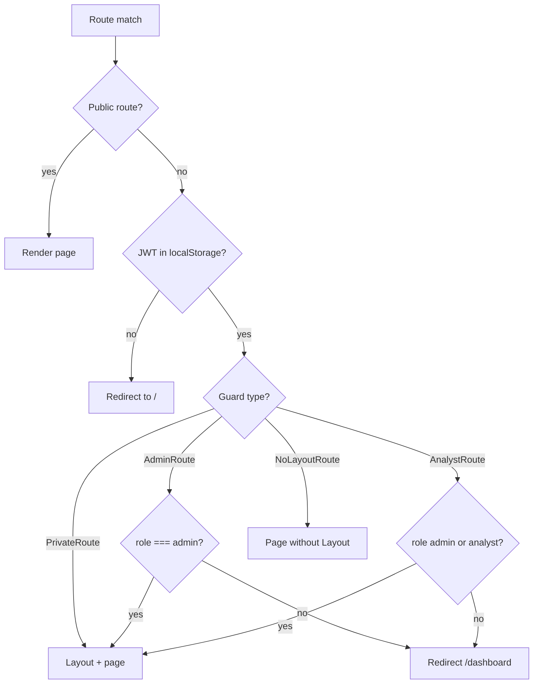
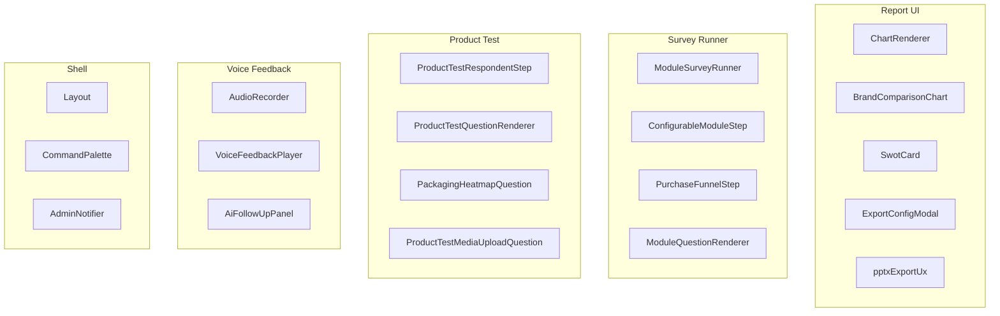
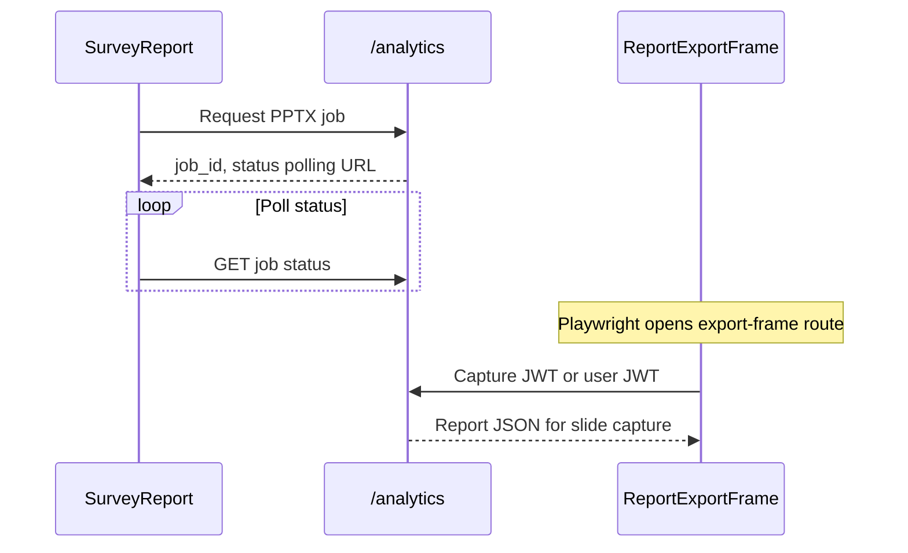

# Frontend Architecture

> **Audience:** Frontend developers and full-stack engineers working on the React SPA.  
> **Purpose:** React application structure — routing, role guards, API client, pages, and major UI subsystems.  
> **Related:** [system-overview.md](system-overview.md) · [auth-and-roles.md](auth-and-roles.md) · [backend-architecture.md](backend-architecture.md)

---

## Stack & Entry Points

| Item | Location |
|------|----------|
| **Bootstrap** | `frontend/src/main.tsx` |
| **Root component** | `frontend/src/App.tsx` |
| **API client** | `frontend/src/services/api.ts` |
| **Theme** | `frontend/src/context/ThemeContext.tsx` |
| **Build** | Vite (`npm run dev` → `:5173`) |

Environment: `VITE_API_URL` (default `/api` — proxied to backend in dev).

---

## Application Shell



Most authenticated routes wrap content in `Layout` (sidebar, navigation). Report and export-frame routes use `NoLayoutRoute` for full-screen rendering.

---

## Routing Architecture

### Route guard hierarchy



### Guard implementations (`App.tsx`)

| Guard | Checks | On failure |
|-------|--------|------------|
| `PrivateRoute` | `localStorage.token` exists | → `/` |
| `AdminRoute` | token + `role === 'admin'` | → `/` or `/dashboard` |
| `AnalystRoute` | token + role in `admin`, `analyst` | → `/` or `/dashboard` |
| `NoLayoutRoute` | token only (no Layout wrapper) | → `/` |

> **Important:** Guards are **UX-only**. Backend enforces authorization on every protected API call. See [auth-and-roles.md](auth-and-roles.md).

---

## Route Map (Complete)

| Path | Page | Guard | Purpose |
|------|------|-------|---------|
| `/` | `Login` | Public | Portal login |
| `/signup` | `SignUp` | Public | User registration |
| `/dashboard` | `Dashboard` | Private | Home overview |
| `/templates` | `Templates` | Private | Blueprint management |
| `/surveys` | `SurveysPage` | Private | Survey list |
| `/surveys/reports` | `SurveyReports` | Private | Report index |
| `/create-survey` | `CreateSurvey` | Private | Multi-step survey wizard |
| `/surveys/:surveyId` | `TokenManagement` | Private | Tokens for a survey |
| `/surveys/:surveyId/responses` | `SurveyResponses` | Private | Respondent monitoring |
| `/surveys/:surveyId/report` | `SurveyReport` | NoLayout | Interactive web report |
| `/surveys/:surveyId/export-frame` | `ReportExportFrame` | NoLayout | PPTX Playwright capture target |
| `/analytics/:surveyId` | `Analytics` | Private | Legacy/alternate analytics view |
| `/analytics/compare` | `ComparisonAnalytics` | Analyst | Cross-survey comparison |
| `/user-management` | `UserManagement` | Admin | Portal users |
| `/admin/analytics` | `PlatformAnalytics` | Admin | Platform-wide metrics |
| `/admin/ai-telemetry` | `AdminAITelemetry` | Admin | AI cost/usage |
| `/admin/attributes` | `AttributeBankManager` | Admin | Sensory attribute banks |
| `/s/:token` | `PublicSurvey` | **Public** | Respondent screening + L2 |

---

## API Client: `services/api.ts`

### Configuration

```typescript
const API_URL = import.meta.env.VITE_API_URL || '/api';
const api = axios.create({ baseURL: API_URL, timeout: 30000 });
```

### Request interceptor

- Reads `localStorage.token`
- Attaches `Authorization: Bearer <token>` on all requests **except** URLs starting with `s/` (public survey endpoints)

### Response interceptor

- Retries transient errors (502, 503, 504, network timeout) up to 3 times
- On 401: clears token and redirects to `/` (skipped on public survey and export-frame routes)
- Normalizes errors into `ApiError` shape with `actionable_message`

### Public survey exception

```typescript
const isPublicSurveyEndpoint = config.url?.startsWith('s/');
if (token && !isPublicSurveyEndpoint) {
  config.headers.Authorization = `Bearer ${token}`;
}
```

Respondents on `/s/:token` never send portal JWT.

---

## Page Layer (`frontend/src/pages/`)

30 page modules organized by domain:

### Authentication
- `Login.tsx`, `SignUp.tsx` — store `token` + `role` in `localStorage` on success

### Survey operations
- `Dashboard.tsx` — entry hub
- `Templates.tsx` — blueprint CRUD
- `Surveys.tsx` — study list
- `TokenManagement.tsx` — per-survey token batches
- `SurveyResponses.tsx` — lifecycle filters, respondent detail
- `CreateSurvey/` — wizard with steps:
  - `IdentityStep`, `ParametersStep`, `ArchitectStep`, `DeploymentStep`

### Reporting
- `SurveyReport.tsx` — main report viewer (charts, AI sections, export actions)
- `SurveyReports.tsx` — report listing
- `ReportExportFrame.tsx` — stripped UI for headless PPTX capture
- `Analytics.tsx`, `AnalyticsDashboard.tsx` — analytics views

### Admin
- `UserManagement.tsx`
- `PlatformAnalytics.tsx`
- `AdminAITelemetry.tsx`
- `Admin/ComparisonAnalytics.tsx`
- `Admin/AttributeBankManager.tsx`

### Public
- `PublicSurvey.tsx` — Layer 1 + Layer 2 respondent experience (large, high-churn file)

### Voice
- `VoiceFeedbackDashboard.tsx` — voice themes and playback

---

## Component Architecture

89+ components under `frontend/src/components/`, grouped by subsystem:



---

## Reporting UI

**Primary page:** `SurveyReport.tsx`

**Key components** (`components/report/`):

| Component | Purpose |
|-----------|---------|
| `ChartRenderer` | Dispatches chart type → Recharts/custom viz |
| `BrandComparisonChart`, `AttributeProfileChart` | Brand analytics |
| `PurchaseFunnelLineChart`, `BrandAwarenessWaterfallChart` | Funnel / awareness |
| `SwotCard`, `AIDeepAnalysis`, `InsightCard` | AI narrative blocks |
| `ExportConfigModal`, `ExportActions` | PPTX export UX |
| `pptxExportUx.ts` | Export state machine, polling, rollout flags |
| `FilterPanel` | Report segment filters |
| `ProductTestAnalyticsStrip` | PT-specific report sections |
| `ChartCsvExportButton` | Per-chart CSV download |

### PPTX export flow (frontend)



`ReportExportFrame` renders charts without Layout chrome for Playwright screenshot capture.

---

## Product Test UI

### Admin / creation flow
- `CreateSurvey/components/ProductTestBlueprintStatusBar.tsx` — bank health indicator
- `ProductTestConfigModal.tsx` — PT parameter configuration
- `ProductTestL2PreviewPanel.tsx` — blueprint preview
- `PackagingHeatmapConfigPanel.tsx` — heatmap setup

### Respondent flow (`components/product-test-respondent/`)

| Component | Role |
|-----------|------|
| `ProductTestRespondentStep` | Phase orchestration |
| `ProductTestQuestionRenderer` | Question type dispatch |
| `ProductTestMediaUploadQuestion` | Trial photo/video upload |
| `PackagingHeatmapQuestion` | Tap heatmap on packaging image |
| `ProductTestProgressBar` | Phase progress |
| `ProductTestPhaseHeader` | Section headers |
| `VoiceNoteRecorder` | Optional voice notes in PT |

Backend integration via `product_test_public_gateway` and `/surveys` media endpoints.

---

## Survey Module UI

DB-driven research modules (Phase 9 rollout):

| Component | Role |
|-----------|------|
| `survey/ModuleSurveyRunner.tsx` | Sequences module steps |
| `survey/ConfigurableModuleStep.tsx` | Generic module renderer |
| `survey/ModuleQuestionRenderer.tsx` | Per-question rendering |
| `survey/PurchaseFunnelStep.tsx` | Legacy/dedicated PF UI |
| `survey/BrandSatisfactionLoop.tsx` | Brand iteration wrapper |

Rollout controlled by `VITE_MODULE_ROLLOUT_STAGE` — see [module-rollout.md](../releases/module-rollout.md).

---

## Voice Feedback UI

| Component | Role |
|-----------|------|
| `voice-feedback/AudioRecorder.tsx` | Browser audio capture |
| `voice-feedback/VoiceFeedbackPlayer.tsx` | Playback with waveform |
| `voice-feedback/FeedbackCard.tsx` | Single feedback item |
| `voice-feedback/AiFollowUpPanel.tsx` | Smart follow-up questions |
| `voice-feedback/SentimentTrendChart.tsx` | Theme trends |
| `voice-feedback/OpenEndAnswerInput.tsx` | Text fallback |

**Dashboard page:** `VoiceFeedbackDashboard.tsx` — aggregates via `/voice-dashboard` API.

---

## Client Utilities (`frontend/src/utils/`)

| Area | Examples |
|------|----------|
| Survey orchestration | `surveyFlowOrchestration.ts` — step sequencing |
| Module logic | `moduleQuestionUtils.ts`, `purchaseFunnelBrandLogic.ts` |
| Chart export | `chartCsvExport.ts` |
| Export frame | `export/exportFrameContext.ts` |

Vitest tests colocated (e.g. `moduleRollout.test.ts`, `pptxExportUx.test.ts`).

---

## State & Auth Storage

| Key | Storage | Set by |
|-----|---------|--------|
| `token` | `localStorage` | Login, SignUp |
| `role` | `localStorage` | Login response (`admin`, `analyst`, `client`) |

No global state manager (Redux/Zustand) for auth — route guards read `localStorage` directly.

---

## Theming

`ThemeContext` provides light/dark mode toggled via `ThemeProvider`. Tailwind `dark:` variants used across Layout and report pages.

---

## Development Notes

| Topic | Detail |
|-------|--------|
| **Proxy** | Vite dev server proxies `/api` → backend (typically `:8081` or `:8000`) |
| **Large files** | `PublicSurvey.tsx` is a god component — primary respondent logic |
| **Animations** | Framer Motion `AnimatePresence` on route transitions |
| **Toasts** | Sonner for success/error feedback |
| **Command palette** | `CommandPalette.tsx` for power-user navigation |

---

## Related Documentation

| Document | Purpose |
|----------|---------|
| [auth-and-roles.md](auth-and-roles.md) | JWT + route guard security model |
| [backend-architecture.md](backend-architecture.md) | API endpoints consumed by UI |
| [../guides/respondent-flow.md](../guides/respondent-flow.md) | Respondent UX (non-technical) |
| [../guides/admin-guide.md](../guides/admin-guide.md) | Portal workflows |

---

*Phase 3 technical architecture — [docs/README.md](../README.md)*
