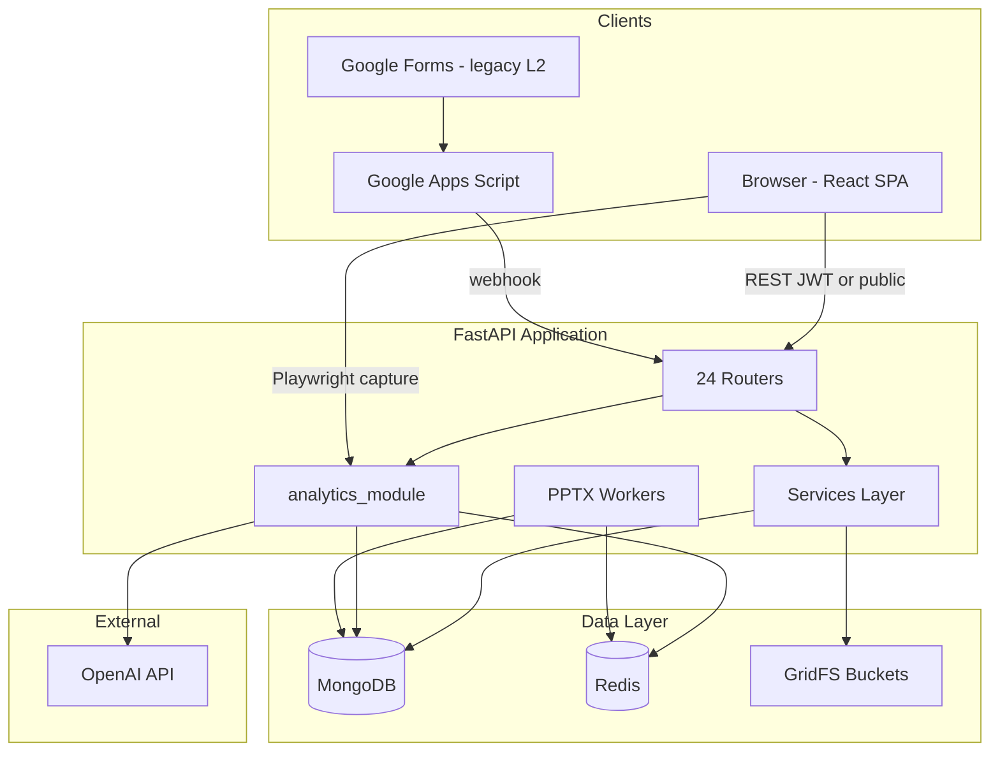
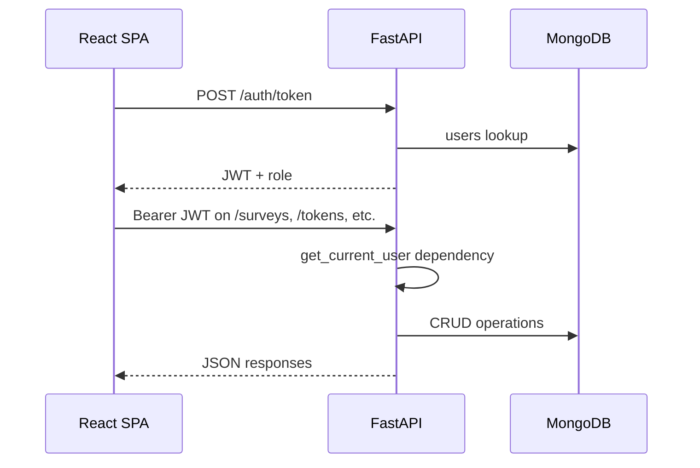
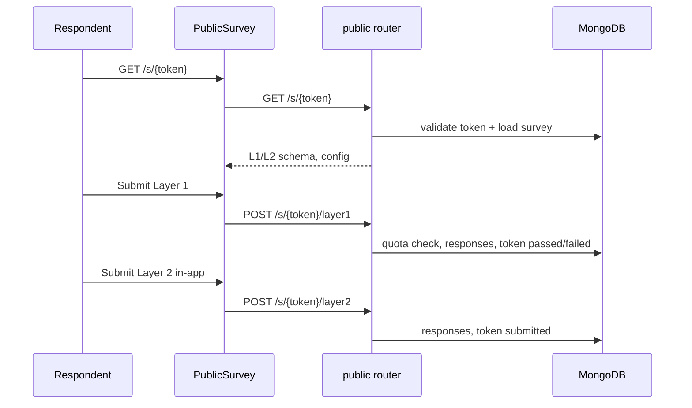
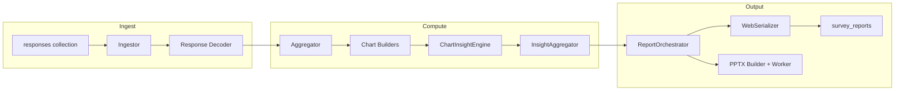
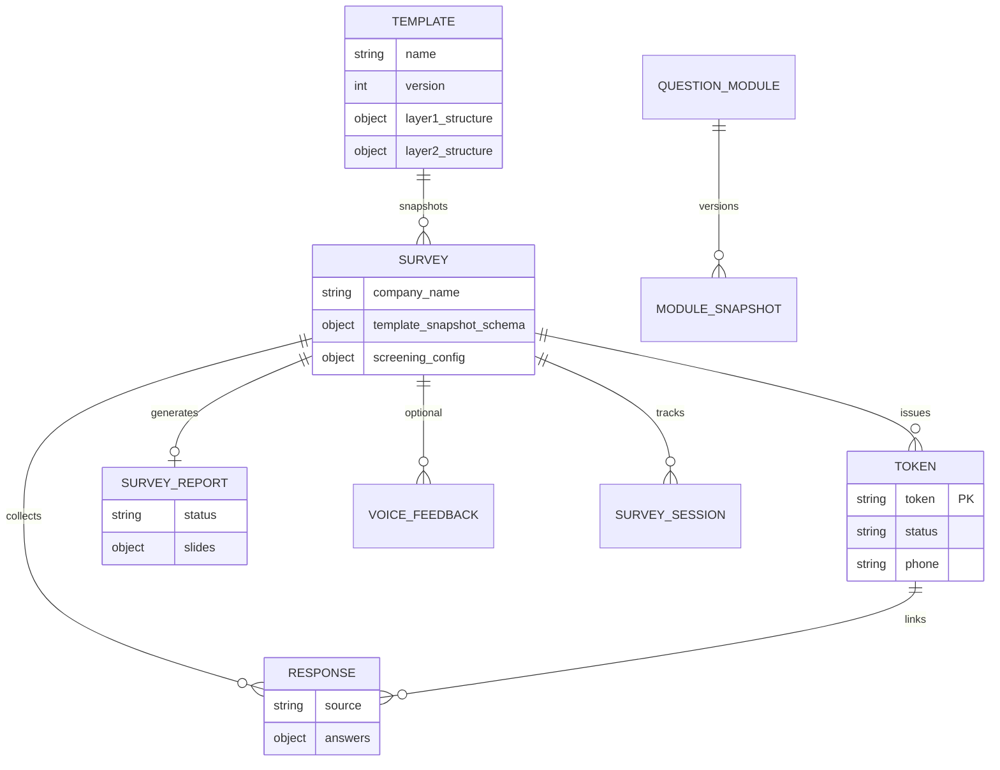
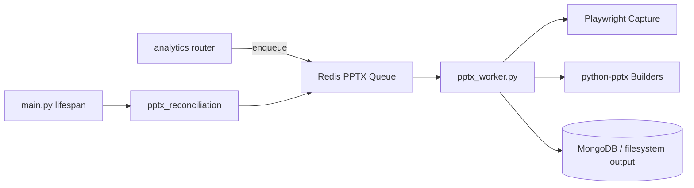

# System Overview

> **Audience:** Developers, architects, and technical operators onboarding to Questioner.  
> **Purpose:** Canonical platform architecture — components, data flows, dependencies, and integration points.  
> **Last reviewed:** 2026-07-06 (24 API routers, current `main.py` lifespan hooks).  
> **Related:** [backend-architecture.md](backend-architecture.md) · [frontend-architecture.md](frontend-architecture.md) · [auth-and-roles.md](auth-and-roles.md) · [architecture-review.md](architecture-review.md) · [../data/database-overview.md](../data/database-overview.md)

> **Supersedes:** April 2026 `architecture_analysis.md.resolved` (removed) — risks and refactoring directions live in [architecture-review.md](architecture-review.md).

---

## Executive Summary

Questioner is a **three-tier** market-research platform:

| Tier | Technology | Responsibility |
|------|------------|----------------|
| **Presentation** | React 18 + TypeScript + Vite | Admin/analyst portal, public respondent UI, report viewer |
| **Application** | FastAPI + Pydantic v2 | REST API, business logic, analytics orchestration, background workers |
| **Data** | MongoDB + Redis + GridFS | Persistent documents, cache/queues, binary media |

Respondents access studies via **token URLs** (`/s/{token}`) with no login. Portal users authenticate via **JWT** (roles: `admin`, `analyst`, `client`).

---

## End-to-End Architecture



---

## Core Request Flows

### 1. Admin / analyst portal flow



### 2. Respondent survey flow



### 3. Analytics and report flow



---

## Technology Stack

| Layer | Components |
|-------|------------|
| **Frontend** | React 18, TypeScript, Vite, Tailwind CSS, Framer Motion, React Router, Axios, Recharts, Sonner, Vitest |
| **Backend** | FastAPI, Motor (async MongoDB), Pydantic v2, python-jose (JWT), passlib/bcrypt, SlowAPI + Redis rate limiting |
| **Analytics** | pandas, numpy, scipy, statsmodels, OpenAI SDK, python-pptx, Playwright (hybrid PPTX capture) |
| **Voice** | Whisper (API/local), pydub, embedding/clustering pipelines |
| **Infra** | Docker Compose, Nginx, AWS ECS, GitHub Actions |

---

## Backend Surface Area (Current)

**24 routers** mounted in `backend/main.py`:

| Router | Prefix | Domain |
|--------|--------|--------|
| `auth` | `/auth` | Login, signup, `/me` |
| `templates` | `/templates` | Survey blueprints |
| `surveys` | `/surveys` | Survey CRUD, stats |
| `tokens` | `/tokens` | Token batch generation |
| `public` | `/s` | Respondent L1/L2 (no JWT) |
| `webhook` | `/webhook` | Google Forms relay |
| `analytics` | `/analytics` | Report generation, PPTX jobs |
| `responses` | `/responses` | Respondent listing, detail |
| `users` | `/users` | User admin (admin only) |
| `exports` | `/exports` | BA/PF, product-scalers Excel |
| `sessions` | `/sessions` | Survey session state |
| `attribute_banks` | `/attribute-banks` | Sensory attributes |
| `taste_test_configs` | `/taste-test-configs` | Taste test setup |
| `questions` | `/questions` | Master question bank |
| `purchase_funnels` | `/purchase-funnels` | PF configuration |
| `question_modules` | `/modules` | DB-driven research modules |
| `voice_feedback` | `/voice-feedback` | Audio upload & analysis |
| `voice_dashboard` | `/voice-dashboard` | Voice analytics UI API |
| `brand_attributes` | `/brand-attributes` | Brand attribute registry |
| `product_test_configs` | `/product-test-configs` | Product Test study config |
| `product_test_questions` | *(root paths)* | PT question bank API |
| `packaging_heatmap` | `/surveys` | Packaging heatmap uploads |
| `product_test_media` | `/surveys` | Trial media GridFS |

Detail: [backend-architecture.md](backend-architecture.md)

---

## Frontend Surface Area (Current)

**17 authenticated routes** + **1 public route** in `frontend/src/App.tsx`:

| Guard | Routes |
|-------|--------|
| **Public** | `/`, `/signup`, `/s/:token` |
| **PrivateRoute** (any JWT) | `/dashboard`, `/templates`, `/surveys`, `/create-survey`, `/surveys/:id`, `/surveys/:id/responses`, `/analytics/:id`, `/surveys/reports` |
| **AnalystRoute** | `/analytics/compare` |
| **AdminRoute** | `/user-management`, `/admin/analytics`, `/admin/ai-telemetry`, `/admin/attributes` |
| **NoLayoutRoute** (JWT, no shell) | `/surveys/:id/report`, `/surveys/:id/export-frame` |

Detail: [frontend-architecture.md](frontend-architecture.md)

---

## Data Architecture



### Primary MongoDB collections

| Collection | Purpose |
|------------|---------|
| `users` | Portal accounts (admin/analyst/client) |
| `templates` | Versioned blueprints |
| `surveys` | Live study instances |
| `tokens` | Respondent access keys + status machine |
| `responses` | L1/L2 answers (`layer1`, `layer2`, `in_app_gateway`) |
| `respondents` | Profile upserted by phone |
| `survey_reports` | Generated analytics output |
| `ai_insight_cache` | Cached OpenAI responses |
| `question_modules` / `module_snapshots` | Modular research blocks |
| `product_test_questions` / `package_test_questions` | PT question banks |
| `voice_feedbacks` | Voice response metadata |
| `survey_sessions` | In-progress session state |
| `packaging_heatmap_aggregates` | Heatmap analytics |
| `product_test_media_assets` | Trial media registry |
| `orphan_submissions` | Failed webhook / unmatched payloads |
| `audit_logs` | Admin action audit trail |

### GridFS buckets

| Bucket | Content |
|--------|---------|
| `voice_recordings` | Voice feedback audio |
| `packaging_images` | Packaging heatmap images |
| `product_test_media` | Respondent trial photo/video |

Indexes are ensured on startup via `db.ensure_indexes()` — see [backend-architecture.md](backend-architecture.md#startup-lifecycle).

---

## Queue & Background Processing



| Component | Role |
|-----------|------|
| `PptxJobQueue` | Async Redis queue for export jobs |
| `pptx_worker.py` | Consumes jobs, hybrid slide capture + native builders |
| `pptx_reconciliation.py` | On startup, recovers orphaned/stale jobs |
| Redis (general) | AI insight cache TTL, rate limit backend |

PPTX export is gated by rollout flags — see [pptx-export.md](../analytics/pptx-export.md) and [pptx-export-rollout.md](../releases/pptx-export-rollout.md).

---

## Layer 1 / Layer 2 Paths

### Layer 2 delivery modes

| Mode | `responses.source` | Integration |
|------|-------------------|-------------|
| **In-app gateway** | `in_app_gateway` | `POST /s/{token}/layer2` — modern default |
| **Google Forms** | `layer2` | Apps Script → `POST /webhook/google-form` |

### Token state machine

```
unused ──► passed ──► submitted
   │
   └──► failed (terminal)
```

Enforced atomically by `TokenService` in `backend/services/token_service.py`.

---

## External Dependencies

| Service | Criticality | Role |
|---------|-------------|------|
| **MongoDB** | Critical | All platform data |
| **Redis** | High | Rate limits, PPTX queue, AI cache |
| **OpenAI** | Medium | AI narratives — reports work without it (data-only) |
| **Google Forms + Apps Script** | Low–Medium | Legacy L2 only |
| **Playwright** | Medium | PPTX hybrid chart capture |
| **ffmpeg / Whisper** | Low | Voice feedback (feature-dependent) |

---

## Security & Middleware (API)

Applied in `backend/main.py`:

| Layer | Implementation |
|-------|----------------|
| **CORS** | Configurable via `ALLOWED_ORIGINS` |
| **Rate limiting** | SlowAPI + Redis (`backend/utils/rate_limit.py`) |
| **Security headers** | CSP, HSTS, X-Frame-Options, nosniff |
| **Request logging** | `LoggingMiddleware` |
| **JWT auth** | Per-route FastAPI dependencies |

Auth detail: [auth-and-roles.md](auth-and-roles.md)

---

## Application Startup Sequence

On API boot (`lifespan` in `main.py`):

1. Initialize logging
2. Connect MongoDB
3. `ensure_indexes()` — reports, voice, modules, sessions, heatmap, PT media
4. `seed_admin()` — ensure admin user from env
5. **AI warmup** — background OpenAI prefix priming (if API key present)
6. **PPTX reconciliation** — orphan job recovery (if queue enabled)
7. **Trial media cleanup** — abandoned PT media lifecycle (if enabled)

---

## Major Subsystems

| Subsystem | Location | Description |
|-----------|----------|-------------|
| **Survey core** | `routers/public.py`, `token_service.py` | Screening, quotas, L2 gateway |
| **Analytics pipeline** | `backend/analytics_module/` | Ingest → aggregate → AI → report/PPTX |
| **Product Test** | `services/product_test_*`, `routers/product_test_*` | IHUT orchestration, media, banks |
| **Question modules** | `question_module_service.py`, `routers/question_modules.py` | PF, usage, pricing modules |
| **Voice feedback** | `backend/voice_feedback/`, voice routers | Upload, transcribe, NLP, dashboard |
| **Packaging heatmap** | `packaging_heatmap.py`, heatmap services | Image upload + aggregate analytics |
| **Exports** | `routers/exports.py` | Excel flat/stacked exports |

---

## Repository Layout (Technical)

```
Questioner/
├── backend/
│   ├── main.py              # App entry, router mount, lifespan
│   ├── config.py            # Settings from environment
│   ├── models.py            # Pydantic document models
│   ├── database.py          # Motor client, indexes, GridFS
│   ├── routers/             # 24 API route modules
│   ├── services/            # Business logic (17 modules)
│   ├── workers/             # PPTX queue + worker
│   ├── analytics_module/    # Report pipeline (~237 files)
│   └── voice_feedback/      # Voice processing
├── frontend/
│   └── src/
│       ├── App.tsx          # Routes + role guards
│       ├── pages/           # Route-level screens (30 files)
│       ├── components/      # UI building blocks (89+ files)
│       └── services/api.ts  # Axios client + interceptors
├── infra/                   # Docker, Nginx, AWS
└── docs/technical/          # This documentation tree
```

---

## Known Architecture Considerations

Items from the April 2026 review that remain relevant for developers:

| Topic | Notes |
|-------|-------|
| **Google Forms fragility** | Prefer in-app gateway; webhook has no signature auth |
| **Quota race window** | L1 quota check is not fully atomic under extreme concurrency |
| **Client-side role guards** | Frontend routes are UX-only; backend must enforce RBAC |
| **Large god files** | `PublicSurvey.tsx`, `aggregator.py`, `models.py` are high-churn |
| **Market hardcoding** | Egypt-specific area/SES data in public flow |

For the full historical assessment (scores, refactoring directions), see [architecture-review.md](architecture-review.md).

---

## Related Documentation

| Document | Purpose |
|----------|---------|
| [backend-architecture.md](backend-architecture.md) | Routers, services, workers, config |
| [frontend-architecture.md](frontend-architecture.md) | React routes, pages, components |
| [auth-and-roles.md](auth-and-roles.md) | JWT, RBAC, capture tokens |
| [architecture-review.md](architecture-review.md) | Known risks and refactoring backlog |
| [../handover/product-overview.md](../handover/product-overview.md) | Non-technical feature map |
| [../guides/survey-lifecycle.md](../guides/survey-lifecycle.md) | Operational lifecycle |
| [../../backend/analytics_module/AI_ARCHITECTURE.md](../../backend/analytics_module/AI_ARCHITECTURE.md) | AI pipeline deep dive |

---

*Phase 3 technical architecture — [docs/README.md](../README.md)*
