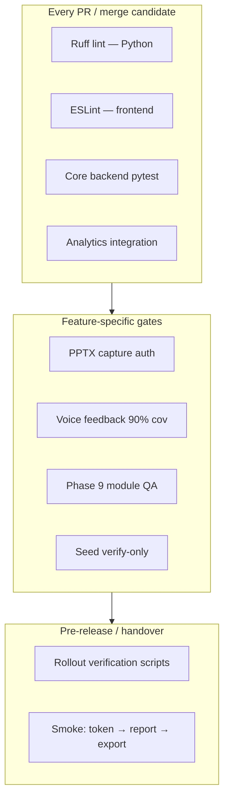

# Testing & Quality Assurance

> **Audience:** Developers, QA engineers, and release managers validating changes before merge or handover.  
> **Purpose:** Canonical reference for test suites, linting, seed verification, rollout QA matrices, and pre-handover quality gates.  
> **Related:** [../operations/ci-cd.md](../operations/ci-cd.md) · [../releases/module-rollout.md](../releases/module-rollout.md) · [../releases/pptx-export-rollout.md](../releases/pptx-export-rollout.md) · [../data/seeds-and-fixtures.md](../data/seeds-and-fixtures.md)

---

## Quality Gate Overview



| Gate | When required | Doc section |
|------|---------------|-------------|
| **Ruff lint** | Every backend change | [Linting](#linting) |
| **ESLint** | Every frontend change | [Linting](#linting) |
| **Backend pytest** | Every backend change | [Backend tests](#backend-tests) |
| **Analytics integration** | Analytics/report changes | [Backend tests](#backend-tests) |
| **Capture auth** | PPTX / auth / export-frame | [PPTX rollout QA](#pptx-rollout-qa) |
| **Voice coverage** | `backend/voice_feedback/` | [Backend tests](#backend-tests) |
| **Phase 9 QA** | Modules / PF / exports | [Module rollout QA](#module-rollout-qa) |
| **Seed verify** | Product Test / modules / banks | [Seeded data tests](#seeded-data-tests) |
| **Handover sign-off** | Teammate onboarding complete | [Handover checklist](#handover-quality-gates) |

---

## Test Layout

```
backend/tests/
├── analytics/          # Report pipeline, PPTX, charts, ingestor
├── capture_auth/       # PPTX capture JWT + report API auth
├── pptx_rollout/       # Rollout flag unit + integration
├── voice_feedback/     # Voice pipeline (90% coverage gate)
├── integration/        # Cross-module integration (analytics)
└── test_*.py           # Routers, modules, product test, PPTX queue

frontend/src/
├── **/*.test.ts        # Vitest unit tests (utils, components)
└── **/*.test.tsx
```

| Layer | Runner | Config |
|-------|--------|--------|
| Backend | `pytest` | [backend/pytest.ini](../../backend/pytest.ini) |
| Frontend | `vitest` | Vite + `frontend/package.json` |

> **CI note:** `ci.yml` references `backend/tests/unit`, but that directory is **not present** in the repo. CI may skip or fail that step until tests are reorganized. Locally, run targeted suites below or `pytest backend/tests -o addopts= -q` for the full backend matrix.

---

## Linting

### Python (Ruff)

Matches [.github/workflows/ci.yml](../../.github/workflows/ci.yml):

```bash
# Fatal: syntax errors, undefined names
ruff check backend/ --select=E9,F63,F7,F82 --target-version=py311

# Full check (warnings allowed in CI)
ruff check backend/ --target-version=py311
```

### Frontend (ESLint)

```bash
cd frontend
npm run lint
```

`npm run build` also runs `tsc` — type errors fail the production build.

---

## Backend Tests

### Environment (local)

```bash
export MONGO_URI=mongodb://localhost:27017/test_db
export REDIS_URL=redis://localhost:6379
export SECRET_KEY=local-test-secret
export ADMIN_USERNAME=admin
export ADMIN_PASSWORD=password
export OPENAI_API_KEY=mock_key   # analytics tests
```

On Windows PowerShell, use `$env:MONGO_URI = "..."` instead of `export`.

### Quick smoke (recommended daily)

```bash
# From repo root — disable pytest.ini default cov addopts
pytest backend/tests/test_module_rollout_flags.py \
       backend/tests/test_question_modules_router.py \
       -o addopts= -q
```

### Analytics integration (CI parity)

```bash
export ANALYTICS_RESOURCES_DIR=backend/resources/analytics
export ANALYTICS_OUTPUT_DIR=/tmp/analytics_out
pytest backend/tests/integration/test_analytics.py -o addopts= -q
```

### Full backend matrix (pre-handover)

```bash
pytest backend/tests -o addopts= -q
```

Expect **MongoDB** and **Redis** reachable for integration tests. Many unit tests use `mongomock` and do not need live services.

### Capture auth (PPTX Phases 1–7)

Required before promoting PPTX capture changes — matches [backend-tests.yml](../../.github/workflows/backend-tests.yml):

```bash
pytest backend/tests/capture_auth \
  backend/tests/test_capture_auth.py \
  backend/tests/test_capture_session.py \
  backend/tests/test_capture_preflight_auth.py \
  backend/tests/test_report_capture_auth.py \
  -o addopts= -q
```

Rollout verification script (with running stack):

```bash
docker exec questioner_pptx_worker python -m backend.scripts.verify_capture_auth_rollout \
  --survey-id <survey-id> --probe-api
```

Detail: [../releases/pptx-export-rollout.md](../releases/pptx-export-rollout.md)

### Voice feedback (90% coverage gate)

```bash
pytest backend/tests/voice_feedback/ \
  --cov=backend/voice_feedback \
  --cov-report=term-missing \
  --cov-fail-under=90
```

### Product Test backend suites

| Area | Example test files |
|------|-------------------|
| Question bank | `test_product_test_bank_service.py` |
| Configs router | `test_product_test_configs_router.py` |
| Media / packaging | `test_packaging_heatmap_phase*.py`, `test_trial_media_*.py` |
| Phase 5 QA | `test_product_test_phase5_qa.py` |

---

## Frontend Tests

### Run all tests

```bash
cd frontend
npm run test
```

### Module rollout (Phase 9 — frontend parity)

Matches [module-rollout.md](../releases/module-rollout.md) QA matrix:

```bash
cd frontend
npm run test -- --run \
  moduleSequencePermutations \
  purchaseFunnelBrandLogic \
  surveyFlowOrchestration \
  moduleRollout \
  moduleQuestionUtils
```

### PPTX export UX

```bash
cd frontend
npm run test -- src/export/reportLoadErrors.test.ts
npm run test -- src/components/report/pptxExportUx.test.ts
```

### Chart CSV export

```bash
npm run test:chart-csv
```

---

## Seeded Data Tests

Seed scripts are **not** pytest — they are operational verification gates for environments.

### Product Test bank

```bash
python -m backend.scripts.seed_product_test_data --verify-only
# Exit 0 = collections populated; 1 = missing or invalid
```

Wrapper scripts: `scripts/seed-pt.ps1` (Windows), `scripts/seed-pt.sh` (Unix).

Detail: [../data/product-test-data-layer.md](../data/product-test-data-layer.md)

### Question modules (Phase 9)

```bash
python -m backend.scripts.seed_question_modules --dry-run
python -m backend.scripts.seed_question_modules
```

### New environment checklist

From [seeds-and-fixtures.md](../data/seeds-and-fixtures.md):

| Step | Command |
|------|---------|
| 1 | Admin user auto-seeded on API startup |
| 2 | `python -m backend.scripts.seed_question_modules --dry-run` |
| 3 | `python -m backend.scripts.seed_product_test_data --verify-only` |
| 4 | Optional: attribute banks per team convention |

---

## Module Rollout QA

### One-command backend matrix

```bash
python -m backend.scripts.run_phase9_qa
# Optional: --skip-seed-dry-run if Excel fixture unavailable
```

Runs:

| Test file | Area |
|-----------|------|
| `test_phase9_seed_contract.py` | Seed contracts |
| `test_question_modules_router.py` | Module API |
| `test_question_module_service_versioning.py` | Version immutability |
| `test_module_specify_roundtrip.py` | Specify round-trip |
| `test_exports_modules.py` | Excel export aliases |
| `test_module_rollout_flags.py` | Rollout flags |
| `test_module_answer_aliases.py` | Analytics aliases |
| `test_question_modules.py` | Core module logic |
| `test_question_module_parsers.py` | Parsers |
| `test_ingestor_modules.py` | Analytics ingest |
| `test_aggregator_modules.py` | Analytics aggregate |

Plus seed dry-run unless `--skip-seed-dry-run`.

### Staged rollout validation

After changing `MODULE_ROLLOUT_STAGE` / `VITE_MODULE_ROLLOUT_STAGE`:

1. Run `run_phase9_qa` (backend)
2. Run frontend module test bundle (above)
3. Manual: create survey with PF module → complete respondent flow → verify export columns

Full stage matrix: [../releases/module-rollout.md](../releases/module-rollout.md)

---

## PPTX Rollout QA

| Check | Command / action |
|-------|------------------|
| Unit tests | `pytest backend/tests/pptx_rollout -o addopts= -q` |
| Capture auth | Capture auth suite (above) |
| Rollout script | `verify_capture_auth_rollout.py --probe-api` |
| Frontend errors | `npm run test -- src/export/reportLoadErrors.test.ts` |
| Manual | Generate report → Export PPTX → download → spot-check slides |

Pre-promote checklist: [../releases/pptx-export-rollout.md](../releases/pptx-export-rollout.md) § Phase 7

Daily reference: [../analytics/pptx-export.md](../analytics/pptx-export.md)

---

## CI/CD Mapping

| Workflow | What runs | Local equivalent |
|----------|-----------|------------------|
| [ci.yml](../../.github/workflows/ci.yml) | Ruff, `backend/tests/unit`*, analytics integration | [Linting](#linting) + [Analytics integration](#backend-tests) |
| [backend-tests.yml](../../.github/workflows/backend-tests.yml) | Capture auth + voice 90% | [Capture auth](#capture-auth-pptx-phases-17) + [Voice](#voice-feedback-90-coverage-gate) |

\*See [Test layout](#test-layout) — `unit/` directory gap.

Detail: [../operations/ci-cd.md](../operations/ci-cd.md)

---

## Handover Quality Gates

Before signing off [teammate-handover-checklist.md](../handover/teammate-handover-checklist.md), the receiving engineer should pass:

| # | Gate | Pass criteria |
|---|------|---------------|
| 1 | **Local run** | API on 8081, frontend on 5173, login works |
| 2 | **Lint** | `ruff check` fatal rules clean; `npm run lint` passes |
| 3 | **Core backend** | `pytest backend/tests/test_module_rollout_flags.py backend/tests/test_question_modules_router.py -o addopts= -q` |
| 4 | **Frontend** | `cd frontend && npm run test` — all green |
| 5 | **Seeds** | `seed_product_test_data --verify-only` exit 0 (if using Product Test) |
| 6 | **Analytics** | Can generate one report on a test survey (manual) |
| 7 | **Exports** | `GET /exports/test/ba-pf` returns Excel with valid JWT |
| 8 | **Docs** | Read canonical paths in [docs/README.md](../README.md) — no reliance on legacy redirects |

### Role-specific additions

| Role | Additional gates |
|------|------------------|
| **Analytics engineer** | `pytest backend/tests/integration/test_analytics.py`; capture auth if touching PPTX |
| **Module / PF work** | `run_phase9_qa` + frontend module tests |
| **Voice feature** | Voice suite with 90% coverage |
| **Release manager** | Rollout docs reviewed; `verify_capture_auth_rollout` on staging |

---

## Pre-Merge Checklist (Developers)

Copy into PR description or run locally before push:

- [ ] `ruff check backend/ --select=E9,F63,F7,F82` — no fatal issues
- [ ] `cd frontend && npm run lint`
- [ ] Backend tests relevant to your change pass (`-o addopts=` to avoid default cov)
- [ ] If analytics: `pytest backend/tests/integration/test_analytics.py`
- [ ] If PPTX/auth: capture auth suite green
- [ ] If voice: `pytest backend/tests/voice_feedback/` with `--cov-fail-under=90`
- [ ] If modules: `python -m backend.scripts.run_phase9_qa`
- [ ] If Product Test: `seed_product_test_data --verify-only`
- [ ] If env/rollout flags: updated [releases/](../releases/) docs or [environment-variables.md](environment-variables.md)
- [ ] If docs edited: `python scripts/validate_docs_links.py` passes

## Troubleshooting Tests

| Symptom | Likely cause | Fix |
|---------|--------------|-----|
| `Connection refused` Mongo | No local Mongo | Start Docker Compose or use CI services ports |
| Coverage fail on unrelated tests | `pytest.ini` default `--cov` | Use `-o addopts=` |
| OpenAI errors in analytics tests | Missing mock key | `export OPENAI_API_KEY=mock_key` |
| Seed verify fails | Excel missing | Place `General_Product_Test_Evaluation.xlsx` at repo root or use JSON fixture |
| Phase 9 seed dry-run warn | Excel path | `--skip-seed-dry-run` for backend-only QA |
| Frontend OOM | Large test run | Run targeted `--run <pattern>` |

More: [../operations/troubleshooting.md](../operations/troubleshooting.md)

---

## Related Documentation

| Document | Purpose |
|----------|---------|
| [ci-cd.md](../operations/ci-cd.md) | GitHub Actions workflows |
| [module-rollout.md](../releases/module-rollout.md) | Module stage matrix |
| [pptx-export-rollout.md](../releases/pptx-export-rollout.md) | PPTX deploy verification |
| [seeds-and-fixtures.md](../data/seeds-and-fixtures.md) | All seed scripts |
| [local-development.md](local-development.md) | Environment setup |

---

*Phase 7 — [docs/README.md](../README.md)*
